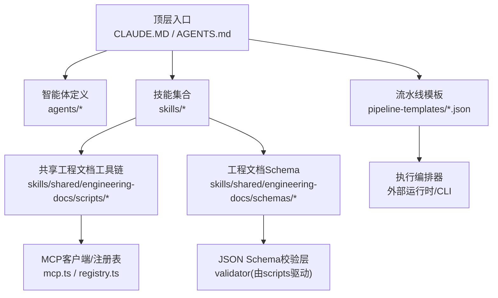
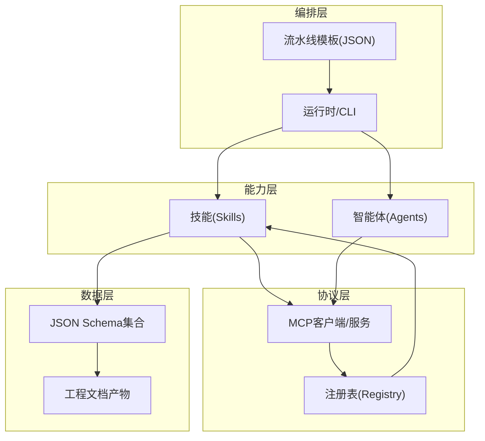
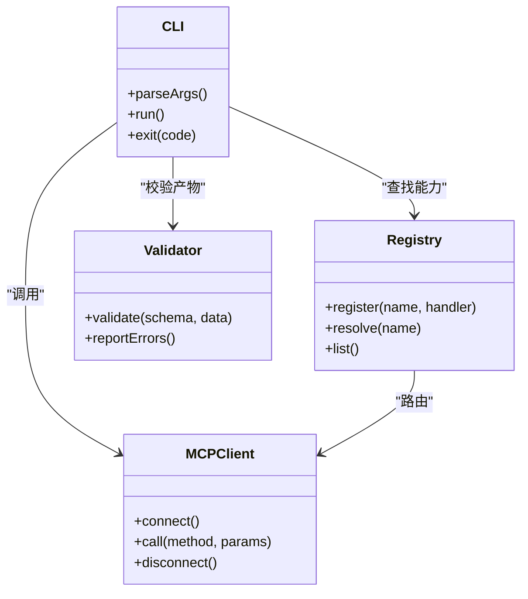
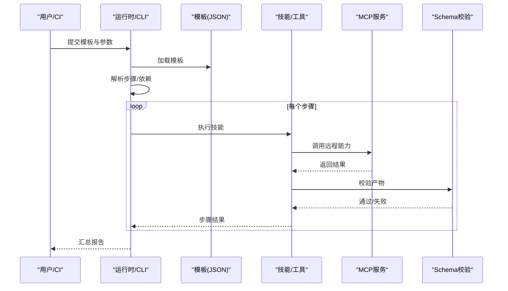
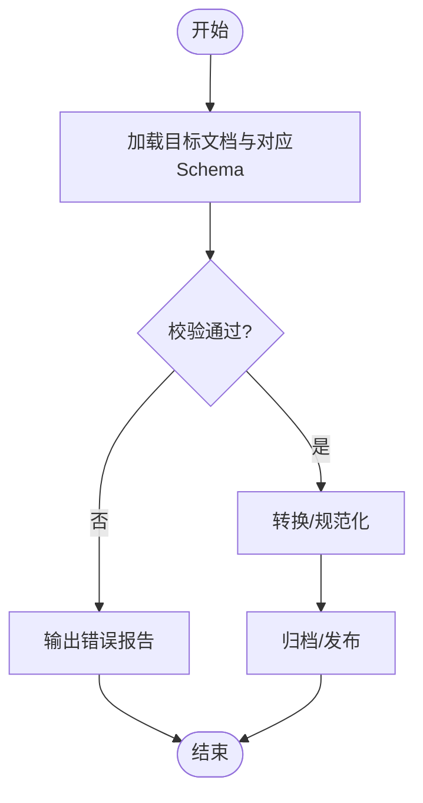
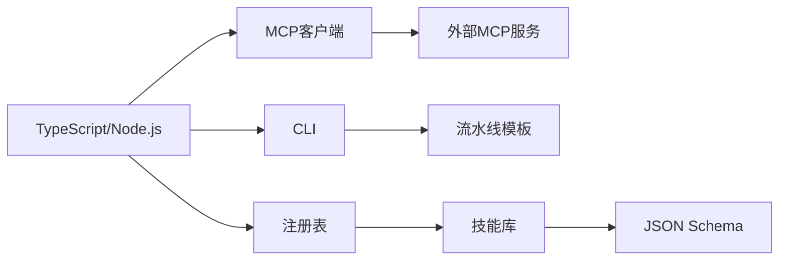

# 技术架构总览

<cite>
**本文引用的文件**   
- [CLAUDE.MD](file://CLAUDE.MD)
- [AGENT-SKILL-MATRIX.md](file://AGENT-SKILL-MATRIX.md)
- [AGENTS.md](file://AGENTS.md)
- [dir-graph.yaml](file://dir-graph.yaml)
- [pipeline-templates/README.md](file://pipeline-templates/README.md)
- [pipeline-templates/architecture-design.pipeline.json](file://pipeline-templates/architecture-design.pipeline.json)
- [pipeline-templates/code-implementation.pipeline.json](file://pipeline-templates/code-implementation.pipeline.json)
- [skills/shared/engineering-docs/scripts/src/cli.ts](file://skills/shared/engineering-docs/scripts/src/cli.ts)
- [skills/shared/engineering-docs/scripts/src/mcp.ts](file://skills/shared/engineering-docs/scripts/src/mcp.ts)
- [skills/shared/engineering-docs/scripts/src/registry.ts](file://skills/shared/engineering-docs/scripts/src/registry.ts)
- [skills/shared/engineering-docs/scripts/package.json](file://skills/shared/engineering-docs/scripts/package.json)
- [skills/shared/engineering-docs/scripts/tsconfig.json](file://skills/shared/engineering-docs/scripts/tsconfig.json)
- [skills/shared/engineering-docs/schemas/common-defs.schema.json](file://skills/shared/engineering-docs/schemas/common-defs.schema.json)
- [skills/shared/engineering-docs/schemas/prd.schema.json](file://skills/shared/engineering-docs/schemas/prd.schema.json)
- [skills/shared/engineering-docs/schemas/plan.schema.json](file://skills/shared/engineering-docs/schemas/plan.schema.json)
- [skills/shared/engineering-docs/schemas/sdd.schema.json](file://skills/shared/engineering-docs/schemas/sdd.schema.json)
- [skills/shared/engineering-docs/schemas/task.schema.json](file://skills/shared/engineering-docs/schemas/task.schema.json)
- [skills/shared/engineering-docs/schemas/form.schema.json](file://skills/shared/engineering-docs/schemas/form.schema.json)
- [skills/shared/engineering-docs/schemas/module.schema.json](file://skills/shared/engineering-docs/schemas/module.schema.json)
- [skills/shared/engineering-docs/schemas/release.schema.json](file://skills/shared/engineering-docs/schemas/release.schema.json)
</cite>

## 目录
1. [引言](#引言)
2. [项目结构](#项目结构)
3. [核心组件](#核心组件)
4. [架构总览](#架构总览)
5. [详细组件分析](#详细组件分析)
6. [依赖关系分析](#依赖关系分析)
7. [性能考虑](#性能考虑)
8. [安全设计](#安全设计)
9. [监控与可观测性](#监控与可观测性)
10. [部署与基础设施](#部署与基础设施)
11. [故障排查指南](#故障排查指南)
12. [结论](#结论)

## 引言
本技术架构总览面向AI工程化工具集，聚焦分层架构、模块化设计与插件化模式，围绕MCP协议、JSON Schema验证与TypeScript工具链等核心技术栈展开。文档从系统整体视图出发，解释数据流与控制流、组件通信机制、可扩展性与扩展点，并提供架构图表与组件关系图，帮助读者快速理解并高效使用该系统。

## 项目结构
仓库采用“能力域+模板+脚本”的复合组织方式：
- agents：按角色划分的智能体定义与说明（如竞品分析、客服、交付、开发、产品规划、质量评审、需求编写、规格说明等）。
- pipeline-templates：以JSON描述的可编排流水线模板，覆盖架构设计、代码实现、竞争雷达、特性回写、市场到规划、产品规划、需求撰写、简历CR等场景。
- skills：按领域划分的能力技能集合，包含竞争性分析、CR管理、开发流程、规划、需求、评审、规范文档、规格查询、同步、回写等；其中shared/engineering-docs提供工程文档标准、模板、Schema与TS工具链。
- dir-graph.yaml：用于可视化或辅助分析的目录结构图。
- CLAUDE.MD、AGENTS.md、AGENT-SKILL-MATRIX.md：顶层说明与矩阵映射，便于定位能力边界与组合方式。

图表来源
- [dir-graph.yaml](file://dir-graph.yaml)
- [CLAUDE.MD](file://CLAUDE.MD)
- [AGENTS.md](file://AGENTS.md)
- [pipeline-templates/README.md](file://pipeline-templates/README.md)
- [skills/shared/engineering-docs/scripts/src/mcp.ts](file://skills/shared/engineering-docs/scripts/src/mcp.ts)
- [skills/shared/engineering-docs/scripts/src/registry.ts](file://skills/shared/engineering-docs/scripts/src/registry.ts)
- [skills/shared/engineering-docs/scripts/package.json](file://skills/shared/engineering-docs/scripts/package.json)
- [skills/shared/engineering-docs/scripts/tsconfig.json](file://skills/shared/engineering-docs/scripts/tsconfig.json)

章节来源
- [CLAUDE.MD](file://CLAUDE.MD)
- [AGENTS.md](file://AGENTS.md)
- [AGENT-SKILL-MATRIX.md](file://AGENT-SKILL-MATRIX.md)
- [dir-graph.yaml](file://dir-graph.yaml)
- [pipeline-templates/README.md](file://pipeline-templates/README.md)

## 核心组件
- 智能体（Agents）：以角色为中心的职责抽象，通过SKILL与PIPELINE组合完成端到端任务。
- 流水线模板（Pipeline Templates）：以JSON声明式描述步骤、输入输出、条件分支与并行度，驱动编排器执行。
- 技能（Skills）：将业务动作封装为可复用单元，配合文档标准与Schema确保产出物一致性。
- 工程文档工具链（Engineering Docs Scripts）：基于TypeScript构建的CLI、MCP集成、注册表与校验器，支撑文档生成、校验与发布。
- MCP协议集成：作为工具与服务之间的标准化通信通道，支持远程能力发现与调用。
- JSON Schema验证：对PRD、SDD、PLAN、TASK、FORM、MODULE、RELEASE等文档进行强类型约束与一致性检查。

章节来源
- [AGENTS.md](file://AGENTS.md)
- [AGENT-SKILL-MATRIX.md](file://AGENT-SKILL-MATRIX.md)
- [pipeline-templates/README.md](file://pipeline-templates/README.md)
- [skills/shared/engineering-docs/scripts/src/cli.ts](file://skills/shared/engineering-docs/scripts/src/cli.ts)
- [skills/shared/engineering-docs/scripts/src/mcp.ts](file://skills/shared/engineering-docs/scripts/src/mcp.ts)
- [skills/shared/engineering-docs/scripts/src/registry.ts](file://skills/shared/engineering-docs/scripts/src/registry.ts)
- [skills/shared/engineering-docs/scripts/package.json](file://skills/shared/engineering-docs/scripts/package.json)
- [skills/shared/engineering-docs/scripts/tsconfig.json](file://skills/shared/engineering-docs/scripts/tsconfig.json)
- [skills/shared/engineering-docs/schemas/common-defs.schema.json](file://skills/shared/engineering-docs/schemas/common-defs.schema.json)
- [skills/shared/engineering-docs/schemas/prd.schema.json](file://skills/shared/engineering-docs/schemas/prd.schema.json)
- [skills/shared/engineering-docs/schemas/plan.schema.json](file://skills/shared/engineering-docs/schemas/plan.schema.json)
- [skills/shared/engineering-docs/schemas/sdd.schema.json](file://skills/shared/engineering-docs/schemas/sdd.schema.json)
- [skills/shared/engineering-docs/schemas/task.schema.json](file://skills/shared/engineering-docs/schemas/task.schema.json)
- [skills/shared/engineering-docs/schemas/form.schema.json](file://skills/shared/engineering-docs/schemas/form.schema.json)
- [skills/shared/engineering-docs/schemas/module.schema.json](file://skills/shared/engineering-docs/schemas/module.schema.json)
- [skills/shared/engineering-docs/schemas/release.schema.json](file://skills/shared/engineering-docs/schemas/release.schema.json)

## 架构总览
系统采用“编排层—能力层—协议层—数据层”的分层架构：
- 编排层：以流水线模板为核心，声明式驱动多阶段任务执行，支持条件、并发与回滚策略。
- 能力层：以技能与智能体为粒度，封装领域知识与工作流片段，支持按需装配。
- 协议层：通过MCP统一暴露与消费工具能力，屏蔽底层差异，提升可插拔性。
- 数据层：以JSON Schema为契约，保障文档与结构化数据的强一致与可演进。

图表来源
- [pipeline-templates/README.md](file://pipeline-templates/README.md)
- [skills/shared/engineering-docs/scripts/src/mcp.ts](file://skills/shared/engineering-docs/scripts/src/mcp.ts)
- [skills/shared/engineering-docs/scripts/src/registry.ts](file://skills/shared/engineering-docs/scripts/src/registry.ts)
- [skills/shared/engineering-docs/scripts/package.json](file://skills/shared/engineering-docs/scripts/package.json)
- [skills/shared/engineering-docs/scripts/tsconfig.json](file://skills/shared/engineering-docs/scripts/tsconfig.json)
- [skills/shared/engineering-docs/schemas/common-defs.schema.json](file://skills/shared/engineering-docs/schemas/common-defs.schema.json)

## 详细组件分析

### 工程文档工具链（CLI/MCP/注册表）
该子模块提供统一的命令行入口、MCP集成与能力注册中心，负责：
- CLI命令解析与参数校验
- 加载与分发MCP工具
- 维护能力注册表，支持动态发现与版本管理
- 驱动Schema校验与文档生成

图表来源
- [skills/shared/engineering-docs/scripts/src/cli.ts](file://skills/shared/engineering-docs/scripts/src/cli.ts)
- [skills/shared/engineering-docs/scripts/src/mcp.ts](file://skills/shared/engineering-docs/scripts/src/mcp.ts)
- [skills/shared/engineering-docs/scripts/src/registry.ts](file://skills/shared/engineering-docs/scripts/src/registry.ts)
- [skills/shared/engineering-docs/scripts/package.json](file://skills/shared/engineering-docs/scripts/package.json)
- [skills/shared/engineering-docs/scripts/tsconfig.json](file://skills/shared/engineering-docs/scripts/tsconfig.json)

章节来源
- [skills/shared/engineering-docs/scripts/src/cli.ts](file://skills/shared/engineering-docs/scripts/src/cli.ts)
- [skills/shared/engineering-docs/scripts/src/mcp.ts](file://skills/shared/engineering-docs/scripts/src/mcp.ts)
- [skills/shared/engineering-docs/scripts/src/registry.ts](file://skills/shared/engineering-docs/scripts/src/registry.ts)
- [skills/shared/engineering-docs/scripts/package.json](file://skills/shared/engineering-docs/scripts/package.json)
- [skills/shared/engineering-docs/scripts/tsconfig.json](file://skills/shared/engineering-docs/scripts/tsconfig.json)

### 流水线模板与编排
流水线模板以JSON描述任务序列、输入输出、条件与并行度，供外部运行时加载执行。典型流程包括：
- 读取模板与上下文
- 解析步骤与依赖
- 调度执行与状态跟踪
- 错误处理与重试

图表来源
- [pipeline-templates/README.md](file://pipeline-templates/README.md)
- [pipeline-templates/architecture-design.pipeline.json](file://pipeline-templates/architecture-design.pipeline.json)
- [pipeline-templates/code-implementation.pipeline.json](file://pipeline-templates/code-implementation.pipeline.json)
- [skills/shared/engineering-docs/scripts/src/mcp.ts](file://skills/shared/engineering-docs/scripts/src/mcp.ts)
- [skills/shared/engineering-docs/scripts/src/registry.ts](file://skills/shared/engineering-docs/scripts/src/registry.ts)

章节来源
- [pipeline-templates/README.md](file://pipeline-templates/README.md)
- [pipeline-templates/architecture-design.pipeline.json](file://pipeline-templates/architecture-design.pipeline.json)
- [pipeline-templates/code-implementation.pipeline.json](file://pipeline-templates/code-implementation.pipeline.json)

### 文档Schema与校验流程
工程文档遵循严格的Schema约束，涵盖PRD、SDD、PLAN、TASK、FORM、MODULE、RELEASE等。校验流程如下：

图表来源
- [skills/shared/engineering-docs/schemas/common-defs.schema.json](file://skills/shared/engineering-docs/schemas/common-defs.schema.json)
- [skills/shared/engineering-docs/schemas/prd.schema.json](file://skills/shared/engineering-docs/schemas/prd.schema.json)
- [skills/shared/engineering-docs/schemas/plan.schema.json](file://skills/shared/engineering-docs/schemas/plan.schema.json)
- [skills/shared/engineering-docs/schemas/sdd.schema.json](file://skills/shared/engineering-docs/schemas/sdd.schema.json)
- [skills/shared/engineering-docs/schemas/task.schema.json](file://skills/shared/engineering-docs/schemas/task.schema.json)
- [skills/shared/engineering-docs/schemas/form.schema.json](file://skills/shared/engineering-docs/schemas/form.schema.json)
- [skills/shared/engineering-docs/schemas/module.schema.json](file://skills/shared/engineering-docs/schemas/module.schema.json)
- [skills/shared/engineering-docs/schemas/release.schema.json](file://skills/shared/engineering-docs/schemas/release.schema.json)

章节来源
- [skills/shared/engineering-docs/schemas/common-defs.schema.json](file://skills/shared/engineering-docs/schemas/common-defs.schema.json)
- [skills/shared/engineering-docs/schemas/prd.schema.json](file://skills/shared/engineering-docs/schemas/prd.schema.json)
- [skills/shared/engineering-docs/schemas/plan.schema.json](file://skills/shared/engineering-docs/schemas/plan.schema.json)
- [skills/shared/engineering-docs/schemas/sdd.schema.json](file://skills/shared/engineering-docs/schemas/sdd.schema.json)
- [skills/shared/engineering-docs/schemas/task.schema.json](file://skills/shared/engineering-docs/schemas/task.schema.json)
- [skills/shared/engineering-docs/schemas/form.schema.json](file://skills/shared/engineering-docs/schemas/form.schema.json)
- [skills/shared/engineering-docs/schemas/module.schema.json](file://skills/shared/engineering-docs/schemas/module.schema.json)
- [skills/shared/engineering-docs/schemas/release.schema.json](file://skills/shared/engineering-docs/schemas/release.schema.json)

## 依赖关系分析
- 语言与工具链：TypeScript/Node.js生态，tsconfig与package.json定义编译与运行环境。
- 协议与集成：MCP作为统一接口，屏蔽不同后端实现差异。
- 数据契约：JSON Schema集合构成强约束的数据模型，贯穿生成、校验与发布。
- 编排与执行：外部运行时加载JSON模板，驱动技能与MCP工具协同工作。

图表来源
- [skills/shared/engineering-docs/scripts/package.json](file://skills/shared/engineering-docs/scripts/package.json)
- [skills/shared/engineering-docs/scripts/tsconfig.json](file://skills/shared/engineering-docs/scripts/tsconfig.json)
- [skills/shared/engineering-docs/scripts/src/mcp.ts](file://skills/shared/engineering-docs/scripts/src/mcp.ts)
- [skills/shared/engineering-docs/scripts/src/registry.ts](file://skills/shared/engineering-docs/scripts/src/registry.ts)
- [skills/shared/engineering-docs/scripts/src/cli.ts](file://skills/shared/engineering-docs/scripts/src/cli.ts)
- [pipeline-templates/README.md](file://pipeline-templates/README.md)

章节来源
- [skills/shared/engineering-docs/scripts/package.json](file://skills/shared/engineering-docs/scripts/package.json)
- [skills/shared/engineering-docs/scripts/tsconfig.json](file://skills/shared/engineering-docs/scripts/tsconfig.json)
- [skills/shared/engineering-docs/scripts/src/mcp.ts](file://skills/shared/engineering-docs/scripts/src/mcp.ts)
- [skills/shared/engineering-docs/scripts/src/registry.ts](file://skills/shared/engineering-docs/scripts/src/registry.ts)
- [skills/shared/engineering-docs/scripts/src/cli.ts](file://skills/shared/engineering-docs/scripts/src/cli.ts)
- [pipeline-templates/README.md](file://pipeline-templates/README.md)

## 性能考虑
- 模板级并行：在流水线中合理设置并行度，减少关键路径耗时。
- 增量校验：仅对变更文档执行Schema校验，降低I/O与CPU开销。
- 缓存与复用：对MCP调用结果与中间产物建立缓存，避免重复计算。
- 资源隔离：为重型任务分配独立进程/容器，防止相互影响。
- 超时与限流：为MCP调用设置超时与重试上限，避免雪崩。

[本节为通用指导，不直接分析具体文件]

## 安全设计
- 最小权限：MCP服务与技能仅授予必要访问范围。
- 输入校验：所有外部输入经CLI与Schema双重校验，拒绝非法数据。
- 传输安全：MCP通信启用TLS与鉴权令牌，防止窃听与篡改。
- 审计日志：记录关键操作与调用链，便于追溯与合规。
- 沙箱执行：对不可信脚本在受限环境中运行，限制文件系统与网络访问。

[本节为通用指导，不直接分析具体文件]

## 监控与可观测性
- 指标采集：收集流水线步骤耗时、成功率、MCP调用延迟与错误率。
- 链路追踪：为每次模板执行生成唯一TraceID，串联各组件日志。
- 告警规则：对失败率、超时、资源水位设定阈值告警。
- 可视化面板：展示关键指标趋势与热点瓶颈。

[本节为通用指导，不直接分析具体文件]

## 部署与基础设施
- 运行时：Node.js LTS环境，TypeScript编译产物可直接运行。
- 配置管理：环境变量与配置文件分离，敏感信息通过密钥管理服务注入。
- 存储：产物与日志落盘至持久卷，支持备份与恢复。
- 网络：MCP服务需开放受控端口，配置防火墙与访问控制列表。
- 容器化：建议以容器镜像打包CLI与依赖，便于跨环境一致性。

[本节为通用指导，不直接分析具体文件]

## 故障排查指南
- 模板解析失败：检查JSON语法与必填字段，确认运行时版本兼容。
- MCP调用异常：核对服务地址、鉴权信息与网络连通性，查看服务端日志。
- Schema校验报错：对照错误提示修正文档字段类型与枚举值。
- 性能退化：定位长耗时步骤，评估是否可并行或引入缓存。
- 权限问题：确认运行账户具备读写目标目录与访问MCP服务的权限。

[本节为通用指导，不直接分析具体文件]

## 结论
本架构以“模板编排+技能能力+MCP协议+Schema契约”为核心，形成高内聚、低耦合、易扩展的工程化工具体系。通过分层与模块化设计，结合JSON Schema与TypeScript工具链，系统在一致性、可观测性与可运维性方面具备良好基础。后续可在自动化测试、灰度发布与弹性伸缩等方面持续增强。