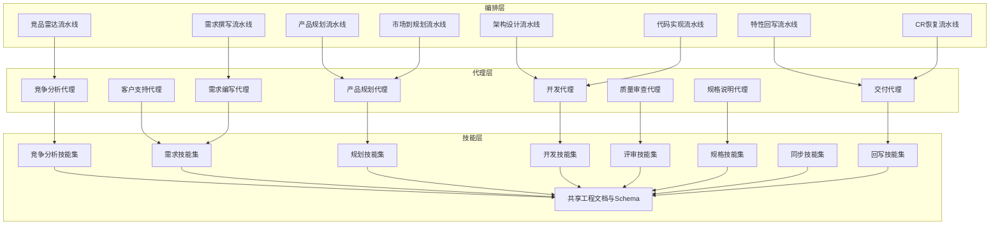
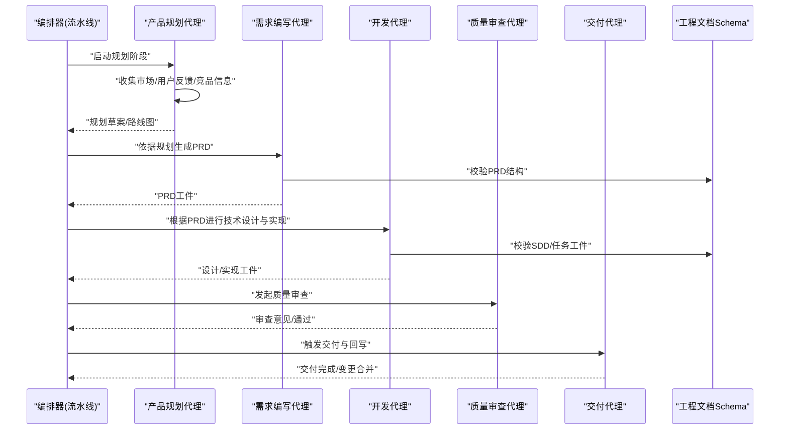
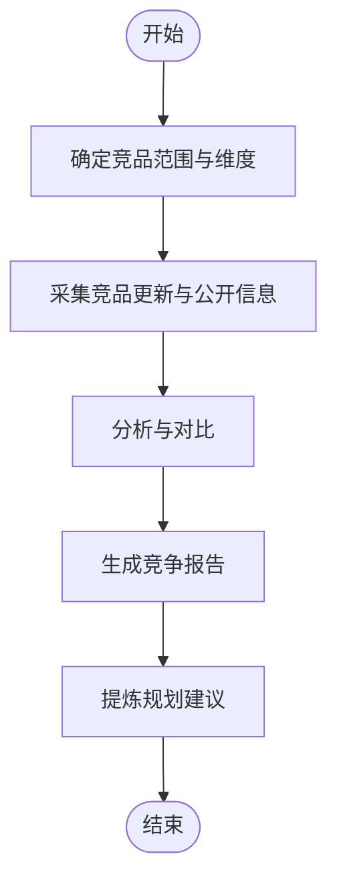
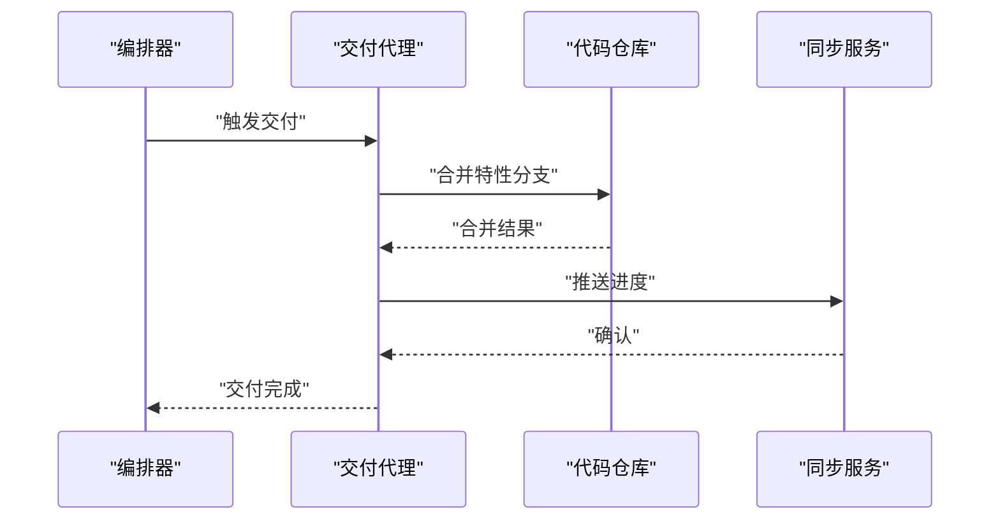
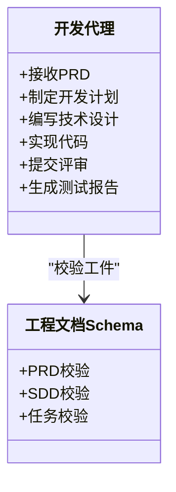
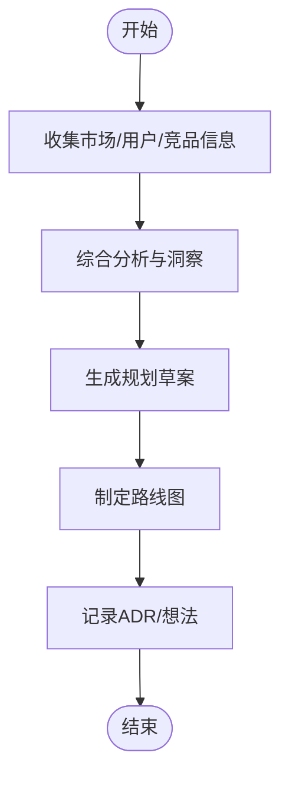
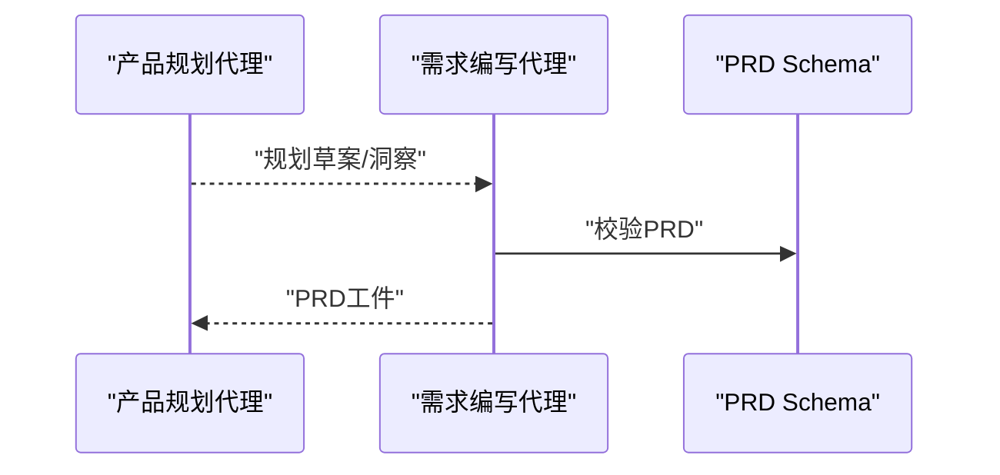
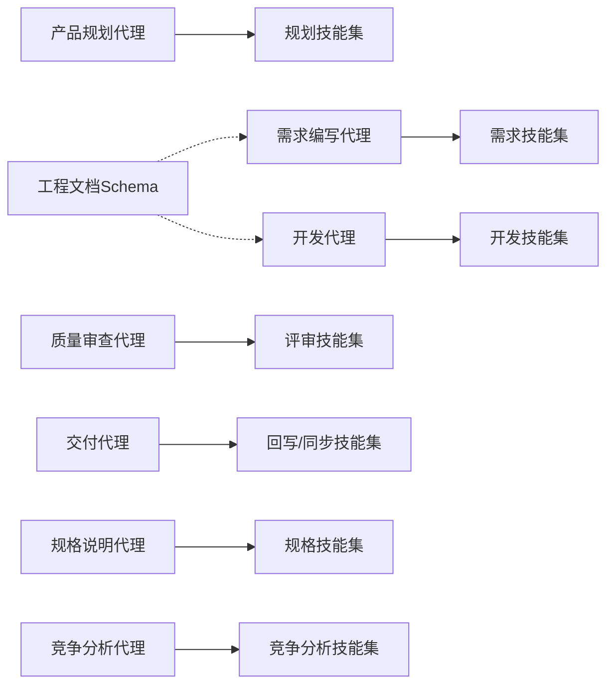

# AI代理(Agent)系统

<cite>
**本文引用的文件**   
- [agents/_index.yml](file://agents/_index.yml)
- [agents/competitive-analyst-agent.md](file://agents/competitive-analyst-agent.md)
- [agents/customer-support-agent.md](file://agents/customer-support-agent.md)
- [agents/delivery-agent.md](file://agents/delivery-agent.md)
- [agents/dev-agent.md](file://agents/dev-agent.md)
- [agents/product-planning-agent.md](file://agents/product-planning-agent.md)
- [agents/quality-reviewer-agent.md](file://agents/quality-reviewer-agent.md)
- [agents/requirement-writer.md](file://agents/requirement-writer.md)
- [agents/spec-agent.md](file://agents/spec-agent.md)
- [AGENT-SKILL-MATRIX.md](file://AGENT-SKILL-MATRIX.md)
- [agent-skill-matrix.yml](file://agent-skill-matrix.yml)
- [skills/shared/engineering-docs/schemas/common-defs.schema.json](file://skills/shared/engineering-docs/schemas/common-defs.schema.json)
- [skills/shared/engineering-docs/schemas/prd.schema.json](file://skills/shared/engineering-docs/schemas/prd.schema.json)
- [skills/shared/engineering-docs/schemas/sdd.schema.json](file://skills/shared/engineering-docs/schemas/sdd.schema.json)
- [skills/shared/engineering-docs/schemas/task.schema.json](file://skills/shared/engineering-docs/schemas/task.schema.json)
- [pipeline-templates/architecture-design.pipeline.json](file://pipeline-templates/architecture-design.pipeline.json)
- [pipeline-templates/code-implementation.pipeline.json](file://pipeline-templates/code-implementation.pipeline.json)
- [pipeline-templates/competitive-radar.pipeline.json](file://pipeline-templates/competitive-radar.pipeline.json)
- [pipeline-templates/feature-writeback.pipeline.json](file://pipeline-templates/feature-writeback.pipeline.json)
- [pipeline-templates/market-to-plan.pipeline.json](file://pipeline-templates/market-to-plan.pipeline.json)
- [pipeline-templates/product-planning.pipeline.json](file://pipeline-templates/product-planning.pipeline.json)
- [pipeline-templates/requirement-authoring.pipeline.json](file://pipeline-templates/requirement-authoring.pipeline.json)
- [pipeline-templates/resume-cr.pipeline.json](file://pipeline-templates/resume-cr.pipeline.json)
</cite>

## 目录
1. [简介](#简介)
2. [项目结构](#项目结构)
3. [核心组件](#核心组件)
4. [架构总览](#架构总览)
5. [详细组件分析](#详细组件分析)
6. [依赖分析](#依赖分析)
7. [性能考虑](#性能考虑)
8. [故障排查指南](#故障排查指南)
9. [结论](#结论)
10. [附录](#附录)

## 简介
本文件面向AI代理（Agent）系统的产品与工程读者，系统化阐述Agent的概念、设计模式、架构原理、生命周期管理、能力边界与行为模式；并对8个内置Agent的职责分工与协作机制进行说明。同时提供配置结构、参数定义、执行上下文、自定义开发指南、以及Agent间通信协议与数据交换格式的总体规范。文档以仓库中的Agent描述、技能矩阵、流水线模板与工程文档Schema为依据，确保内容可追溯、可落地。

## 项目结构
仓库围绕“Agent + Skills + Pipelines + Engineering Docs”的体系组织：
- agents：各Agent的角色定义、职责、输入输出与约束
- skills：按领域划分的可复用技能集合（竞争分析、需求、规划、开发、评审、规格、同步、回写等），每个技能包含SKILL.md说明与可选工具脚本
- pipeline-templates：端到端流程编排模板，将多个Agent与技能串联为可复用的工作流
- shared/engineering-docs：工程文档标准、模板与Schema，用于统一PRD/SDD/任务等工件的结构与校验

图表来源
- [agents/_index.yml](file://agents/_index.yml)
- [pipeline-templates/product-planning.pipeline.json](file://pipeline-templates/product-planning.pipeline.json)
- [pipeline-templates/requirement-authoring.pipeline.json](file://pipeline-templates/requirement-authoring.pipeline.json)
- [pipeline-templates/architecture-design.pipeline.json](file://pipeline-templates/architecture-design.pipeline.json)
- [pipeline-templates/code-implementation.pipeline.json](file://pipeline-templates/code-implementation.pipeline.json)
- [pipeline-templates/competitive-radar.pipeline.json](file://pipeline-templates/competitive-radar.pipeline.json)
- [pipeline-templates/feature-writeback.pipeline.json](file://pipeline-templates/feature-writeback.pipeline.json)
- [pipeline-templates/market-to-plan.pipeline.json](file://pipeline-templates/market-to-plan.pipeline.json)
- [pipeline-templates/resume-cr.pipeline.json](file://pipeline-templates/resume-cr.pipeline.json)

章节来源
- [agents/_index.yml](file://agents/_index.yml)
- [AGENT-SKILL-MATRIX.md](file://AGENT-SKILL-MATRIX.md)
- [agent-skill-matrix.yml](file://agent-skill-matrix.yml)

## 核心组件
本节聚焦于Agent的定义、生命周期、能力边界与行为模式，并给出通用配置结构与执行上下文约定。

- Agent概念与角色
  - Agent是具备明确职责、输入输出契约、可用技能与约束条件的智能体单元。它通过调用技能完成具体任务，并在流水线中被编排协同。
- 生命周期管理
  - 初始化：加载配置、解析上下文、注册可用技能与工具
  - 准备：校验输入、构建执行环境、拉取必要上下文
  - 执行：按策略调度技能、处理中间结果、记录审计日志
  - 收尾：产出工件、更新状态、触发下游或回写
  - 清理：释放资源、归档产物、上报指标
- 能力边界与行为模式
  - 只读/读写分离：部分Agent仅读取外部信息（如竞争情报），部分负责写入（如回写任务）
  - 幂等与重试：对关键操作支持幂等键与重试策略
  - 可观测性：结构化日志、指标上报、错误分类
- 通用配置结构（字段语义）
  - id/name：唯一标识与显示名
  - role/capabilities：角色标签与能力清单
  - inputs/outputs：输入输出契约（类型、必填、示例路径）
  - skills：可调用的技能列表及参数映射
  - context：执行上下文（目标仓库、分支、用户、时间窗口）
  - policy：超时、重试、并发、熔断、审计开关
  - schema：输入/输出校验规则引用
- 执行上下文约定
  - 运行环境：工作区、临时目录、缓存目录
  - 身份与权限：访问令牌、作用域、最小权限原则
  - 追踪ID：贯穿流水线的trace_id，便于跨Agent链路追踪

章节来源
- [agents/_index.yml](file://agents/_index.yml)
- [agent-skill-matrix.yml](file://agent-skill-matrix.yml)

## 架构总览
系统采用“Agent-技能-流水线-工件”的分层架构：
- Agent层：定义角色与职责，组合技能完成业务目标
- 技能层：封装原子能力（查询、生成、校验、回写等），可被多Agent复用
- 流水线层：将多个Agent与技能编排为端到端流程，驱动工件流转
- 工件层：基于工程文档Schema的标准化产物（PRD、SDD、任务等）

图表来源
- [pipeline-templates/product-planning.pipeline.json](file://pipeline-templates/product-planning.pipeline.json)
- [pipeline-templates/requirement-authoring.pipeline.json](file://pipeline-templates/requirement-authoring.pipeline.json)
- [pipeline-templates/architecture-design.pipeline.json](file://pipeline-templates/architecture-design.pipeline.json)
- [pipeline-templates/code-implementation.pipeline.json](file://pipeline-templates/code-implementation.pipeline.json)
- [pipeline-templates/feature-writeback.pipeline.json](file://pipeline-templates/feature-writeback.pipeline.json)
- [skills/shared/engineering-docs/schemas/prd.schema.json](file://skills/shared/engineering-docs/schemas/prd.schema.json)
- [skills/shared/engineering-docs/schemas/sdd.schema.json](file://skills/shared/engineering-docs/schemas/sdd.schema.json)
- [skills/shared/engineering-docs/schemas/task.schema.json](file://skills/shared/engineering-docs/schemas/task.schema.json)

## 详细组件分析

### 竞争分析代理
- 职责与边界
  - 负责采集与分析竞品动态、功能对比与市场信号，输出竞争报告与建议，供规划与决策使用
- 典型输入/输出
  - 输入：竞品范围、时间窗口、关注维度
  - 输出：竞争分析报告、洞察摘要、建议条目
- 关键技能
  - 抓取竞品更新、撰写竞争报告、向规划建议转化
- 协作关系
  - 为产品规划代理提供输入；在竞品雷达流水线中作为核心节点

图表来源
- [agents/competitive-analyst-agent.md](file://agents/competitive-analyst-agent.md)
- [pipeline-templates/competitive-radar.pipeline.json](file://pipeline-templates/competitive-radar.pipeline.json)
- [skills/competitive/fetch-competitor-updates/SKILL.md](file://skills/competitive/fetch-competitor-updates/SKILL.md)
- [skills/competitive/write-competitive-report/SKILL.md](file://skills/competitive/write-competitive-report/SKILL.md)
- [skills/competitive/report-to-planning-suggestion/](file://skills/competitive/report-to-planning-suggestion/)

章节来源
- [agents/competitive-analyst-agent.md](file://agents/competitive-analyst-agent.md)
- [pipeline-templates/competitive-radar.pipeline.json](file://pipeline-templates/competitive-radar.pipeline.json)

### 客户支持代理
- 职责与边界
  - 面向用户问题与反馈，进行归类、解答与转交，沉淀知识库与常见问题
- 典型输入/输出
  - 输入：用户问题、历史对话、工单上下文
  - 输出：解决方案、升级建议、知识条目
- 关键技能
  - 工单查询、状态设置、收件箱处理、反馈回写
- 协作关系
  - 与需求编写代理联动，将高频问题转化为需求线索

章节来源
- [agents/customer-support-agent.md](file://agents/customer-support-agent.md)
- [skills/cr/inbox-emit/SKILL.md](file://skills/cr/inbox-emit/SKILL.md)
- [skills/cr/cr-status-set/](file://skills/cr/cr-status-set/)
- [skills/cr/feedback-writeback/SKILL.md](file://skills/cr/feedback-writeback/SKILL.md)

### 交付代理
- 职责与边界
  - 负责版本发布、分支合并、进度同步与远程恢复，保障交付闭环
- 典型输入/输出
  - 输入：待发布工件、合并策略、同步目标
  - 输出：发布记录、合并结果、进度快照
- 关键技能
  - 推送进度、拉取进度、从远端恢复、合并特性分支
- 协作关系
  - 承接开发与审查通过的工件，执行回写与发布

图表来源
- [agents/delivery-agent.md](file://agents/delivery-agent.md)
- [pipeline-templates/feature-writeback.pipeline.json](file://pipeline-templates/feature-writeback.pipeline.json)
- [skills/sync/push-progress/SKILL.md](file://skills/sync/push-progress/SKILL.md)
- [skills/sync/pull-progress/SKILL.md](file://skills/sync/pull-progress/SKILL.md)
- [skills/sync/resume-from-remote/SKILL.md](file://skills/sync/resume-from-remote/SKILL.md)
- [skills/writeback/merge-feature-branch/SKILL.md](file://skills/writeback/merge-feature-branch/SKILL.md)

章节来源
- [agents/delivery-agent.md](file://agents/delivery-agent.md)
- [pipeline-templates/feature-writeback.pipeline.json](file://pipeline-templates/feature-writeback.pipeline.json)

### 开发代理
- 职责与边界
  - 负责技术设计、任务拆解、代码实现与测试报告，遵循工程文档规范
- 典型输入/输出
  - 输入：PRD、设计约束、任务清单
  - 输出：技术设计(SDD)、任务工件、实现代码、测试报告
- 关键技能
  - 编写技术设计、制定开发计划、实现代码、代码与设计评审、编写测试报告
- 协作关系
  - 接收需求编写代理的PRD，输出SDD与实现工件，接受质量审查

图表来源
- [agents/dev-agent.md](file://agents/dev-agent.md)
- [pipeline-templates/architecture-design.pipeline.json](file://pipeline-templates/architecture-design.pipeline.json)
- [pipeline-templates/code-implementation.pipeline.json](file://pipeline-templates/code-implementation.pipeline.json)
- [skills/shared/engineering-docs/schemas/prd.schema.json](file://skills/shared/engineering-docs/schemas/prd.schema.json)
- [skills/shared/engineering-docs/schemas/sdd.schema.json](file://skills/shared/engineering-docs/schemas/sdd.schema.json)
- [skills/shared/engineering-docs/schemas/task.schema.json](file://skills/shared/engineering-docs/schemas/task.schema.json)

章节来源
- [agents/dev-agent.md](file://agents/dev-agent.md)
- [pipeline-templates/architecture-design.pipeline.json](file://pipeline-templates/architecture-design.pipeline.json)
- [pipeline-templates/code-implementation.pipeline.json](file://pipeline-templates/code-implementation.pipeline.json)

### 产品规划代理
- 职责与边界
  - 整合市场研究、用户反馈与竞品分析，形成产品规划、路线图与决策建议
- 典型输入/输出
  - 输入：市场洞察、用户反馈、竞品报告
  - 输出：规划草案、路线图、ADR/想法记录
- 关键技能
  - 市场分析、洞察提取、规划草稿、路线图编写、记录ADR/想法
- 协作关系
  - 驱动需求编写代理，并为竞争分析代理提供关注点

图表来源
- [agents/product-planning-agent.md](file://agents/product-planning-agent.md)
- [pipeline-templates/product-planning.pipeline.json](file://pipeline-templates/product-planning.pipeline.json)
- [pipeline-templates/market-to-plan.pipeline.json](file://pipeline-templates/market-to-plan.pipeline.json)
- [skills/planning/conduct-market-research/SKILL.md](file://skills/planning/conduct-market-research/SKILL.md)
- [skills/planning/extract-market-insight/SKILL.md](file://skills/planning/extract-market-insight/SKILL.md)
- [skills/planning/write-roadmap/SKILL.md](file://skills/planning/write-roadmap/SKILL.md)
- [skills/planning/record-adr/SKILL.md](file://skills/planning/record-adr/SKILL.md)
- [skills/planning/record-idea/SKILL.md](file://skills/planning/record-idea/SKILL.md)

章节来源
- [agents/product-planning-agent.md](file://agents/product-planning-agent.md)
- [pipeline-templates/product-planning.pipeline.json](file://pipeline-templates/product-planning.pipeline.json)
- [pipeline-templates/market-to-plan.pipeline.json](file://pipeline-templates/market-to-plan.pipeline.json)

### 质量审查代理
- 职责与边界
  - 对设计、实现与需求进行一致性、合规性与影响面审查，输出审查意见与通过结论
- 典型输入/输出
  - 输入：PRD/SDD/任务/代码变更
  - 输出：审查报告、对齐度评估、变更影响分析
- 关键技能
  - 一致性审查、变更影响分析
- 协作关系
  - 在开发完成后介入，为交付代理放行提供依据

章节来源
- [agents/quality-reviewer-agent.md](file://agents/quality-reviewer-agent.md)
- [skills/review/review-alignment/SKILL.md](file://skills/review/review-alignment/SKILL.md)
- [skills/review/change-impact-analysis/SKILL.md](file://skills/review/change-impact-analysis/SKILL.md)

### 需求编写代理
- 职责与边界
  - 将规划与洞察转化为结构化PRD，遵循工程文档Schema，确保可评审与可实施
- 典型输入/输出
  - 输入：规划草案、洞察摘要、用户反馈
  - 输出：PRD工件、需求登记、评审意见处理
- 关键技能
  - 需求登记、撰写PRD、需求评审
- 协作关系
  - 接收产品规划代理的输出，驱动开发代理的技术设计与实现

图表来源
- [agents/requirement-writer.md](file://agents/requirement-writer.md)
- [pipeline-templates/requirement-authoring.pipeline.json](file://pipeline-templates/requirement-authoring.pipeline.json)
- [skills/requirement/requirement-register/SKILL.md](file://skills/requirement/requirement-register/SKILL.md)
- [skills/requirement/write-requirement-prd/SKILL.md](file://skills/requirement/write-requirement-prd/SKILL.md)
- [skills/requirement/review-requirement/SKILL.md](file://skills/requirement/review-requirement/SKILL.md)
- [skills/shared/engineering-docs/schemas/prd.schema.json](file://skills/shared/engineering-docs/schemas/prd.schema.json)

章节来源
- [agents/requirement-writer.md](file://agents/requirement-writer.md)
- [pipeline-templates/requirement-authoring.pipeline.json](file://pipeline-templates/requirement-authoring.pipeline.json)

### 规格说明代理
- 职责与边界
  - 维护规格说明工件，提供查询与展示能力，支撑跨团队对齐与追溯
- 典型输入/输出
  - 输入：规格条目、关联工件链接
  - 输出：规格看板、规格详情、查询结果
- 关键技能
  - 规格看板、规格查询、规格展示
- 协作关系
  - 与需求与规格文档保持一致，为规划与开发提供权威参考

章节来源
- [agents/spec-agent.md](file://agents/spec-agent.md)
- [skills/spec/spec-dashboard/SKILL.md](file://skills/spec/spec-dashboard/SKILL.md)
- [skills/spec/spec-query/](file://skills/spec/spec-query/)
- [skills/spec/spec-show/SKILL.md](file://skills/spec/spec-show/SKILL.md)

## 依赖分析
- 组件耦合与内聚
  - Agent与技能高内聚低耦合：Agent仅声明所需技能，不直接实现细节
  - 流水线作为编排者，解耦Agent间的时序与条件
- 直接与间接依赖
  - 直接：Agent -> 技能；流水线 -> Agent
  - 间接：流水线 -> 工程文档Schema（通过Agent与技能）
- 外部集成点
  - 代码仓库、同步服务、外部情报源（由技能封装）
- 接口契约
  - 输入/输出工件遵循工程文档Schema，保证跨Agent一致性与可校验性

图表来源
- [agent-skill-matrix.yml](file://agent-skill-matrix.yml)
- [skills/shared/engineering-docs/schemas/common-defs.schema.json](file://skills/shared/engineering-docs/schemas/common-defs.schema.json)
- [skills/shared/engineering-docs/schemas/prd.schema.json](file://skills/shared/engineering-docs/schemas/prd.schema.json)
- [skills/shared/engineering-docs/schemas/sdd.schema.json](file://skills/shared/engineering-docs/schemas/sdd.schema.json)
- [skills/shared/engineering-docs/schemas/task.schema.json](file://skills/shared/engineering-docs/schemas/task.schema.json)

章节来源
- [agent-skill-matrix.yml](file://agent-skill-matrix.yml)
- [AGENT-SKILL-MATRIX.md](file://AGENT-SKILL-MATRIX.md)

## 性能考虑
- 并行与批处理
  - 在流水线中尽可能并行化独立步骤（如多竞品信息采集、多模块设计）
- 缓存与增量
  - 对重复计算（如洞察提取、报告生成）引入缓存与增量更新
- 限流与熔断
  - 对外部API调用增加限流与熔断，避免雪崩
- 工件体积控制
  - 对大型工件进行分片与按需加载，减少传输与存储开销
- 可观测性
  - 全链路追踪与指标上报，定位瓶颈与异常

[本节为通用指导，无需特定文件来源]

## 故障排查指南
- 常见错误与定位
  - 输入校验失败：检查PRD/SDD/任务是否符合Schema
  - 技能执行超时：查看技能日志与外部依赖健康状态
  - 流水线中断：核对编排器状态与上游工件完整性
- 诊断要点
  - 使用trace_id跨Agent追踪
  - 检查权限与作用域是否满足最小权限
  - 验证工作区与缓存目录权限
- 恢复策略
  - 利用恢复流水线从远端断点继续
  - 对幂等操作进行重试与去重

章节来源
- [pipeline-templates/resume-cr.pipeline.json](file://pipeline-templates/resume-cr.pipeline.json)
- [skills/shared/engineering-docs/schemas/common-defs.schema.json](file://skills/shared/engineering-docs/schemas/common-defs.schema.json)

## 结论
本系统以Agent为核心，结合技能与流水线，构建了从洞察到交付的端到端闭环。通过统一的工程文档Schema与清晰的职责划分，实现了高内聚、低耦合的可扩展架构。建议在后续迭代中持续完善可观测性、性能优化与自动化测试，以提升整体稳定性与效率。

[本节为总结，无需特定文件来源]

## 附录

### Agent自定义开发指南
- 能力扩展
  - 新增技能：在对应领域下创建SKILL.md，定义输入输出、执行步骤与依赖
  - 注册能力：在技能矩阵中登记新技能，确保Agent可发现与编排
- 行为定制
  - 调整策略：在Agent配置中设定超时、重试、并发与审计开关
  - 上下文注入：为Agent注入必要的身份、仓库与时间窗口
- 集成方式
  - 流水线编排：在相应pipeline模板中添加步骤，绑定Agent与技能
  - 工件对接：确保输入/输出符合工程文档Schema，启用校验

章节来源
- [agent-skill-matrix.yml](file://agent-skill-matrix.yml)
- [pipeline-templates/product-planning.pipeline.json](file://pipeline-templates/product-planning.pipeline.json)
- [pipeline-templates/requirement-authoring.pipeline.json](file://pipeline-templates/requirement-authoring.pipeline.json)
- [pipeline-templates/architecture-design.pipeline.json](file://pipeline-templates/architecture-design.pipeline.json)
- [pipeline-templates/code-implementation.pipeline.json](file://pipeline-templates/code-implementation.pipeline.json)
- [pipeline-templates/feature-writeback.pipeline.json](file://pipeline-templates/feature-writeback.pipeline.json)
- [pipeline-templates/competitive-radar.pipeline.json](file://pipeline-templates/competitive-radar.pipeline.json)
- [pipeline-templates/market-to-plan.pipeline.json](file://pipeline-templates/market-to-plan.pipeline.json)
- [pipeline-templates/resume-cr.pipeline.json](file://pipeline-templates/resume-cr.pipeline.json)

### Agent间通信协议与数据交换格式
- 通信协议
  - 事件驱动：流水线通过事件触发Agent执行
  - 请求-响应：Agent返回结构化结果供下游消费
- 数据交换格式
  - 工件：遵循工程文档Schema（PRD/SDD/任务等）
  - 元数据：包含trace_id、版本、时间戳、作者、来源
- 校验与契约
  - 所有工件在入队前进行Schema校验
  - 失败时返回错误码与修复建议

章节来源
- [skills/shared/engineering-docs/schemas/prd.schema.json](file://skills/shared/engineering-docs/schemas/prd.schema.json)
- [skills/shared/engineering-docs/schemas/sdd.schema.json](file://skills/shared/engineering-docs/schemas/sdd.schema.json)
- [skills/shared/engineering-docs/schemas/task.schema.json](file://skills/shared/engineering-docs/schemas/task.schema.json)
- [skills/shared/engineering-docs/schemas/common-defs.schema.json](file://skills/shared/engineering-docs/schemas/common-defs.schema.json)