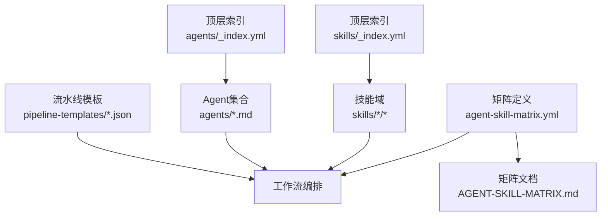
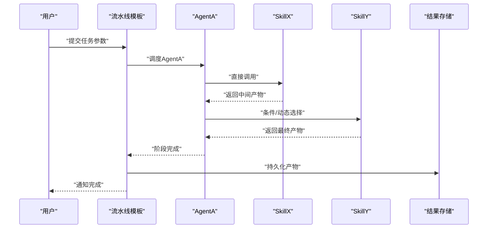
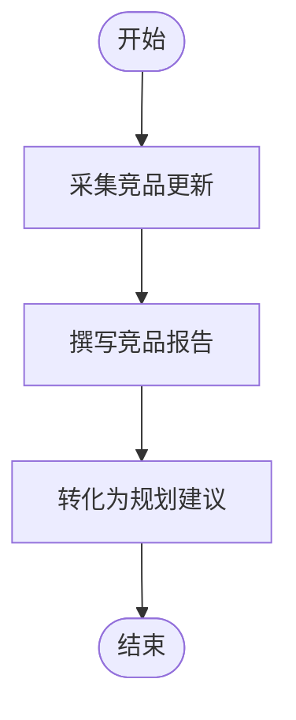
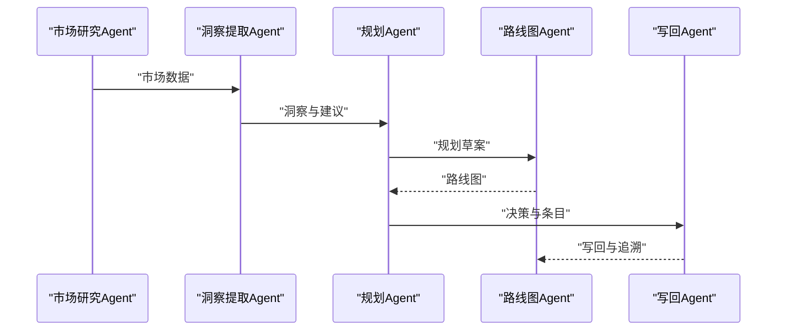
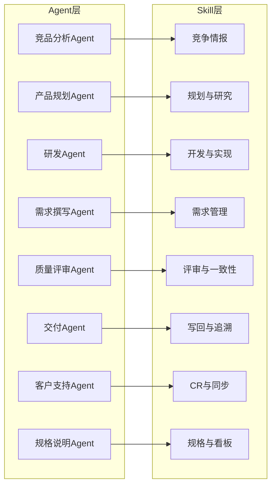

# Agent-Skill映射关系

<cite>
**本文引用的文件**   
- [AGENT-SKILL-MATRIX.md](file://AGENT-SKILL-MATRIX.md)
- [agent-skill-matrix.yml](file://agent-skill-matrix.yml)
- [AGENTS.md](file://AGENTS.md)
- [agents/_index.yml](file://agents/_index.yml)
- [skills/_index.yml](file://skills/_index.yml)
- [skills/reviewer-panel.yaml](file://skills/reviewer-panel.yaml)
- [pipeline-templates/README.md](file://pipeline-templates/README.md)
- [pipeline-templates/product-planning.pipeline.json](file://pipeline-templates/product-planning.pipeline.json)
- [pipeline-templates/code-implementation.pipeline.json](file://pipeline-templates/code-implementation.pipeline.json)
- [pipeline-templates/requirement-authoring.pipeline.json](file://pipeline-templates/requirement-authoring.pipeline.json)
- [pipeline-templates/architecture-design.pipeline.json](file://pipeline-templates/architecture-design.pipeline.json)
- [pipeline-templates/market-to-plan.pipeline.json](file://pipeline-templates/market-to-plan.pipeline.json)
- [pipeline-templates/competitive-radar.pipeline.json](file://pipeline-templates/competitive-radar.pipeline.json)
- [pipeline-templates/feature-writeback.pipeline.json](file://pipeline-templates/feature-writeback.pipeline.json)
- [pipeline-templates/resume-cr.pipeline.json](file://pipeline-templates/resume-cr.pipeline.json)
- [agents/competitive-analyst-agent.md](file://agents/competitive-analyst-agent.md)
- [agents/customer-support-agent.md](file://agents/customer-support-agent.md)
- [agents/delivery-agent.md](file://agents/delivery-agent.md)
- [agents/dev-agent.md](file://agents/dev-agent.md)
- [agents/product-planning-agent.md](file://agents/product-planning-agent.md)
- [agents/quality-reviewer-agent.md](file://agents/quality-reviewer-agent.md)
- [agents/requirement-writer.md](file://agents/requirement-writer.md)
- [agents/spec-agent.md](file://agents/spec-agent.md)
</cite>

## 目录
1. [简介](#简介)
2. [项目结构](#项目结构)
3. [核心组件](#核心组件)
4. [架构总览](#架构总览)
5. [详细组件分析](#详细组件分析)
6. [依赖分析](#依赖分析)
7. [性能考虑](#性能考虑)
8. [故障排查指南](#故障排查指南)
9. [结论](#结论)
10. [附录](#附录)

## 简介
本文件系统化阐述Agent与Skill的映射关系，覆盖设计理念、组织原则、调用与组合方式、配置结构与扩展机制、动态协作模式、维护优化最佳实践，以及实际协作示例与故障排查。目标是帮助读者快速理解“谁（Agent）在何时以何种方式使用哪些能力（Skill）”，并据此进行扩展与维护。

## 项目结构
仓库采用“按领域分层的技能库 + 按角色定义的Agent + 可编排的流水线模板”的组织方式：
- agents：定义各类Agent的职责、目标与可用能力范围
- skills：按领域划分的具体可复用能力单元，每个Skill包含说明文档与必要资源
- pipeline-templates：将多个Agent与Skill组合为端到端工作流的模板
- 顶层矩阵与索引：提供全局视角的映射关系与导航入口

图表来源
- [agents/_index.yml:1-200](file://agents/_index.yml#L1-L200)
- [skills/_index.yml:1-200](file://skills/_index.yml#L1-L200)
- [agent-skill-matrix.yml:1-200](file://agent-skill-matrix.yml#L1-L200)
- [AGENT-SKILL-MATRIX.md:1-200](file://AGENT-SKILL-MATRIX.md#L1-L200)
- [pipeline-templates/README.md:1-200](file://pipeline-templates/README.md#L1-L200)

章节来源
- [agents/_index.yml:1-200](file://agents/_index.yml#L1-L200)
- [skills/_index.yml:1-200](file://skills/_index.yml#L1-L200)
- [agent-skill-matrix.yml:1-200](file://agent-skill-matrix.yml#L1-L200)
- [AGENT-SKILL-MATRIX.md:1-200](file://AGENT-SKILL-MATRIX.md#L1-L200)
- [pipeline-templates/README.md:1-200](file://pipeline-templates/README.md#L1-L200)

## 核心组件
- Agent：面向角色的任务执行主体，具备明确的目标、边界与职责描述，通常通过声明式方式绑定到一组Skill或Pipeline阶段。
- Skill：最小可复用的能力单元，围绕特定领域（如规划、开发、需求、评审、同步、写回等）封装输入输出契约、工具与环境约束。
- 映射矩阵：集中描述“Agent ↔ Skill”的直接调用、间接依赖与动态选择规则，并提供版本兼容性与优先级策略。
- 流水线模板：将多个Agent与Skill串联为端到端流程，支持条件分支、并行与重试等编排语义。

章节来源
- [AGENTS.md:1-200](file://AGENTS.md#L1-L200)
- [agent-skill-matrix.yml:1-200](file://agent-skill-matrix.yml#L1-L200)
- [AGENT-SKILL-MATRIX.md:1-200](file://AGENT-SKILL-MATRIX.md#L1-L200)
- [pipeline-templates/README.md:1-200](file://pipeline-templates/README.md#L1-L200)

## 架构总览
下图展示从“用户触发”到“流水线执行”的整体数据与控制流，体现Agent与Skill在端到端工作流中的协作关系。

图表来源
- [pipeline-templates/product-planning.pipeline.json:1-200](file://pipeline-templates/product-planning.pipeline.json#L1-L200)
- [pipeline-templates/code-implementation.pipeline.json:1-200](file://pipeline-templates/code-implementation.pipeline.json#L1-L200)
- [pipeline-templates/requirement-authoring.pipeline.json:1-200](file://pipeline-templates/requirement-authoring.pipeline.json#L1-L200)

## 详细组件分析

### 设计原则与组织方式
- 单一职责：每个Skill聚焦一个明确的子任务，输入输出清晰，便于替换与升级。
- 显式契约：Skill的输入/输出、前置条件、错误码与幂等性在文档中约定，降低耦合。
- 分层解耦：Agent仅声明“需要哪些能力”，不关心具体实现细节；Skill对上层透明。
- 可编排：通过流水线模板将多Agent、多Skill组合为复杂工作流，支持条件与并发。
- 可观测：关键节点产出与状态可追踪，便于定位问题与性能分析。

章节来源
- [AGENT-SKILL-MATRIX.md:1-200](file://AGENT-SKILL-MATRIX.md#L1-L200)
- [skills/_index.yml:1-200](file://skills/_index.yml#L1-L200)

### 映射矩阵结构与语义
- 维度
  - Agent标识：唯一键，对应agents下的具体Agent定义
  - Skill标识：唯一键，对应skills下的具体Skill目录
  - 关系类型：直接调用、间接依赖、动态选择
  - 版本约束：兼容范围、弃用策略、迁移指引
  - 优先级与条件：当存在多个候选Skill时的选择依据
- 语义
  - 直接调用：Agent在执行其职责时显式调用该Skill
  - 间接依赖：由上游Agent或流水线阶段引入的隐式依赖
  - 动态选择：根据上下文（如产品阶段、环境、输入特征）运行时选择不同Skill实现

章节来源
- [agent-skill-matrix.yml:1-200](file://agent-skill-matrix.yml#L1-L200)
- [AGENT-SKILL-MATRIX.md:1-200](file://AGENT-SKILL-MATRIX.md#L1-L200)

### 典型Agent与其Skill映射

#### 竞品分析Agent
- 核心能力
  - 采集竞品动态、生成分析报告、向规划建议反馈
- 主要Skill
  - 获取竞品更新、撰写竞品报告、将报告转化为规划建议
- 调用模式
  - 直接调用：数据采集与报告生成
  - 间接依赖：共享工程文档规范、校验器
  - 动态选择：根据竞品数量与来源选择不同抓取策略

图表来源
- [agents/competitive-analyst-agent.md:1-200](file://agents/competitive-analyst-agent.md#L1-L200)
- [skills/competitive/fetch-competitor-updates/SKILL.md:1-200](file://skills/competitive/fetch-competitor-updates/SKILL.md#L1-L200)
- [skills/competitive/write-competitive-report/SKILL.md:1-200](file://skills/competitive/write-competitive-report/SKILL.md#L1-L200)
- [skills/competitive/report-to-planning-suggestion:1-200](file://skills/competitive/report-to-planning-suggestion#L1-L200)

章节来源
- [agents/competitive-analyst-agent.md:1-200](file://agents/competitive-analyst-agent.md#L1-L200)
- [skills/competitive/fetch-competitor-updates/SKILL.md:1-200](file://skills/competitive/fetch-competitor-updates/SKILL.md#L1-L200)
- [skills/competitive/write-competitive-report/SKILL.md:1-200](file://skills/competitive/write-competitive-report/SKILL.md#L1-L200)
- [skills/competitive/report-to-planning-suggestion:1-200](file://skills/competitive/report-to-planning-suggestion#L1-L200)

#### 客户支持Agent
- 核心能力
  - 工单处理、知识库检索、常见问题解答、升级路由
- 主要Skill
  - 查询与归档工单、写入反馈、拉取进度、恢复会话
- 调用模式
  - 直接调用：CR查询、归档、反馈写回
  - 间接依赖：共享文档标准、校验器
  - 动态选择：根据问题类别与SLA选择不同处理路径

章节来源
- [agents/customer-support-agent.md:1-200](file://agents/customer-support-agent.md#L1-L200)
- [skills/cr/cr-query/SKILL.md:1-200](file://skills/cr/cr-query/SKILL.md#L1-L200)
- [skills/cr/cr-archive/SKILL.md:1-200](file://skills/cr/cr-archive/SKILL.md#L1-L200)
- [skills/cr/feedback-writeback/SKILL.md:1-200](file://skills/cr/feedback-writeback/SKILL.md#L1-L200)
- [skills/sync/pull-progress/SKILL.md:1-200](file://skills/sync/pull-progress/SKILL.md#L1-L200)
- [skills/sync/resume-from-remote/SKILL.md:1-200](file://skills/sync/resume-from-remote/SKILL.md#L1-L200)

#### 交付Agent
- 核心能力
  - 合并特性分支、写回PRD/SDD、任务写回、追溯信息写回
- 主要Skill
  - 合并分支、写回PRD/SDD、写回任务、写回追溯
- 调用模式
  - 直接调用：写回类Skill
  - 间接依赖：工程文档标准、命名与链式校验
  - 动态选择：根据变更范围与合规要求选择不同写回策略

章节来源
- [agents/delivery-agent.md:1-200](file://agents/delivery-agent.md#L1-L200)
- [skills/writeback/merge-feature-branch/SKILL.md:1-200](file://skills/writeback/merge-feature-branch/SKILL.md#L1-L200)
- [skills/writeback/writeback-prd-sdd/SKILL.md:1-200](file://skills/writeback/writeback-prd-sdd/SKILL.md#L1-L200)
- [skills/writeback/writeback-tasks/SKILL.md:1-200](file://skills/writeback/writeback-tasks/SKILL.md#L1-L200)
- [skills/writeback/writeback-traceability/SKILL.md:1-200](file://skills/writeback/writeback-traceability/SKILL.md#L1-L200)

#### 研发Agent
- 核心能力
  - 编写技术方案、实现代码、代码审查、测试报告、任务拆解
- 主要Skill
  - 技术设计、代码实现、代码审查、测试报告、开发计划、任务拆解、审批流程
- 调用模式
  - 直接调用：设计与实现相关Skill
  - 间接依赖：工程文档标准、命名规范、校验器
  - 动态选择：根据复杂度与风险等级选择不同审查与实现策略

章节来源
- [agents/dev-agent.md:1-200](file://agents/dev-agent.md#L1-L200)
- [skills/develop/write-tech-design/SKILL.md:1-200](file://skills/develop/write-tech-design/SKILL.md#L1-L200)
- [skills/develop/implement-code/SKILL.md:1-200](file://skills/develop/implement-code/SKILL.md#L1-L200)
- [skills/develop/review-code/SKILL.md:1-200](file://skills/develop/review-code/SKILL.md#L1-L200)
- [skills/develop/write-test-report/SKILL.md:1-200](file://skills/develop/write-test-report/SKILL.md#L1-L200)
- [skills/develop/write-dev-plan/SKILL.md:1-200](file://skills/develop/write-dev-plan/SKILL.md#L1-L200)
- [skills/develop/write-dev-tasks/SKILL.md:1-200](file://skills/develop/write-dev-tasks/SKILL.md#L1-L200)
- [skills/develop/approve-code/SKILL.md:1-200](file://skills/develop/approve-code/SKILL.md#L1-L200)
- [skills/develop/approve-dev-start/SKILL.md:1-200](file://skills/develop/approve-dev-start/SKILL.md#L1-L200)
- [skills/develop/approve-tech-design/SKILL.md:1-200](file://skills/develop/approve-tech-design/SKILL.md#L1-L200)

#### 产品规划Agent
- 核心能力
  - 市场研究、洞察提取、当前产品分析、用户反馈分析、路线图制定
- 主要Skill
  - 市场研究、洞察提取、当前产品分析、用户反馈分析、规划草案、规划报告、路线图
- 调用模式
  - 直接调用：研究与规划类Skill
  - 间接依赖：工程文档标准、ADR记录、创意记录
  - 动态选择：根据业务阶段与市场信号选择不同分析方法

章节来源
- [agents/product-planning-agent.md:1-200](file://agents/product-planning-agent.md#L1-L200)
- [skills/planning/conduct-market-research/SKILL.md:1-200](file://skills/planning/conduct-market-research/SKILL.md#L1-L200)
- [skills/planning/extract-market-insight/SKILL.md:1-200](file://skills/planning/extract-market-insight/SKILL.md#L1-L200)
- [skills/planning/analyze-current-product/SKILL.md:1-200](file://skills/planning/analyze-current-product/SKILL.md#L1-L200)
- [skills/planning/analyze-user-feedback/SKILL.md:1-200](file://skills/planning/analyze-user-feedback/SKILL.md#L1-L200)
- [skills/planning/planning-draft/SKILL.md:1-200](file://skills/planning/planning-draft/SKILL.md#L1-L200)
- [skills/planning/write-planning-report/SKILL.md:1-200](file://skills/planning/write-planning-report/SKILL.md#L1-L200)
- [skills/planning/write-roadmap/SKILL.md:1-200](file://skills/planning/write-roadmap/SKILL.md#L1-L200)
- [skills/planning/record-adr/SKILL.md:1-200](file://skills/planning/record-adr/SKILL.md#L1-L200)
- [skills/planning/record-idea/SKILL.md:1-200](file://skills/planning/record-idea/SKILL.md#L1-L200)

#### 质量评审Agent
- 核心能力
  - 一致性评审、变更影响分析、对齐度检查
- 主要Skill
  - 变更影响分析、一致性评审
- 调用模式
  - 直接调用：评审与分析类Skill
  - 间接依赖：工程文档标准、命名与链式校验
  - 动态选择：根据变更规模与风险选择不同评审深度

章节来源
- [agents/quality-reviewer-agent.md:1-200](file://agents/quality-reviewer-agent.md#L1-L200)
- [skills/review/change-impact-analysis/SKILL.md:1-200](file://skills/review/change-impact-analysis/SKILL.md#L1-L200)
- [skills/review/review-alignment/SKILL.md:1-200](file://skills/review/review-alignment/SKILL.md#L1-L200)

#### 需求撰写Agent
- 核心能力
  - 需求注册、评审、PRD撰写、审批
- 主要Skill
  - 需求注册、需求评审、PRD撰写、需求审批
- 调用模式
  - 直接调用：需求类Skill
  - 间接依赖：工程文档标准、表单与模块Schema
  - 动态选择：根据需求复杂度与合规要求选择不同评审路径

章节来源
- [agents/requirement-writer.md:1-200](file://agents/requirement-writer.md#L1-L200)
- [skills/requirement/requirement-register/SKILL.md:1-200](file://skills/requirement/requirement-register/SKILL.md#L1-L200)
- [skills/requirement/review-requirement/SKILL.md:1-200](file://skills/requirement/review-requirement/SKILL.md#L1-L200)
- [skills/requirement/write-requirement-prd/SKILL.md:1-200](file://skills/requirement/write-requirement-prd/SKILL.md#L1-L200)
- [skills/requirement/approve-requirement/SKILL.md:1-200](file://skills/requirement/approve-requirement/SKILL.md#L1-L200)

#### 规格说明Agent
- 核心能力
  - 规格查询、展示、看板
- 主要Skill
  - 规格看板、规格查询、规格展示
- 调用模式
  - 直接调用：规格类Skill
  - 间接依赖：工程文档标准、命名与链式校验
  - 动态选择：根据查询粒度与视图偏好选择不同展示策略

章节来源
- [agents/spec-agent.md:1-200](file://agents/spec-agent.md#L1-L200)
- [skills/spec/spec-dashboard/SKILL.md:1-200](file://skills/spec/spec-dashboard/SKILL.md#L1-L200)
- [skills/spec/spec-query/SKILL.md:1-200](file://skills/spec/spec-query/SKILL.md#L1-L200)
- [skills/spec/spec-show/SKILL.md:1-200](file://skills/spec/spec-show/SKILL.md#L1-L200)

### 动态协作与工作流编排
- 端到端产品规划
  - 市场→洞察→规划→路线图，跨多个Agent与Skill协同
- 需求到实现
  - 需求注册→评审→PRD→技术设计→实现→测试→写回
- 竞争情报驱动
  - 竞品监控→报告→规划建议→路线图调整
- 特性写回与追溯
  - 合并分支→写回PRD/SDD→写回任务→写回追溯

图表来源
- [pipeline-templates/market-to-plan.pipeline.json:1-200](file://pipeline-templates/market-to-plan.pipeline.json#L1-L200)
- [pipeline-templates/product-planning.pipeline.json:1-200](file://pipeline-templates/product-planning.pipeline.json#L1-L200)
- [pipeline-templates/feature-writeback.pipeline.json:1-200](file://pipeline-templates/feature-writeback.pipeline.json#L1-L200)

章节来源
- [pipeline-templates/market-to-plan.pipeline.json:1-200](file://pipeline-templates/market-to-plan.pipeline.json#L1-L200)
- [pipeline-templates/product-planning.pipeline.json:1-200](file://pipeline-templates/product-planning.pipeline.json#L1-L200)
- [pipeline-templates/feature-writeback.pipeline.json:1-200](file://pipeline-templates/feature-writeback.pipeline.json#L1-L200)

## 依赖分析
- 组件内聚
  - Agent与Skill之间通过“映射矩阵”与“流水线模板”解耦，降低直接耦合
- 外部依赖
  - 工程文档标准、命名规范、Schema校验、MCP工具注册等共享能力
- 循环依赖
  - 通过“间接依赖”与“动态选择”避免硬编码循环，必要时引入编排层协调
- 接口契约
  - Skill的输入/输出、错误码、幂等性、重试策略需严格约定并在文档中声明

图表来源
- [agent-skill-matrix.yml:1-200](file://agent-skill-matrix.yml#L1-L200)
- [AGENT-SKILL-MATRIX.md:1-200](file://AGENT-SKILL-MATRIX.md#L1-L200)

章节来源
- [agent-skill-matrix.yml:1-200](file://agent-skill-matrix.yml#L1-L200)
- [AGENT-SKILL-MATRIX.md:1-200](file://AGENT-SKILL-MATRIX.md#L1-L200)

## 性能考虑
- 缓存与去重
  - 对重复的数据采集与报告生成引入缓存与增量更新
- 并行与批处理
  - 在流水线模板中启用并行阶段与批量处理，缩短端到端耗时
- 超时与重试
  - 为外部依赖设置合理超时与退避重试，避免雪崩
- 资源隔离
  - 高负载Skill独立运行环境与配额限制，防止相互干扰
- 可观测性
  - 关键指标埋点：吞吐、延迟、错误率、资源占用

[本节为通用指导，无需列出具体文件来源]

## 故障排查指南
- 常见症状
  - 某阶段长时间无响应、产物缺失、校验失败、权限不足、版本不兼容
- 定位步骤
  - 查看流水线日志与阶段产物
  - 核对映射矩阵中Agent与Skill的版本兼容范围
  - 检查Skill输入是否符合Schema与命名规范
  - 确认外部依赖（网络、认证、配额）可用性
- 修复建议
  - 降级到兼容版本、修正输入格式、增加重试与熔断、补充缺失产物
- 预防机制
  - 在流水线中加入预检与断言、引入灰度发布与回滚策略

章节来源
- [skills/shared/engineering-docs/SKILL.md:1-200](file://skills/shared/engineering-docs/SKILL.md#L1-L200)
- [skills/shared/validate-doc/SKILL.md:1-200](file://skills/shared/validate-doc/SKILL.md#L1-L200)
- [skills/reviewer-panel.yaml:1-200](file://skills/reviewer-panel.yaml#L1-L200)

## 结论
通过将Agent职责与Skill能力解耦并以映射矩阵与流水线模板进行编排，系统实现了高内聚、低耦合、可扩展的工作流体系。遵循统一契约与规范，结合动态选择与版本兼容策略，可在保证稳定性的同时持续演进。

[本节为总结性内容，无需列出具体文件来源]

## 附录

### 配置结构与扩展方式
- 新增Agent
  - 在agents下新增Agent定义，明确职责与边界
  - 在映射矩阵中添加Agent与Skill的关系条目，注明关系类型与版本约束
- 新增Skill
  - 在对应领域目录下创建Skill目录与SKILL.md，定义输入/输出、前置条件、错误码
  - 在映射矩阵中登记新Skill，并评估对现有Agent的影响
- 扩展流水线
  - 基于现有模板复制并定制，调整阶段顺序、条件分支与并行策略
- 版本兼容
  - 在映射矩阵中标注兼容范围与弃用时间线，提供迁移指引
- 评审面板
  - 使用reviewer-panel.yaml统一评审入口与规则，确保一致性

章节来源
- [agent-skill-matrix.yml:1-200](file://agent-skill-matrix.yml#L1-L200)
- [AGENT-SKILL-MATRIX.md:1-200](file://AGENT-SKILL-MATRIX.md#L1-L200)
- [skills/reviewer-panel.yaml:1-200](file://skills/reviewer-panel.yaml#L1-L200)

### 实际协作示例
- 产品规划端到端
  - 市场研究→洞察提取→规划草案→规划报告→路线图
- 需求到实现
  - 需求注册→评审→PRD→技术设计→实现→测试→写回
- 竞争情报驱动
  - 竞品监控→报告→规划建议→路线图调整

章节来源
- [pipeline-templates/product-planning.pipeline.json:1-200](file://pipeline-templates/product-planning.pipeline.json#L1-L200)
- [pipeline-templates/requirement-authoring.pipeline.json:1-200](file://pipeline-templates/requirement-authoring.pipeline.json#L1-L200)
- [pipeline-templates/code-implementation.pipeline.json:1-200](file://pipeline-templates/code-implementation.pipeline.json#L1-L200)
- [pipeline-templates/market-to-plan.pipeline.json:1-200](file://pipeline-templates/market-to-plan.pipeline.json#L1-L200)
- [pipeline-templates/feature-writeback.pipeline.json:1-200](file://pipeline-templates/feature-writeback.pipeline.json#L1-L200)