# 技能(Skill)系统

<cite>
**本文引用的文件**   
- [skills/_index.yml](file://skills/_index.yml)
- [agents/_index.yml](file://agents/_index.yml)
- [agent-skill-matrix.yml](file://agent-skill-matrix.yml)
- [AGENT-SKILL-MATRIX.md](file://AGENT-SKILL-MATRIX.md)
- [CLAUDE.MD](file://CLAUDE.MD)
- [dir-graph.yaml](file://dir-graph.yaml)
- [pipeline-templates/README.md](file://pipeline-templates/README.md)
- [pipeline-templates/architecture-design.pipeline.json](file://pipeline-templates/architecture-design.pipeline.json)
- [pipeline-templates/code-implementation.pipeline.json](file://pipeline-templates/code-implementation.pipeline.json)
- [pipeline-templates/competitive-radar.pipeline.json](file://pipeline-templates/competitive-radar.pipeline.json)
- [pipeline-templates/feature-writeback.pipeline.json](file://pipeline-templates/feature-writeback.pipeline.json)
- [pipeline-templates/market-to-plan.pipeline.json](file://pipeline-templates/market-to-plan.pipeline.json)
- [pipeline-templates/product-planning.pipeline.json](file://pipeline-templates/product-planning.pipeline.json)
- [pipeline-templates/requirement-authoring.pipeline.json](file://pipeline-templates/requirement-authoring.pipeline.json)
- [pipeline-templates/resume-cr.pipeline.json](file://pipeline-templates/resume-cr.pipeline.json)
- [skills/shared/engineering-docs/SKILL.md](file://skills/shared/engineering-docs/SKILL.md)
- [skills/shared/engineering-docs/schemas/common-defs.schema.json](file://skills/shared/engineering-docs/schemas/common-defs.schema.json)
- [skills/shared/engineering-docs/schemas/prd.schema.json](file://skills/shared/engineering-docs/schemas/prd.schema.json)
- [skills/shared/engineering-docs/schemas/sdd.schema.json](file://skills/shared/engineering-docs/schemas/sdd.schema.json)
- [skills/shared/engineering-docs/schemas/plan.schema.json](file://skills/shared/engineering-docs/schemas/plan.schema.json)
- [skills/shared/engineering-docs/schemas/task.schema.json](file://skills/shared/engineering-docs/schemas/task.schema.json)
- [skills/shared/engineering-docs/scripts/src/cli.ts](file://skills/shared/engineering-docs/scripts/src/cli.ts)
- [skills/shared/engineering-docs/scripts/src/validators/index-sync.ts](file://skills/shared/engineering-docs/scripts/src/validators/index-sync.ts)
- [skills/shared/engineering-docs/scripts/src/generators/base.ts](file://skills/shared/engineering-docs/scripts/src/generators/base.ts)
- [skills/shared/engineering-docs/scripts/package.json](file://skills/shared/engineering-docs/scripts/package.json)
- [skills/shared/validate-doc/SKILL.md](file://skills/shared/validate-doc/SKILL.md)
- [skills/competitive/fetch-competitor-updates/SKILL.md](file://skills/competitive/fetch-competitor-updates/SKILL.md)
- [skills/competitive/write-competitive-report/SKILL.md](file://skills/competitive/write-competitive-report/SKILL.md)
- [skills/cr/cr-query/SKILL.md](file://skills/cr/cr-query/SKILL.md)
- [skills/cr/cr-dashboard/SKILL.md](file://skills/cr/cr-dashboard/SKILL.md)
- [skills/cr/cr-archive/SKILL.md](file://skills/cr/cr-archive/SKILL.md)
- [skills/cr/feedback-writeback/SKILL.md](file://skills/cr/feedback-writeback/SKILL.md)
- [skills/cr/inbox-emit/SKILL.md](file://skills/cr/inbox-emit/SKILL.md)
- [skills/develop/implement-code/SKILL.md](file://skills/develop/implement-code/SKILL.md)
- [skills/develop/review-code/SKILL.md](file://skills/develop/review-code/SKILL.md)
- [skills/develop/write-dev-tasks/SKILL.md](file://skills/develop/write-dev-tasks/SKILL.md)
- [skills/develop/write-test-report/SKILL.md](file://skills/develop/write-test-report/SKILL.md)
- [skills/planning/conduct-market-research/SKILL.md](file://skills/planning/conduct-market-research/SKILL.md)
- [skills/planning/run-competitive-analysis/SKILL.md](file://skills/planning/run-competitive-analysis/SKILL.md)
- [skills/planning/write-planning-report/SKILL.md](file://skills/planning/write-planning-report/SKILL.md)
- [skills/planning/write-roadmap/SKILL.md](file://skills/planning/write-roadmap/SKILL.md)
- [skills/requirement/approve-requirement/SKILL.md](file://skills/requirement/approve-requirement/SKILL.md)
- [skills/requirement/write-requirement-prd/SKILL.md](file://skills/requirement/write-requirement-prd/SKILL.md)
- [skills/review/change-impact-analysis/SKILL.md](file://skills/review/change-impact-analysis/SKILL.md)
- [skills/review/review-alignment/SKILL.md](file://skills/review/review-alignment/SKILL.md)
- [skills/spec/spec-dashboard/SKILL.md](file://skills/spec/spec-dashboard/SKILL.md)
- [skills/sync/pull-progress/SKILL.md](file://skills/sync/pull-progress/SKILL.md)
- [skills/sync/resume-from-remote/SKILL.md](file://skills/sync/resume-from-remote/SKILL.md)
- [skills/writeback/merge-feature-branch/SKILL.md](file://skills/writeback/merge-feature-branch/SKILL.md)
- [skills/writeback/writeback-prd-sdd/SKILL.md](file://skills/writeback/writeback-prd-sdd/SKILL.md)
- [skills/writeback/writeback-traceability/SKILL.md](file://skills/writeback/writeback-traceability/SKILL.md)
</cite>

## 目录
1. [引言](#引言)
2. [项目结构](#项目结构)
3. [核心组件](#核心组件)
4. [架构总览](#架构总览)
5. [详细组件分析](#详细组件分析)
6. [依赖关系分析](#依赖关系分析)
7. [性能与可扩展性](#性能与可扩展性)
8. [故障排查指南](#故障排查指南)
9. [结论](#结论)
10. [附录](#附录)

## 引言
本文件系统化阐述仓库中的“技能(Skill)”体系：从设计理念、模块化组织、复用机制与扩展点，到60+内置技能的功能分类与职责划分；并说明技能的执行模型、输入输出规范与参数配置方式，以及技能间的依赖与组合模式。最后提供自定义技能开发指南（模板、验证规则、最佳实践）与版本管理、兼容性策略建议。

## 项目结构
仓库采用“按领域分域 + 共享能力下沉”的组织方式：
- skills：所有技能定义与实现描述，按领域子目录划分（如 competitive、cr、develop、planning、requirement、review、spec、sync、writeback），并在 shared 中沉淀通用文档规范、Schema、脚本工具等可复用资产。
- agents：智能体角色定义与职责说明，通过矩阵与索引关联到具体技能集合。
- pipeline-templates：面向典型工作流的流水线模板，将多个技能编排为端到端流程。
- 根级索引与映射：_index.yml、agent-skill-matrix.yml、AGENT-SKILL-MATRIX.md、dir-graph.yaml 等用于全局导航与关系可视化。

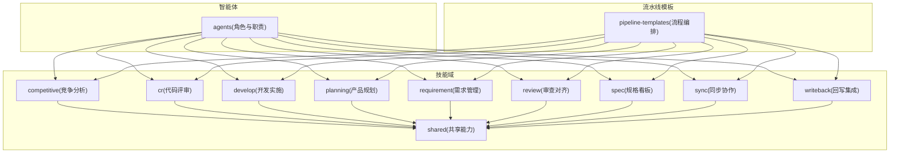

图表来源
- [dir-graph.yaml](file://dir-graph.yaml)
- [skills/_index.yml](file://skills/_index.yml)
- [agents/_index.yml](file://agents/_index.yml)
- [pipeline-templates/README.md](file://pipeline-templates/README.md)

章节来源
- [skills/_index.yml](file://skills/_index.yml)
- [agents/_index.yml](file://agents/_index.yml)
- [dir-graph.yaml](file://dir-graph.yaml)
- [pipeline-templates/README.md](file://pipeline-templates/README.md)

## 核心组件
- 技能定义单元：每个技能以独立目录表示，通常包含 SKILL.md 作为入口说明，必要时附带脚本、模板或配置文件。
- 共享能力层：在 shared 下提供工程文档规范、Schema 校验、生成器与 CLI 工具，供多技能复用。
- 智能体矩阵：通过 agent-skill-matrix.yml 与 AGENT-SKILL-MATRIX.md 将智能体角色与技能集合建立映射。
- 流水线模板：以 JSON 形式声明式编排多个技能，形成可复用的端到端流程。

章节来源
- [agent-skill-matrix.yml](file://agent-skill-matrix.yml)
- [AGENT-SKILL-MATRIX.md](file://AGENT-SKILL-MATRIX.md)
- [skills/shared/engineering-docs/SKILL.md](file://skills/shared/engineering-docs/SKILL.md)
- [pipeline-templates/README.md](file://pipeline-templates/README.md)

## 架构总览
技能系统围绕“领域化组织 + 共享能力 + 声明式编排”的三层架构展开：
- 领域层：各业务域的技能集，聚焦单一职责，便于维护与演进。
- 共享层：跨域通用的文档规范、Schema、脚本与工具，降低重复建设成本。
- 编排层：通过流水线模板将多个技能串联，形成稳定可复用的工作流。

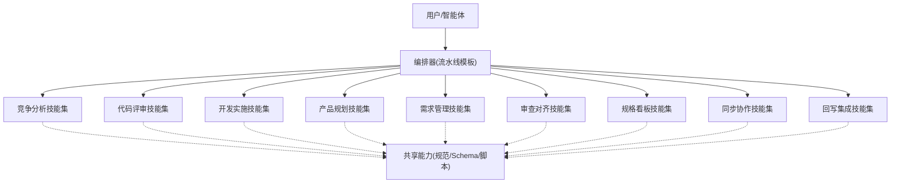

图表来源
- [pipeline-templates/README.md](file://pipeline-templates/README.md)
- [skills/shared/engineering-docs/SKILL.md](file://skills/shared/engineering-docs/SKILL.md)

## 详细组件分析

### 技能组织与命名约定
- 每个技能目录对应一个明确职责，SKILL.md 作为该技能的“契约”，描述目的、输入、输出、参数与注意事项。
- 共享能力集中在 shared 目录，避免重复实现，提升一致性。
- 通过 _index.yml 与 dir-graph.yaml 提供全局索引与依赖图，便于检索与理解。

章节来源
- [skills/_index.yml](file://skills/_index.yml)
- [dir-graph.yaml](file://dir-graph.yaml)

### 共享能力：工程文档规范与校验
- 工程文档规范：统一 PRD、SDD、PLAN、TASK、FORM、RELEASE 等文档结构与字段语义，确保跨团队一致。
- Schema 校验：提供 common-defs、prd、sdd、plan、task 等 JSON Schema，保障产出质量。
- 生成器与 CLI：提供基础生成器与命令行工具，支持批量生成与校验。
- 索引同步校验：确保文档索引与实际内容一致，减少遗漏。

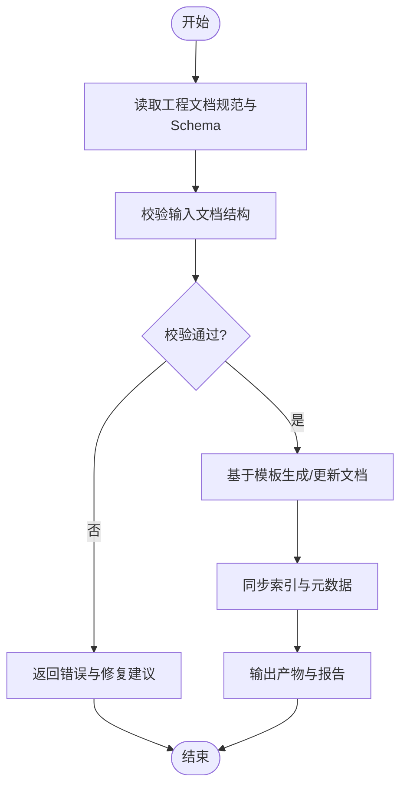

图表来源
- [skills/shared/engineering-docs/SKILL.md](file://skills/shared/engineering-docs/SKILL.md)
- [skills/shared/engineering-docs/schemas/common-defs.schema.json](file://skills/shared/engineering-docs/schemas/common-defs.schema.json)
- [skills/shared/engineering-docs/schemas/prd.schema.json](file://skills/shared/engineering-docs/schemas/prd.schema.json)
- [skills/shared/engineering-docs/schemas/sdd.schema.json](file://skills/shared/engineering-docs/schemas/sdd.schema.json)
- [skills/shared/engineering-docs/schemas/plan.schema.json](file://skills/shared/engineering-docs/schemas/plan.schema.json)
- [skills/shared/engineering-docs/schemas/task.schema.json](file://skills/shared/engineering-docs/schemas/task.schema.json)
- [skills/shared/engineering-docs/scripts/src/validators/index-sync.ts](file://skills/shared/engineering-docs/scripts/src/validators/index-sync.ts)
- [skills/shared/engineering-docs/scripts/src/generators/base.ts](file://skills/shared/engineering-docs/scripts/src/generators/base.ts)
- [skills/shared/engineering-docs/scripts/src/cli.ts](file://skills/shared/engineering-docs/scripts/src/cli.ts)
- [skills/shared/engineering-docs/scripts/package.json](file://skills/shared/engineering-docs/scripts/package.json)

章节来源
- [skills/shared/engineering-docs/SKILL.md](file://skills/shared/engineering-docs/SKILL.md)
- [skills/shared/engineering-docs/scripts/src/cli.ts](file://skills/shared/engineering-docs/scripts/src/cli.ts)
- [skills/shared/engineering-docs/scripts/src/validators/index-sync.ts](file://skills/shared/engineering-docs/scripts/src/validators/index-sync.ts)
- [skills/shared/engineering-docs/scripts/src/generators/base.ts](file://skills/shared/engineering-docs/scripts/src/generators/base.ts)
- [skills/shared/engineering-docs/scripts/package.json](file://skills/shared/engineering-docs/scripts/package.json)

### 竞争分析技能集
- fetch-competitor-updates：拉取竞品动态，聚合关键信息。
- write-competitive-report：基于采集信息撰写竞争分析报告。
- planning 域的 run-competitive-analysis：驱动竞争分析流程，整合结果至规划阶段。

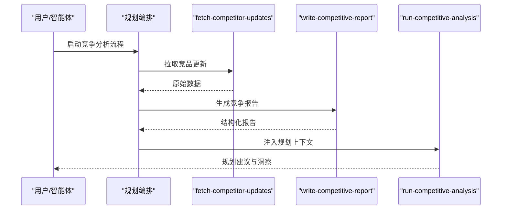

图表来源
- [skills/competitive/fetch-competitor-updates/SKILL.md](file://skills/competitive/fetch-competitor-updates/SKILL.md)
- [skills/competitive/write-competitive-report/SKILL.md](file://skills/competitive/write-competitive-report/SKILL.md)
- [skills/planning/run-competitive-analysis/SKILL.md](file://skills/planning/run-competitive-analysis/SKILL.md)

章节来源
- [skills/competitive/fetch-competitor-updates/SKILL.md](file://skills/competitive/fetch-competitor-updates/SKILL.md)
- [skills/competitive/write-competitive-report/SKILL.md](file://skills/competitive/write-competitive-report/SKILL.md)
- [skills/planning/run-competitive-analysis/SKILL.md](file://skills/planning/run-competitive-analysis/SKILL.md)

### 代码评审技能集
- cr-query：查询评审任务与状态。
- cr-dashboard：展示评审看板与指标。
- cr-archive：归档历史评审记录。
- feedback-writeback：将评审反馈回写至相关工件。
- inbox-emit：向收件箱发射待处理事项。

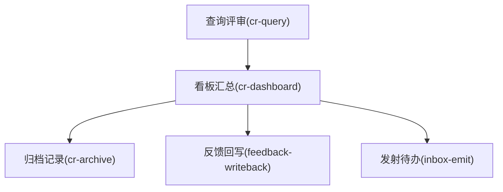

图表来源
- [skills/cr/cr-query/SKILL.md](file://skills/cr/cr-query/SKILL.md)
- [skills/cr/cr-dashboard/SKILL.md](file://skills/cr/cr-dashboard/SKILL.md)
- [skills/cr/cr-archive/SKILL.md](file://skills/cr/cr-archive/SKILL.md)
- [skills/cr/feedback-writeback/SKILL.md](file://skills/cr/feedback-writeback/SKILL.md)
- [skills/cr/inbox-emit/SKILL.md](file://skills/cr/inbox-emit/SKILL.md)

章节来源
- [skills/cr/cr-query/SKILL.md](file://skills/cr/cr-query/SKILL.md)
- [skills/cr/cr-dashboard/SKILL.md](file://skills/cr/cr-dashboard/SKILL.md)
- [skills/cr/cr-archive/SKILL.md](file://skills/cr/cr-archive/SKILL.md)
- [skills/cr/feedback-writeback/SKILL.md](file://skills/cr/feedback-writeback/SKILL.md)
- [skills/cr/inbox-emit/SKILL.md](file://skills/cr/inbox-emit/SKILL.md)

### 开发实施技能集
- implement-code：依据设计与任务进行代码实现。
- review-code：对实现进行同行评审。
- write-dev-tasks：拆解与编写开发任务。
- write-test-report：生成测试报告与质量度量。

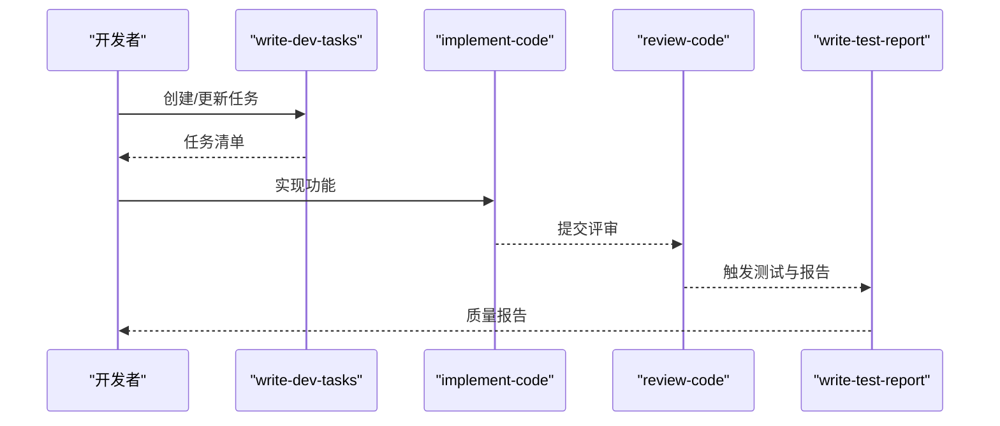

图表来源
- [skills/develop/write-dev-tasks/SKILL.md](file://skills/develop/write-dev-tasks/SKILL.md)
- [skills/develop/implement-code/SKILL.md](file://skills/develop/implement-code/SKILL.md)
- [skills/develop/review-code/SKILL.md](file://skills/develop/review-code/SKILL.md)
- [skills/develop/write-test-report/SKILL.md](file://skills/develop/write-test-report/SKILL.md)

章节来源
- [skills/develop/write-dev-tasks/SKILL.md](file://skills/develop/write-dev-tasks/SKILL.md)
- [skills/develop/implement-code/SKILL.md](file://skills/develop/implement-code/SKILL.md)
- [skills/develop/review-code/SKILL.md](file://skills/develop/review-code/SKILL.md)
- [skills/develop/write-test-report/SKILL.md](file://skills/develop/write-test-report/SKILL.md)

### 产品规划技能集
- conduct-market-research：开展市场调研与信息收集。
- run-competitive-analysis：运行竞争分析流程。
- write-planning-report：撰写规划报告。
- write-roadmap：制定路线图与里程碑。

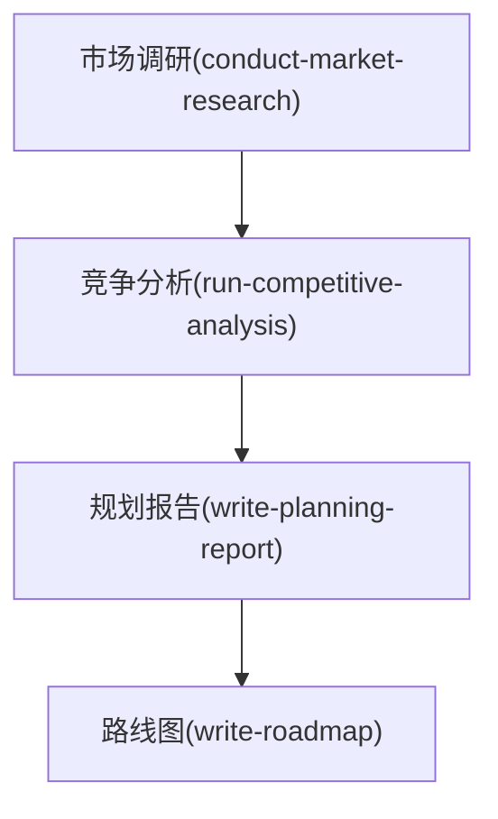

图表来源
- [skills/planning/conduct-market-research/SKILL.md](file://skills/planning/conduct-market-research/SKILL.md)
- [skills/planning/run-competitive-analysis/SKILL.md](file://skills/planning/run-competitive-analysis/SKILL.md)
- [skills/planning/write-planning-report/SKILL.md](file://skills/planning/write-planning-report/SKILL.md)
- [skills/planning/write-roadmap/SKILL.md](file://skills/planning/write-roadmap/SKILL.md)

章节来源
- [skills/planning/conduct-market-research/SKILL.md](file://skills/planning/conduct-market-research/SKILL.md)
- [skills/planning/run-competitive-analysis/SKILL.md](file://skills/planning/run-competitive-analysis/SKILL.md)
- [skills/planning/write-planning-report/SKILL.md](file://skills/planning/write-planning-report/SKILL.md)
- [skills/planning/write-roadmap/SKILL.md](file://skills/planning/write-roadmap/SKILL.md)

### 需求管理技能集
- approve-requirement：需求审批与准入控制。
- write-requirement-prd：编写产品需求文档。

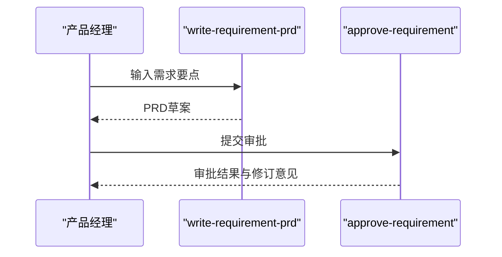

图表来源
- [skills/requirement/write-requirement-prd/SKILL.md](file://skills/requirement/write-requirement-prd/SKILL.md)
- [skills/requirement/approve-requirement/SKILL.md](file://skills/requirement/approve-requirement/SKILL.md)

章节来源
- [skills/requirement/write-requirement-prd/SKILL.md](file://skills/requirement/write-requirement-prd/SKILL.md)
- [skills/requirement/approve-requirement/SKILL.md](file://skills/requirement/approve-requirement/SKILL.md)

### 审查对齐技能集
- change-impact-analysis：变更影响分析，评估范围与风险。
- review-alignment：审查对齐，确保产出与目标一致。

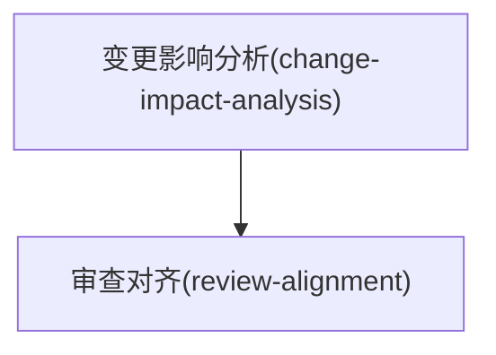

图表来源
- [skills/review/change-impact-analysis/SKILL.md](file://skills/review/change-impact-analysis/SKILL.md)
- [skills/review/review-alignment/SKILL.md](file://skills/review/review-alignment/SKILL.md)

章节来源
- [skills/review/change-impact-analysis/SKILL.md](file://skills/review/change-impact-analysis/SKILL.md)
- [skills/review/review-alignment/SKILL.md](file://skills/review/review-alignment/SKILL.md)

### 规格看板与同步协作
- spec-dashboard：规格看板，集中展示规格信息与进度。
- pull-progress：拉取进度同步。
- resume-from-remote：从远程恢复工作流。

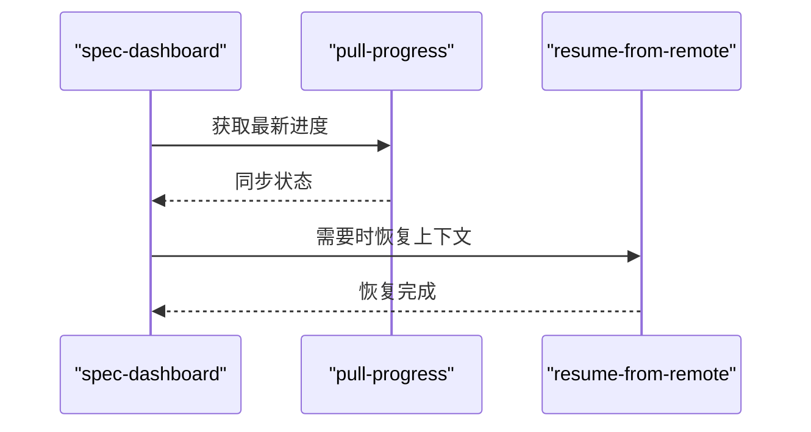

图表来源
- [skills/spec/spec-dashboard/SKILL.md](file://skills/spec/spec-dashboard/SKILL.md)
- [skills/sync/pull-progress/SKILL.md](file://skills/sync/pull-progress/SKILL.md)
- [skills/sync/resume-from-remote/SKILL.md](file://skills/sync/resume-from-remote/SKILL.md)

章节来源
- [skills/spec/spec-dashboard/SKILL.md](file://skills/spec/spec-dashboard/SKILL.md)
- [skills/sync/pull-progress/SKILL.md](file://skills/sync/pull-progress/SKILL.md)
- [skills/sync/resume-from-remote/SKILL.md](file://skills/sync/resume-from-remote/SKILL.md)

### 回写集成技能集
- merge-feature-branch：合并特性分支，推进发布。
- writeback-prd-sdd：将PRD与SDD回写至目标位置。
- writeback-traceability：回写追溯信息，保证链路完整。

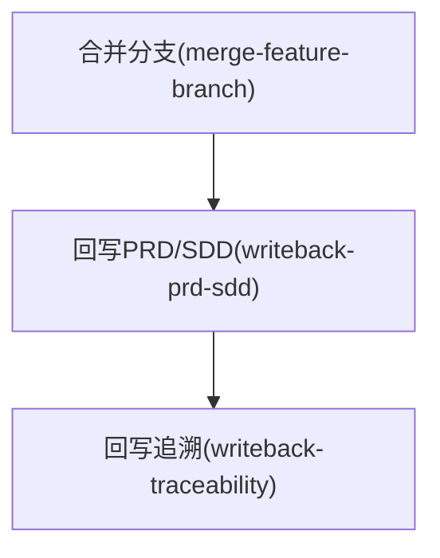

图表来源
- [skills/writeback/merge-feature-branch/SKILL.md](file://skills/writeback/merge-feature-branch/SKILL.md)
- [skills/writeback/writeback-prd-sdd/SKILL.md](file://skills/writeback/writeback-prd-sdd/SKILL.md)
- [skills/writeback/writeback-traceability/SKILL.md](file://skills/writeback/writeback-traceability/SKILL.md)

章节来源
- [skills/writeback/merge-feature-branch/SKILL.md](file://skills/writeback/merge-feature-branch/SKILL.md)
- [skills/writeback/writeback-prd-sdd/SKILL.md](file://skills/writeback/writeback-prd-sdd/SKILL.md)
- [skills/writeback/writeback-traceability/SKILL.md](file://skills/writeback/writeback-traceability/SKILL.md)

### 智能体与技能矩阵
- agent-skill-matrix.yml 与 AGENT-SKILL-MATRIX.md 定义了智能体角色与其可调用的技能集合，便于按需装配与权限控制。
- agents/_index.yml 提供智能体索引与简要说明。

章节来源
- [agent-skill-matrix.yml](file://agent-skill-matrix.yml)
- [AGENT-SKILL-MATRIX.md](file://AGENT-SKILL-MATRIX.md)
- [agents/_index.yml](file://agents/_index.yml)

### 流水线模板与编排
- pipeline-templates 提供多种端到端流程模板，例如架构设计、代码实现、竞争雷达、特性回写、市场到规划、产品规划、需求创作、CR恢复等。
- 模板以 JSON 形式声明技能序列、输入输出绑定与条件分支，便于复用与自动化。

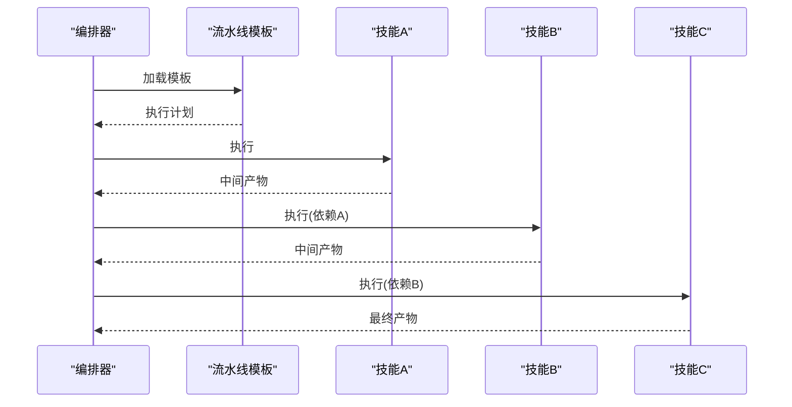

图表来源
- [pipeline-templates/README.md](file://pipeline-templates/README.md)
- [pipeline-templates/architecture-design.pipeline.json](file://pipeline-templates/architecture-design.pipeline.json)
- [pipeline-templates/code-implementation.pipeline.json](file://pipeline-templates/code-implementation.pipeline.json)
- [pipeline-templates/competitive-radar.pipeline.json](file://pipeline-templates/competitive-radar.pipeline.json)
- [pipeline-templates/feature-writeback.pipeline.json](file://pipeline-templates/feature-writeback.pipeline.json)
- [pipeline-templates/market-to-plan.pipeline.json](file://pipeline-templates/market-to-plan.pipeline.json)
- [pipeline-templates/product-planning.pipeline.json](file://pipeline-templates/product-planning.pipeline.json)
- [pipeline-templates/requirement-authoring.pipeline.json](file://pipeline-templates/requirement-authoring.pipeline.json)
- [pipeline-templates/resume-cr.pipeline.json](file://pipeline-templates/resume-cr.pipeline.json)

章节来源
- [pipeline-templates/README.md](file://pipeline-templates/README.md)
- [pipeline-templates/architecture-design.pipeline.json](file://pipeline-templates/architecture-design.pipeline.json)
- [pipeline-templates/code-implementation.pipeline.json](file://pipeline-templates/code-implementation.pipeline.json)
- [pipeline-templates/competitive-radar.pipeline.json](file://pipeline-templates/competitive-radar.pipeline.json)
- [pipeline-templates/feature-writeback.pipeline.json](file://pipeline-templates/feature-writeback.pipeline.json)
- [pipeline-templates/market-to-plan.pipeline.json](file://pipeline-templates/market-to-plan.pipeline.json)
- [pipeline-templates/product-planning.pipeline.json](file://pipeline-templates/product-planning.pipeline.json)
- [pipeline-templates/requirement-authoring.pipeline.json](file://pipeline-templates/requirement-authoring.pipeline.json)
- [pipeline-templates/resume-cr.pipeline.json](file://pipeline-templates/resume-cr.pipeline.json)

## 依赖关系分析
- 领域内依赖：同一域内的技能常存在前后置关系，如调研→分析→报告→路线图的顺序依赖。
- 跨域依赖：规划域依赖竞争分析；开发域依赖需求与规格；回写域依赖开发与评审。
- 共享依赖：多数技能依赖 shared 下的文档规范与 Schema 校验，确保产出一致性与可验证性。
- 编排依赖：流水线模板显式声明技能间的数据传递与执行顺序。

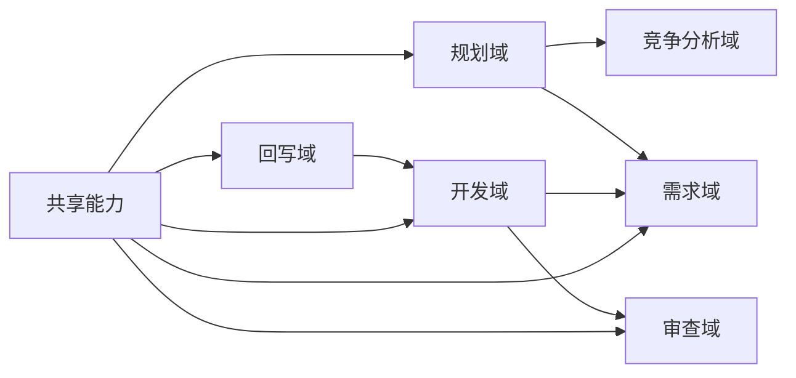

图表来源
- [dir-graph.yaml](file://dir-graph.yaml)
- [skills/_index.yml](file://skills/_index.yml)

章节来源
- [dir-graph.yaml](file://dir-graph.yaml)
- [skills/_index.yml](file://skills/_index.yml)

## 性能与可扩展性
- 并行与缓存：对于数据拉取与报告生成类技能，建议在编排层引入并行执行与结果缓存，减少重复计算。
- 增量处理：对大规模文档与评审数据，优先采用增量更新与差异对比，降低资源消耗。
- 模板化与参数化：通过流水线模板的参数化配置，避免硬编码，提高复用率与可维护性。
- 校验前置：在输入阶段尽早进行 Schema 校验，快速失败，缩短反馈周期。

[本节为通用指导，不直接分析具体文件]

## 故障排查指南
- 文档校验失败：检查 shared 下的 Schema 与规范是否匹配当前文档版本，确认字段必填与类型约束。
- 索引不同步：使用 index-sync 校验逻辑定位缺失或冗余条目，修正后重新同步。
- 流水线执行中断：查看模板中技能依赖链，确认上游产物是否存在且格式正确。
- 权限与路径问题：核对回写与合并操作的权限与路径配置，确保目标仓库与分支可达。

章节来源
- [skills/shared/engineering-docs/scripts/src/validators/index-sync.ts](file://skills/shared/engineering-docs/scripts/src/validators/index-sync.ts)
- [skills/shared/engineering-docs/scripts/src/cli.ts](file://skills/shared/engineering-docs/scripts/src/cli.ts)
- [skills/shared/engineering-docs/scripts/package.json](file://skills/shared/engineering-docs/scripts/package.json)

## 结论
本技能系统通过清晰的领域划分、强大的共享能力与灵活的编排机制，实现了高内聚、低耦合的可复用工作流。借助统一的文档规范与 Schema 校验，保障了产出的质量与一致性；通过智能体矩阵与流水线模板，提升了团队协作效率与自动化水平。未来可在并行执行、增量处理与参数化方面进一步优化，持续提升性能与可维护性。

[本节为总结性内容，不直接分析具体文件]

## 附录

### 自定义技能开发指南
- 技能目录结构：新建技能目录，包含 SKILL.md 作为入口说明，必要时添加脚本、模板或配置文件。
- 输入输出规范：在 SKILL.md 中明确输入参数、输出产物与异常处理策略，遵循 shared 下的文档规范与 Schema。
- 复用与扩展：优先复用 shared 下的生成器、校验器与 CLI 工具；如需新增能力，保持接口稳定，向后兼容。
- 验证规则：在 shared 的 validators 中补充校验逻辑，确保新技能产出符合规范。
- 最佳实践：
  - 单一职责：每个技能聚焦一个明确目标。
  - 幂等设计：多次执行应得到一致结果。
  - 可观测性：记录关键步骤与错误信息，便于排障。
  - 版本化：对重大变更增加版本号与迁移说明。

章节来源
- [skills/shared/engineering-docs/SKILL.md](file://skills/shared/engineering-docs/SKILL.md)
- [skills/shared/engineering-docs/scripts/src/validators/index-sync.ts](file://skills/shared/engineering-docs/scripts/src/validators/index-sync.ts)
- [skills/shared/engineering-docs/scripts/src/generators/base.ts](file://skills/shared/engineering-docs/scripts/src/generators/base.ts)
- [skills/shared/engineering-docs/scripts/src/cli.ts](file://skills/shared/engineering-docs/scripts/src/cli.ts)
- [skills/shared/engineering-docs/scripts/package.json](file://skills/shared/engineering-docs/scripts/package.json)

### 技能版本管理与兼容性策略
- 版本标识：在 SKILL.md 或相关配置中标注版本号，记录变更摘要与影响范围。
- 向后兼容：新增字段默认可选，保留旧字段至少两个大版本后再弃用。
- 迁移脚本：对破坏性变更提供迁移脚本或指引，确保平滑升级。
- 依赖锁定：在流水线模板中锁定关键技能版本，避免意外升级导致的不兼容。

[本节为通用指导，不直接分析具体文件]