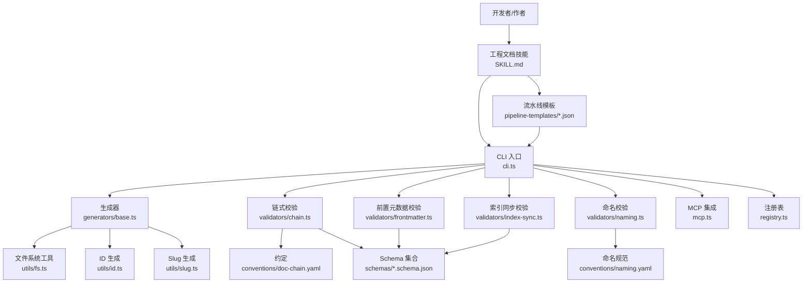
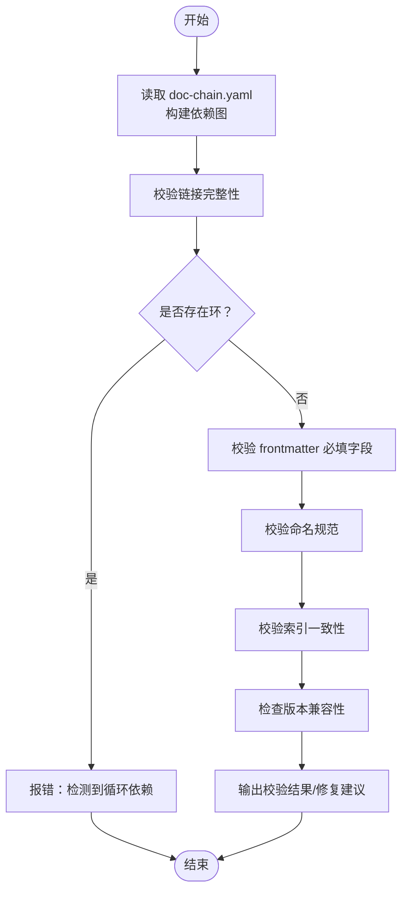
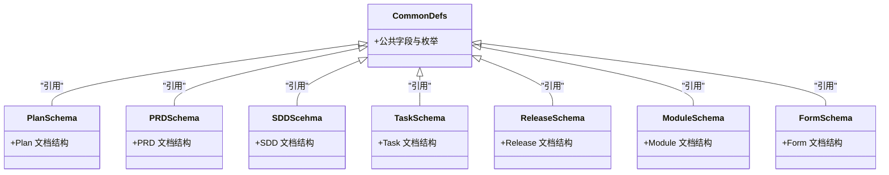
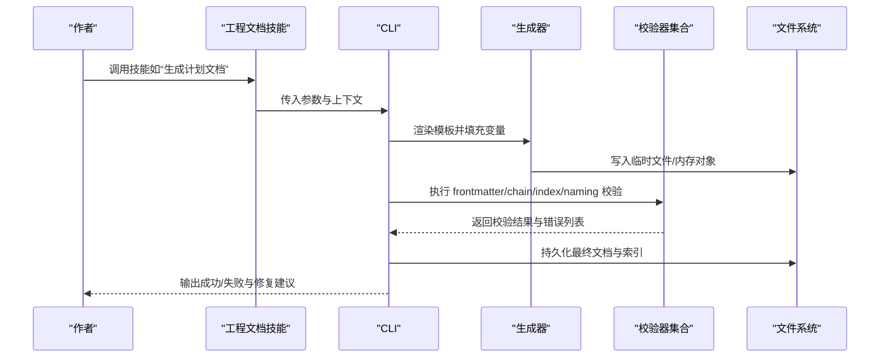
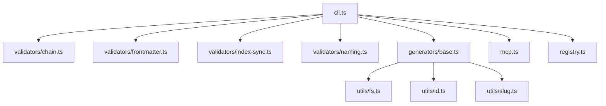

# 数据流转模式

<cite>
**本文引用的文件**   
- [doc-chain.yaml](file://skills/shared/engineering-docs/conventions/doc-chain.yaml)
- [naming.yaml](file://skills/shared/engineering-docs/conventions/naming.yaml)
- [common-defs.schema.json](file://skills/shared/engineering-docs/schemas/common-defs.schema.json)
- [plan.schema.json](file://skills/shared/engineering-docs/schemas/plan.schema.json)
- [prd.schema.json](file://skills/shared/engineering-docs/schemas/prd.schema.json)
- [sdd.schema.json](file://skills/shared/engineering-docs/schemas/sdd.schema.json)
- [task.schema.json](file://skills/shared/engineering-docs/schemas/task.schema.json)
- [release.schema.json](file://skills/shared/engineering-docs/schemas/release.schema.json)
- [module.schema.json](file://skills/shared/engineering-docs/schemas/module.schema.json)
- [form.schema.json](file://skills/shared/engineering-docs/schemas/form.schema.json)
- [chain.ts](file://skills/shared/engineering-docs/scripts/src/validators/chain.ts)
- [frontmatter.ts](file://skills/shared/engineering-docs/scripts/src/validators/frontmatter.ts)
- [index-sync.ts](file://skills/shared/engineering-docs/scripts/src/validators/index-sync.ts)
- [naming.ts](file://skills/shared/engineering-docs/scripts/src/validators/naming.ts)
- [cli.ts](file://skills/shared/engineering-docs/scripts/src/cli.ts)
- [mcp.ts](file://skills/shared/engineering-docs/scripts/src/mcp.ts)
- [registry.ts](file://skills/shared/engineering-docs/scripts/src/registry.ts)
- [base.ts](file://skills/shared/engineering-docs/scripts/src/generators/base.ts)
- [fs.ts](file://skills/shared/engineering-docs/scripts/src/utils/fs.ts)
- [id.ts](file://skills/shared/engineering-docs/scripts/src/utils/id.ts)
- [slug.ts](file://skills/shared/engineering-docs/scripts/src/utils/slug.ts)
- [chain.test.ts](file://skills/shared/engineering-docs/scripts/src/__tests__/chain.test.ts)
- [generators.test.ts](file://skills/shared/engineering-docs/scripts/src/__tests__/generators.test.ts)
- [validators.test.ts](file://skills/shared/engineering-docs/scripts/src/__tests__/validators.test.ts)
- [SKILL.md](file://skills/shared/engineering-docs/SKILL.md)
- [validate-doc SKILL.md](file://skills/shared/validate-doc/SKILL.md)
- [architecture-design.pipeline.json](file://pipeline-templates/architecture-design.pipeline.json)
- [code-implementation.pipeline.json](file://pipeline-templates/code-implementation.pipeline.json)
- [competitive-radar.pipeline.json](file://pipeline-templates/competitive-radar.pipeline.json)
- [feature-writeback.pipeline.json](file://pipeline-templates/feature-writeback.pipeline.json)
- [market-to-plan.pipeline.json](file://pipeline-templates/market-to-plan.pipeline.json)
- [product-planning.pipeline.json](file://pipeline-templates/product-planning.pipeline.json)
- [requirement-authoring.pipeline.json](file://pipeline-templates/requirement-authoring.pipeline.json)
- [resume-cr.pipeline.json](file://pipeline-templates/resume-cr.pipeline.json)
</cite>

## 目录
1. [简介](#简介)
2. [项目结构](#项目结构)
3. [核心组件](#核心组件)
4. [架构总览](#架构总览)
5. [详细组件分析](#详细组件分析)
6. [依赖分析](#依赖分析)
7. [性能考虑](#性能考虑)
8. [故障排查指南](#故障排查指南)
9. [结论](#结论)
10. [附录](#附录)

## 简介
本文件聚焦于工程文档体系中的数据流转模式，覆盖结构化数据、非结构化数据与元数据的定义、传输与处理；重点阐述文档链（doc-chain）的数据流转机制与版本管理策略；解释 Schema 验证系统在一致性保证中的作用；说明组件间传递格式与转换规则；并提供建模、验证、错误处理的实践建议，以及监控调试方法与性能优化建议。

## 项目结构
该仓库围绕“工程文档”能力组织，关键路径包括：
- 约定与规范：conventions 下定义命名与 doc-chain 关系约定
- 数据模型：schemas 下以 JSON Schema 描述各文档类型
- 脚本工具：scripts 提供 CLI、MCP、注册表、生成器、校验器与工具函数
- 技能与模板：SKILL.md 与 templates 提供可复用流程与模板
- 流水线模板：pipeline-templates 定义端到端工作流

```mermaid
graph TB
subgraph "约定与规范"
A["doc-chain.yaml"]
B["naming.yaml"]
end
subgraph "数据模型"
C["common-defs.schema.json"]
D["plan.schema.json"]
E["prd.schema.json"]
F["sdd.schema.json"]
G["task.schema.json"]
H["release.schema.json"]
I["module.schema.json"]
J["form.schema.json"]
end
subgraph "脚本工具"
K["cli.ts"]
L["mcp.ts"]
M["registry.ts"]
N["validators/chain.ts"]
O["validators/frontmatter.ts"]
P["validators/index-sync.ts"]
Q["validators/naming.ts"]
R["generators/base.ts"]
S["utils/fs.ts"]
T["utils/id.ts"]
U["utils/slug.ts"]
end
subgraph "技能与模板"
V["SKILL.md"]
W["templates/*"]
end
subgraph "流水线模板"
X["pipeline-templates/*.json"]
end
A --> N
B --> Q
C --> N
D --> N
E --> N
F --> N
G --> N
H --> N
I --> N
J --> N
K --> N
K --> O
K --> P
K --> Q
K --> R
K --> S
K --> T
K --> U
L --> K
M --> K
V --> K
W --> R
X --> K
```

图表来源
- [doc-chain.yaml](file://skills/shared/engineering-docs/conventions/doc-chain.yaml)
- [naming.yaml](file://skills/shared/engineering-docs/conventions/naming.yaml)
- [common-defs.schema.json](file://skills/shared/engineering-docs/schemas/common-defs.schema.json)
- [plan.schema.json](file://skills/shared/engineering-docs/schemas/plan.schema.json)
- [prd.schema.json](file://skills/shared/engineering-docs/schemas/prd.schema.json)
- [sdd.schema.json](file://skills/shared/engineering-docs/schemas/sdd.schema.json)
- [task.schema.json](file://skills/shared/engineering-docs/schemas/task.schema.json)
- [release.schema.json](file://skills/shared/engineering-docs/schemas/release.schema.json)
- [module.schema.json](file://skills/shared/engineering-docs/schemas/module.schema.json)
- [form.schema.json](file://skills/shared/engineering-docs/schemas/form.schema.json)
- [cli.ts](file://skills/shared/engineering-docs/scripts/src/cli.ts)
- [mcp.ts](file://skills/shared/engineering-docs/scripts/src/mcp.ts)
- [registry.ts](file://skills/shared/engineering-docs/scripts/src/registry.ts)
- [chain.ts](file://skills/shared/engineering-docs/scripts/src/validators/chain.ts)
- [frontmatter.ts](file://skills/shared/engineering-docs/scripts/src/validators/frontmatter.ts)
- [index-sync.ts](file://skills/shared/engineering-docs/scripts/src/validators/index-sync.ts)
- [naming.ts](file://skills/shared/engineering-docs/scripts/src/validators/naming.ts)
- [base.ts](file://skills/shared/engineering-docs/scripts/src/generators/base.ts)
- [fs.ts](file://skills/shared/engineering-docs/scripts/src/utils/fs.ts)
- [id.ts](file://skills/shared/engineering-docs/scripts/src/utils/id.ts)
- [slug.ts](file://skills/shared/engineering-docs/scripts/src/utils/slug.ts)
- [SKILL.md](file://skills/shared/engineering-docs/SKILL.md)
- [architecture-design.pipeline.json](file://pipeline-templates/architecture-design.pipeline.json)
- [code-implementation.pipeline.json](file://pipeline-templates/code-implementation.pipeline.json)
- [competitive-radar.pipeline.json](file://pipeline-templates/competitive-radar.pipeline.json)
- [feature-writeback.pipeline.json](file://pipeline-templates/feature-writeback.pipeline.json)
- [market-to-plan.pipeline.json](file://pipeline-templates/market-to-plan.pipeline.json)
- [product-planning.pipeline.json](file://pipeline-templates/product-planning.pipeline.json)
- [requirement-authoring.pipeline.json](file://pipeline-templates/requirement-authoring.pipeline.json)
- [resume-cr.pipeline.json](file://pipeline-templates/resume-cr.pipeline.json)

章节来源
- [doc-chain.yaml](file://skills/shared/engineering-docs/conventions/doc-chain.yaml)
- [naming.yaml](file://skills/shared/engineering-docs/conventions/naming.yaml)
- [common-defs.schema.json](file://skills/shared/engineering-docs/schemas/common-defs.schema.json)
- [plan.schema.json](file://skills/shared/engineering-docs/schemas/plan.schema.json)
- [prd.schema.json](file://skills/shared/engineering-docs/schemas/prd.schema.json)
- [sdd.schema.json](file://skills/shared/engineering-docs/schemas/sdd.schema.json)
- [task.schema.json](file://skills/shared/engineering-docs/schemas/task.schema.json)
- [release.schema.json](file://skills/shared/engineering-docs/schemas/release.schema.json)
- [module.schema.json](file://skills/shared/engineering-docs/schemas/module.schema.json)
- [form.schema.json](file://skills/shared/engineering-docs/schemas/form.schema.json)
- [cli.ts](file://skills/shared/engineering-docs/scripts/src/cli.ts)
- [mcp.ts](file://skills/shared/engineering-docs/scripts/src/mcp.ts)
- [registry.ts](file://skills/shared/engineering-docs/scripts/src/registry.ts)
- [chain.ts](file://skills/shared/engineering-docs/scripts/src/validators/chain.ts)
- [frontmatter.ts](file://skills/shared/engineering-docs/scripts/src/validators/frontmatter.ts)
- [index-sync.ts](file://skills/shared/engineering-docs/scripts/src/validators/index-sync.ts)
- [naming.ts](file://skills/shared/engineering-docs/scripts/src/validators/naming.ts)
- [base.ts](file://skills/shared/engineering-docs/scripts/src/generators/base.ts)
- [fs.ts](file://skills/shared/engineering-docs/scripts/src/utils/fs.ts)
- [id.ts](file://skills/shared/engineering-docs/scripts/src/utils/id.ts)
- [slug.ts](file://skills/shared/engineering-docs/scripts/src/utils/slug.ts)
- [SKILL.md](file://skills/shared/engineering-docs/SKILL.md)
- [architecture-design.pipeline.json](file://pipeline-templates/architecture-design.pipeline.json)
- [code-implementation.pipeline.json](file://pipeline-templates/code-implementation.pipeline.json)
- [competitive-radar.pipeline.json](file://pipeline-templates/competitive-radar.pipeline.json)
- [feature-writeback.pipeline.json](file://pipeline-templates/feature-writeback.pipeline.json)
- [market-to-plan.pipeline.json](file://pipeline-templates/market-to-plan.pipeline.json)
- [product-planning.pipeline.json](file://pipeline-templates/product-planning.pipeline.json)
- [requirement-authoring.pipeline.json](file://pipeline-templates/requirement-authoring.pipeline.json)
- [resume-cr.pipeline.json](file://pipeline-templates/resume-cr.pipeline.json)

## 核心组件
- 约定层
  - doc-chain.yaml：定义文档之间的引用关系与链路拓扑，作为“文档链”的权威来源
  - naming.yaml：统一命名规范，约束文件名、ID、Slug 等
- 模型层
  - schemas/*.schema.json：JSON Schema 描述 Plan、PRD、SDD、Task、Release、Module、Form 等文档的结构与约束
  - common-defs.schema.json：公共字段与枚举定义，供其他 schema 引用复用
- 工具层
  - validators/*：链式校验（chain）、前置元数据校验（frontmatter）、索引同步校验（index-sync）、命名校验（naming）
  - generators/base.ts：基于模板与约定的内容生成基类
  - utils/*：文件系统、ID 生成、Slug 生成等通用工具
  - cli.ts：命令行入口，编排校验、生成、同步等操作
  - mcp.ts / registry.ts：MCP 集成与命令/能力注册中心
- 技能与流水线
  - SKILL.md：工程文档技能的总体说明与使用指引
  - pipeline-templates/*.json：端到端流水线模板，驱动从需求到实现、评审与写回的全流程

章节来源
- [doc-chain.yaml](file://skills/shared/engineering-docs/conventions/doc-chain.yaml)
- [naming.yaml](file://skills/shared/engineering-docs/conventions/naming.yaml)
- [common-defs.schema.json](file://skills/shared/engineering-docs/schemas/common-defs.schema.json)
- [plan.schema.json](file://skills/shared/engineering-docs/schemas/plan.schema.json)
- [prd.schema.json](file://skills/shared/engineering-docs/schemas/prd.schema.json)
- [sdd.schema.json](file://skills/shared/engineering-docs/schemas/sdd.schema.json)
- [task.schema.json](file://skills/shared/engineering-docs/schemas/task.schema.json)
- [release.schema.json](file://skills/shared/engineering-docs/schemas/release.schema.json)
- [module.schema.json](file://skills/shared/engineering-docs/schemas/module.schema.json)
- [form.schema.json](file://skills/shared/engineering-docs/schemas/form.schema.json)
- [chain.ts](file://skills/shared/engineering-docs/scripts/src/validators/chain.ts)
- [frontmatter.ts](file://skills/shared/engineering-docs/scripts/src/validators/frontmatter.ts)
- [index-sync.ts](file://skills/shared/engineering-docs/scripts/src/validators/index-sync.ts)
- [naming.ts](file://skills/shared/engineering-docs/scripts/src/validators/naming.ts)
- [base.ts](file://skills/shared/engineering-docs/scripts/src/generators/base.ts)
- [fs.ts](file://skills/shared/engineering-docs/scripts/src/utils/fs.ts)
- [id.ts](file://skills/shared/engineering-docs/scripts/src/utils/id.ts)
- [slug.ts](file://skills/shared/engineering-docs/scripts/src/utils/slug.ts)
- [cli.ts](file://skills/shared/engineering-docs/scripts/src/cli.ts)
- [mcp.ts](file://skills/shared/engineering-docs/scripts/src/mcp.ts)
- [registry.ts](file://skills/shared/engineering-docs/scripts/src/registry.ts)
- [SKILL.md](file://skills/shared/engineering-docs/SKILL.md)
- [architecture-design.pipeline.json](file://pipeline-templates/architecture-design.pipeline.json)
- [code-implementation.pipeline.json](file://pipeline-templates/code-implementation.pipeline.json)
- [competitive-radar.pipeline.json](file://pipeline-templates/competitive-radar.pipeline.json)
- [feature-writeback.pipeline.json](file://pipeline-templates/feature-writeback.pipeline.json)
- [market-to-plan.pipeline.json](file://pipeline-templates/market-to-plan.pipeline.json)
- [product-planning.pipeline.json](file://pipeline-templates/product-planning.pipeline.json)
- [requirement-authoring.pipeline.json](file://pipeline-templates/requirement-authoring.pipeline.json)
- [resume-cr.pipeline.json](file://pipeline-templates/resume-cr.pipeline.json)

## 架构总览
下图展示数据在“约定—模型—工具—技能—流水线”间的流转关系，强调文档链与 Schema 验证对一致性的保障。

图表来源
- [cli.ts](file://skills/shared/engineering-docs/scripts/src/cli.ts)
- [mcp.ts](file://skills/shared/engineering-docs/scripts/src/mcp.ts)
- [registry.ts](file://skills/shared/engineering-docs/scripts/src/registry.ts)
- [base.ts](file://skills/shared/engineering-docs/scripts/src/generators/base.ts)
- [chain.ts](file://skills/shared/engineering-docs/scripts/src/validators/chain.ts)
- [frontmatter.ts](file://skills/shared/engineering-docs/scripts/src/validators/frontmatter.ts)
- [index-sync.ts](file://skills/shared/engineering-docs/scripts/src/validators/index-sync.ts)
- [naming.ts](file://skills/shared/engineering-docs/scripts/src/validators/naming.ts)
- [fs.ts](file://skills/shared/engineering-docs/scripts/src/utils/fs.ts)
- [id.ts](file://skills/shared/engineering-docs/scripts/src/utils/id.ts)
- [slug.ts](file://skills/shared/engineering-docs/scripts/src/utils/slug.ts)
- [doc-chain.yaml](file://skills/shared/engineering-docs/conventions/doc-chain.yaml)
- [naming.yaml](file://skills/shared/engineering-docs/conventions/naming.yaml)
- [common-defs.schema.json](file://skills/shared/engineering-docs/schemas/common-defs.schema.json)
- [plan.schema.json](file://skills/shared/engineering-docs/schemas/plan.schema.json)
- [prd.schema.json](file://skills/shared/engineering-docs/schemas/prd.schema.json)
- [sdd.schema.json](file://skills/shared/engineering-docs/schemas/sdd.schema.json)
- [task.schema.json](file://skills/shared/engineering-docs/schemas/task.schema.json)
- [release.schema.json](file://skills/shared/engineering-docs/schemas/release.schema.json)
- [module.schema.json](file://skills/shared/engineering-docs/schemas/module.schema.json)
- [form.schema.json](file://skills/shared/engineering-docs/schemas/form.schema.json)
- [SKILL.md](file://skills/shared/engineering-docs/SKILL.md)
- [architecture-design.pipeline.json](file://pipeline-templates/architecture-design.pipeline.json)
- [code-implementation.pipeline.json](file://pipeline-templates/code-implementation.pipeline.json)
- [competitive-radar.pipeline.json](file://pipeline-templates/competitive-radar.pipeline.json)
- [feature-writeback.pipeline.json](file://pipeline-templates/feature-writeback.pipeline.json)
- [market-to-plan.pipeline.json](file://pipeline-templates/market-to-plan.pipeline.json)
- [product-planning.pipeline.json](file://pipeline-templates/product-planning.pipeline.json)
- [requirement-authoring.pipeline.json](file://pipeline-templates/requirement-authoring.pipeline.json)
- [resume-cr.pipeline.json](file://pipeline-templates/resume-cr.pipeline.json)

## 详细组件分析

### 文档链（doc-chain）数据流转与版本管理
- 数据定义
  - 文档链由 doc-chain.yaml 声明，描述文档节点与边，形成有向图或树形结构，用于表达“上游—下游”依赖关系
  - 每个文档包含前置元数据（frontmatter），其中携带 id、title、version、status、links 等元信息
- 流转过程
  - 创建/更新文档时，先按命名规范生成稳定标识（id/slug），再写入 frontmatter
  - 通过 chain 校验器读取 doc-chain.yaml，构建依赖图并执行一致性检查（如环检测、缺失链接、孤立节点）
  - index-sync 校验器确保索引文件与实际文档集合一致
  - 生成器根据模板与约定产出新文档，自动填充必要字段
- 版本管理策略
  - 版本号遵循语义化约定，变更影响范围由 doc-chain 上下游传播
  - 当上游文档版本升级，下游需显式声明兼容策略或触发重新生成/重审
  - 发布物（release）聚合多个文档版本，形成可追溯的快照

图表来源
- [chain.ts](file://skills/shared/engineering-docs/scripts/src/validators/chain.ts)
- [frontmatter.ts](file://skills/shared/engineering-docs/scripts/src/validators/frontmatter.ts)
- [index-sync.ts](file://skills/shared/engineering-docs/scripts/src/validators/index-sync.ts)
- [naming.ts](file://skills/shared/engineering-docs/scripts/src/validators/naming.ts)
- [doc-chain.yaml](file://skills/shared/engineering-docs/conventions/doc-chain.yaml)

章节来源
- [doc-chain.yaml](file://skills/shared/engineering-docs/conventions/doc-chain.yaml)
- [chain.ts](file://skills/shared/engineering-docs/scripts/src/validators/chain.ts)
- [frontmatter.ts](file://skills/shared/engineering-docs/scripts/src/validators/frontmatter.ts)
- [index-sync.ts](file://skills/shared/engineering-docs/scripts/src/validators/index-sync.ts)
- [naming.ts](file://skills/shared/engineering-docs/scripts/src/validators/naming.ts)

### Schema 验证系统与数据一致性
- 作用
  - 通过 JSON Schema 对结构化数据进行强约束，确保字段类型、必填项、枚举值、引用关系正确
  - 将公共定义抽取至 common-defs.schema.json，避免重复与不一致
- 覆盖范围
  - plan、prd、sdd、task、release、module、form 等文档类型均有对应 schema
- 验证时机
  - 生成阶段：模板填充后即时校验
  - 提交前：CLI 统一执行链式校验
  - 流水线中：作为质量门禁

图表来源
- [common-defs.schema.json](file://skills/shared/engineering-docs/schemas/common-defs.schema.json)
- [plan.schema.json](file://skills/shared/engineering-docs/schemas/plan.schema.json)
- [prd.schema.json](file://skills/shared/engineering-docs/schemas/prd.schema.json)
- [sdd.schema.json](file://skills/shared/engineering-docs/schemas/sdd.schema.json)
- [task.schema.json](file://skills/shared/engineering-docs/schemas/task.schema.json)
- [release.schema.json](file://skills/shared/engineering-docs/schemas/release.schema.json)
- [module.schema.json](file://skills/shared/engineering-docs/schemas/module.schema.json)
- [form.schema.json](file://skills/shared/engineering-docs/schemas/form.schema.json)

章节来源
- [common-defs.schema.json](file://skills/shared/engineering-docs/schemas/common-defs.schema.json)
- [plan.schema.json](file://skills/shared/engineering-docs/schemas/plan.schema.json)
- [prd.schema.json](file://skills/shared/engineering-docs/schemas/prd.schema.json)
- [sdd.schema.json](file://skills/shared/engineering-docs/schemas/sdd.schema.json)
- [task.schema.json](file://skills/shared/engineering-docs/schemas/task.schema.json)
- [release.schema.json](file://skills/shared/engineering-docs/schemas/release.schema.json)
- [module.schema.json](file://skills/shared/engineering-docs/schemas/module.schema.json)
- [form.schema.json](file://skills/shared/engineering-docs/schemas/form.schema.json)

### 组件间数据传递格式与转换规则
- 输入格式
  - 模板变量：由生成器注入，包含上下文对象、目标文档元数据、依赖文档摘要
  - 约定参数：来自 conventions 下的 YAML 配置
- 中间表示
  - 内存中的 AST/对象图，便于链式校验与二次加工
- 输出格式
  - Markdown 文档（含 frontmatter）
  - 索引文件（由 index-sync 维护）
  - 校验报告（结构化错误列表）
- 转换规则
  - 名称→ID/Slug：遵循 naming.yaml 与 slug 生成逻辑
  - 版本解析：依据语义化版本与兼容性矩阵
  - 链接规范化：相对路径、锚点、跨文档引用统一处理

图表来源
- [cli.ts](file://skills/shared/engineering-docs/scripts/src/cli.ts)
- [base.ts](file://skills/shared/engineering-docs/scripts/src/generators/base.ts)
- [frontmatter.ts](file://skills/shared/engineering-docs/scripts/src/validators/frontmatter.ts)
- [chain.ts](file://skills/shared/engineering-docs/scripts/src/validators/chain.ts)
- [index-sync.ts](file://skills/shared/engineering-docs/scripts/src/validators/index-sync.ts)
- [naming.ts](file://skills/shared/engineering-docs/scripts/src/validators/naming.ts)
- [fs.ts](file://skills/shared/engineering-docs/scripts/src/utils/fs.ts)
- [SKILL.md](file://skills/shared/engineering-docs/SKILL.md)

章节来源
- [cli.ts](file://skills/shared/engineering-docs/scripts/src/cli.ts)
- [base.ts](file://skills/shared/engineering-docs/scripts/src/generators/base.ts)
- [frontmatter.ts](file://skills/shared/engineering-docs/scripts/src/validators/frontmatter.ts)
- [chain.ts](file://skills/shared/engineering-docs/scripts/src/validators/chain.ts)
- [index-sync.ts](file://skills/shared/engineering-docs/scripts/src/validators/index-sync.ts)
- [naming.ts](file://skills/shared/engineering-docs/scripts/src/validators/naming.ts)
- [fs.ts](file://skills/shared/engineering-docs/scripts/src/utils/fs.ts)
- [SKILL.md](file://skills/shared/engineering-docs/SKILL.md)

### 端到端流水线中的数据流转
- 典型场景
  - 架构设计：从市场洞察到架构方案，再到任务分解与实现
  - 需求编写：从需求登记到评审与归档
  - 特性写回：从分支合并到文档与代码一致性写回
- 数据形态
  - 结构化：流水线步骤的参数与产物（JSON/YAML）
  - 非结构化：Markdown 文档正文
  - 元数据：frontmatter、doc-chain 节点属性
- 流转要点
  - 每步产物的 schema 必须通过校验
  - 上游变更触发下游重新生成与校验
  - 流水线状态与进度通过 MCP/注册表暴露

图表来源
- [market-to-plan.pipeline.json](file://pipeline-templates/market-to-plan.pipeline.json)
- [requirement-authoring.pipeline.json](file://pipeline-templates/requirement-authoring.pipeline.json)
- [architecture-design.pipeline.json](file://pipeline-templates/architecture-design.pipeline.json)
- [code-implementation.pipeline.json](file://pipeline-templates/code-implementation.pipeline.json)
- [feature-writeback.pipeline.json](file://pipeline-templates/feature-writeback.pipeline.json)
- [resume-cr.pipeline.json](file://pipeline-templates/resume-cr.pipeline.json)
- [competitive-radar.pipeline.json](file://pipeline-templates/competitive-radar.pipeline.json)
- [product-planning.pipeline.json](file://pipeline-templates/product-planning.pipeline.json)

章节来源
- [market-to-plan.pipeline.json](file://pipeline-templates/market-to-plan.pipeline.json)
- [requirement-authoring.pipeline.json](file://pipeline-templates/requirement-authoring.pipeline.json)
- [architecture-design.pipeline.json](file://pipeline-templates/architecture-design.pipeline.json)
- [code-implementation.pipeline.json](file://pipeline-templates/code-implementation.pipeline.json)
- [feature-writeback.pipeline.json](file://pipeline-templates/feature-writeback.pipeline.json)
- [resume-cr.pipeline.json](file://pipeline-templates/resume-cr.pipeline.json)
- [competitive-radar.pipeline.json](file://pipeline-templates/competitive-radar.pipeline.json)
- [product-planning.pipeline.json](file://pipeline-templates/product-planning.pipeline.json)

## 依赖分析
- 模块耦合
  - CLI 作为编排中心，依赖所有校验器与生成器
  - 校验器之间低耦合，各自专注单一职责（链、元数据、索引、命名）
  - 生成器依赖工具库（fs、id、slug）与模板
- 外部依赖
  - MCP 与注册表提供扩展点，便于与外部系统交互
- 潜在风险
  - 若 doc-chain 与 schema 不同步，可能导致运行时校验失败
  - 命名规范变更需全局扫描与批量迁移

图表来源
- [cli.ts](file://skills/shared/engineering-docs/scripts/src/cli.ts)
- [chain.ts](file://skills/shared/engineering-docs/scripts/src/validators/chain.ts)
- [frontmatter.ts](file://skills/shared/engineering-docs/scripts/src/validators/frontmatter.ts)
- [index-sync.ts](file://skills/shared/engineering-docs/scripts/src/validators/index-sync.ts)
- [naming.ts](file://skills/shared/engineering-docs/scripts/src/validators/naming.ts)
- [base.ts](file://skills/shared/engineering-docs/scripts/src/generators/base.ts)
- [fs.ts](file://skills/shared/engineering-docs/scripts/src/utils/fs.ts)
- [id.ts](file://skills/shared/engineering-docs/scripts/src/utils/id.ts)
- [slug.ts](file://skills/shared/engineering-docs/scripts/src/utils/slug.ts)
- [mcp.ts](file://skills/shared/engineering-docs/scripts/src/mcp.ts)
- [registry.ts](file://skills/shared/engineering-docs/scripts/src/registry.ts)

章节来源
- [cli.ts](file://skills/shared/engineering-docs/scripts/src/cli.ts)
- [chain.ts](file://skills/shared/engineering-docs/scripts/src/validators/chain.ts)
- [frontmatter.ts](file://skills/shared/engineering-docs/scripts/src/validators/frontmatter.ts)
- [index-sync.ts](file://skills/shared/engineering-docs/scripts/src/validators/index-sync.ts)
- [naming.ts](file://skills/shared/engineering-docs/scripts/src/validators/naming.ts)
- [base.ts](file://skills/shared/engineering-docs/scripts/src/generators/base.ts)
- [fs.ts](file://skills/shared/engineering-docs/scripts/src/utils/fs.ts)
- [id.ts](file://skills/shared/engineering-docs/scripts/src/utils/id.ts)
- [slug.ts](file://skills/shared/engineering-docs/scripts/src/utils/slug.ts)
- [mcp.ts](file://skills/shared/engineering-docs/scripts/src/mcp.ts)
- [registry.ts](file://skills/shared/engineering-docs/scripts/src/registry.ts)

## 性能考虑
- 校验批量化
  - 将多文档校验合并为一次 IO 批次，减少磁盘访问次数
- 增量计算
  - 仅对受影响的文档链子树进行重新校验与生成
- 缓存策略
  - 对模板渲染结果与 schema 解析结果做短期缓存
- 并行处理
  - 独立文档的校验与生成可并发执行，注意控制并发度以避免资源争用

[本节为通用指导，不直接分析具体文件]

## 故障排查指南
- 常见问题定位
  - 循环依赖：检查 doc-chain 是否有环
  - 缺失链接：确认上游文档存在且链接有效
  - 命名冲突：核对命名规范与唯一性约束
  - 索引不一致：对比索引与实际文件集合
- 调试方法
  - 启用详细日志输出，记录每一步输入/输出
  - 使用单元测试用例复现问题（参考 tests 目录）
  - 借助 MCP 接口获取运行期状态与中间产物
- 恢复建议
  - 优先修复上游文档与 schema，再触发下游重新生成
  - 使用流水线模板一键重建受影响链路

章节来源
- [chain.test.ts](file://skills/shared/engineering-docs/scripts/src/__tests__/chain.test.ts)
- [generators.test.ts](file://skills/shared/engineering-docs/scripts/src/__tests__/generators.test.ts)
- [validators.test.ts](file://skills/shared/engineering-docs/scripts/src/__tests__/validators.test.ts)
- [mcp.ts](file://skills/shared/engineering-docs/scripts/src/mcp.ts)

## 结论
本数据流转模式以“约定+模型+工具”为核心，通过 doc-chain 建立文档依赖拓扑，以 JSON Schema 保障数据结构一致性，借助 CLI 与生成器实现自动化生产与校验，并以流水线模板串联端到端流程。遵循本文的最佳实践与排障建议，可在复杂协作场景中保持文档质量与演进效率。

## 附录
- 最佳实践清单
  - 数据建模：优先复用 common-defs，明确必填与枚举，避免自由字段泛滥
  - 验证规则：在 frontmatter 与 schema 双重约束，结合命名与索引校验
  - 错误处理：给出明确的修复建议与最小改动路径
  - 版本管理：严格语义化版本，记录变更影响范围
  - 监控与调试：集中日志、可观测指标与单元测试覆盖
  - 性能优化：批量化、增量与并行策略

[本节为通用指导，不直接分析具体文件]