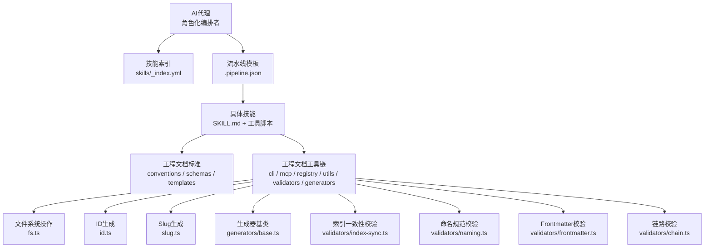
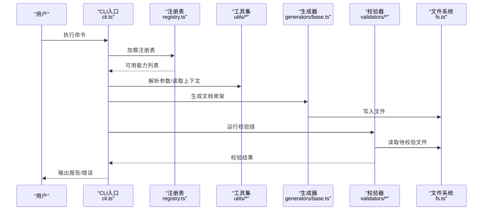
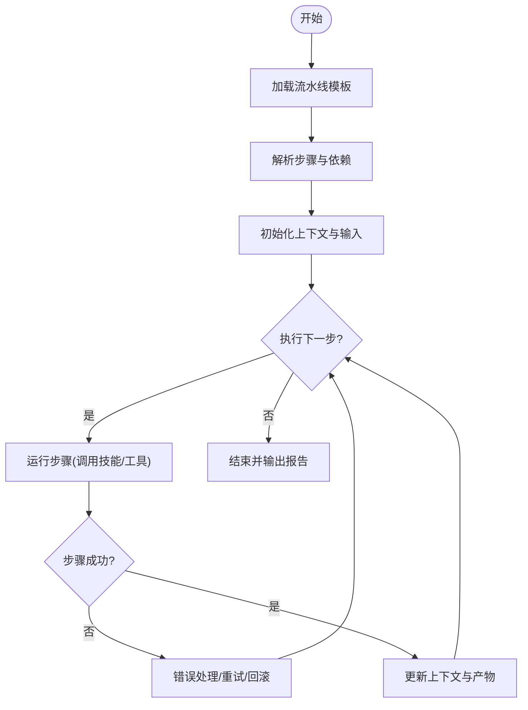
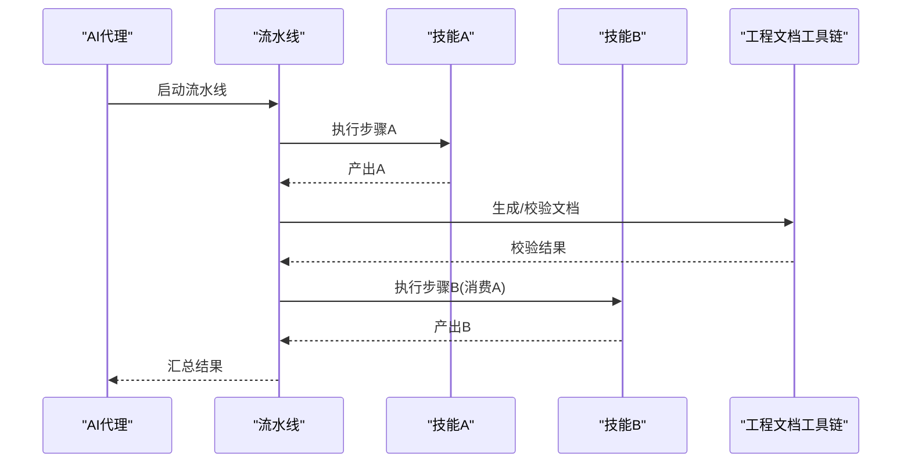
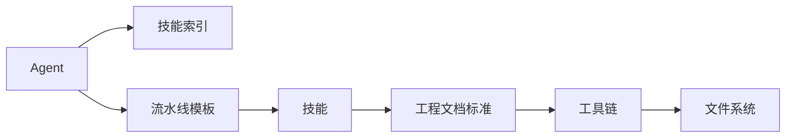

# 核心概念详解

<cite>
**本文引用的文件**   
- [agents/_index.yml](file://agents/_index.yml)
- [skills/_index.yml](file://skills/_index.yml)
- [pipeline-templates/README.md](file://pipeline-templates/README.md)
- [pipeline-templates/architecture-design.pipeline.json](file://pipeline-templates/architecture-design.pipeline.json)
- [pipeline-templates/code-implementation.pipeline.json](file://pipeline-templates/code-implementation.pipeline.json)
- [pipeline-templates/product-planning.pipeline.json](file://pipeline-templates/product-planning.pipeline.json)
- [skills/shared/engineering-docs/SKILL.md](file://skills/shared/engineering-docs/SKILL.md)
- [skills/shared/engineering-docs/conventions/doc-chain.yaml](file://skills/shared/engineering-docs/conventions/doc-chain.yaml)
- [skills/shared/engineering-docs/conventions/naming.yaml](file://skills/shared/engineering-docs/conventions/naming.yaml)
- [skills/shared/engineering-docs/schemas/common-defs.schema.json](file://skills/shared/engineering-docs/schemas/common-defs.schema.json)
- [skills/shared/engineering-docs/schemas/prd.schema.json](file://skills/shared/engineering-docs/schemas/prd.schema.json)
- [skills/shared/engineering-docs/templates/PRD-template.md](file://skills/shared/engineering-docs/templates/PRD-template.md)
- [skills/shared/engineering-docs/scripts/src/cli.ts](file://skills/shared/engineering-docs/scripts/src/cli.ts)
- [skills/shared/engineering-docs/scripts/src/mcp.ts](file://skills/shared/engineering-docs/scripts/src/mcp.ts)
- [skills/shared/engineering-docs/scripts/src/registry.ts](file://skills/shared/engineering-docs/scripts/src/registry.ts)
- [skills/shared/engineering-docs/scripts/src/utils/fs.ts](file://skills/shared/engineering-docs/scripts/src/utils/fs.ts)
- [skills/shared/engineering-docs/scripts/src/utils/id.ts](file://skills/shared/engineering-docs/scripts/src/utils/id.ts)
- [skills/shared/engineering-docs/scripts/src/utils/slug.ts](file://skills/shared/engineering-docs/scripts/src/utils/slug.ts)
- [skills/shared/engineering-docs/scripts/src/generators/base.ts](file://skills/shared/engineering-docs/scripts/src/generators/base.ts)
- [skills/shared/engineering-docs/scripts/src/validators/index-sync.ts](file://skills/shared/engineering-docs/scripts/src/validators/index-sync.ts)
- [skills/shared/engineering-docs/scripts/src/validators/naming.ts](file://skills/shared/engineering-docs/scripts/src/validators/naming.ts)
- [skills/shared/engineering-docs/scripts/src/validators/frontmatter.ts](file://skills/shared/engineering-docs/scripts/src/validators/frontmatter.ts)
- [skills/shared/engineering-docs/scripts/src/validators/chain.ts](file://skills/shared/engineering-docs/scripts/src/validators/chain.ts)
- [skills/shared/engineering-docs/scripts/package.json](file://skills/shared/engineering-docs/scripts/package.json)
- [skills/shared/engineering-docs/scripts/tsconfig.json](file://skills/shared/engineering-docs/scripts/tsconfig.json)
- [dir-graph.yaml](file://dir-graph.yaml)
</cite>

## 目录
1. [引言](#引言)
2. [项目结构](#项目结构)
3. [核心组件](#核心组件)
4. [架构总览](#架构总览)
5. [详细组件分析](#详细组件分析)
6. [依赖关系分析](#依赖关系分析)
7. [性能与可扩展性](#性能与可扩展性)
8. [故障排查指南](#故障排查指南)
9. [结论](#结论)
10. [附录](#附录)

## 引言
本文件面向AI工程化工具集的初学者与进阶用户，系统化阐述以下核心概念：
- AI代理（Agent）的概念、设计原理与在项目中的作用机制
- 技能（Skill）系统的架构设计、复用模式与扩展机制
- 流水线（Pipeline）编排的工作原理与执行流程
- Agent与Skill之间的协作关系与数据流转
- 工程文档体系的设计理念与标准化规范
- 概念间的依赖关系与交互模式，辅以图示与示例路径，帮助快速上手与深入理解

## 项目结构
仓库采用“按能力域组织”的结构：
- agents：定义不同角色的AI代理及其职责边界
- skills：按领域划分的可复用技能集合，每个技能以SKILL.md描述其输入、输出、约束与使用方式
- pipeline-templates：可复用的流水线模板，将多个技能串联为端到端工作流
- shared/engineering-docs：工程文档体系的统一标准、模板、校验与工具脚本

```mermaid
graph TB
subgraph "代理层"
A["agents/_index.yml"]
end
subgraph "技能层"
S["_index.yml"]
SD["shared/engineering-docs/SKILL.md"]
end
subgraph "流水线层"
P1["architecture-design.pipeline.json"]
P2["code-implementation.pipeline.json"]
P3["product-planning.pipeline.json"]
end
subgraph "工程文档体系"
C1["conventions/doc-chain.yaml"]
C2["conventions/naming.yaml"]
SC["schemas/*.schema.json"]
TPL["templates/*.md"]
CLI["scripts/src/cli.ts"]
MCP["scripts/src/mcp.ts"]
REG["scripts/src/registry.ts"]
UFS["scripts/src/utils/fs.ts"]
UID["scripts/src/utils/id.ts"]
USL["scripts/src/utils/slug.ts"]
GEN["scripts/src/generators/base.ts"]
VIDX["scripts/src/validators/index-sync.ts"]
VNAM["scripts/src/validators/naming.ts"]
VFM["scripts/src/validators/frontmatter.ts"]
VCH["scripts/src/validators/chain.ts"]
end
A --> S
S --> P1
S --> P2
S --> P3
SD --> C1
SD --> C2
SD --> SC
SD --> TPL
CLI --> REG
CLI --> UFS
CLI --> UID
CLI --> USL
CLI --> GEN
CLI --> VIDX
CLI --> VNAM
CLI --> VFM
CLI --> VCH
MCP --> REG
```

图表来源
- [agents/_index.yml](file://agents/_index.yml)
- [skills/_index.yml](file://skills/_index.yml)
- [skills/shared/engineering-docs/SKILL.md](file://skills/shared/engineering-docs/SKILL.md)
- [pipeline-templates/architecture-design.pipeline.json](file://pipeline-templates/architecture-design.pipeline.json)
- [pipeline-templates/code-implementation.pipeline.json](file://pipeline-templates/code-implementation.pipeline.json)
- [pipeline-templates/product-planning.pipeline.json](file://pipeline-templates/product-planning.pipeline.json)
- [skills/shared/engineering-docs/conventions/doc-chain.yaml](file://skills/shared/engineering-docs/conventions/doc-chain.yaml)
- [skills/shared/engineering-docs/conventions/naming.yaml](file://skills/shared/engineering-docs/conventions/naming.yaml)
- [skills/shared/engineering-docs/schemas/common-defs.schema.json](file://skills/shared/engineering-docs/schemas/common-defs.schema.json)
- [skills/shared/engineering-docs/schemas/prd.schema.json](file://skills/shared/engineering-docs/schemas/prd.schema.json)
- [skills/shared/engineering-docs/templates/PRD-template.md](file://skills/shared/engineering-docs/templates/PRD-template.md)
- [skills/shared/engineering-docs/scripts/src/cli.ts](file://skills/shared/engineering-docs/scripts/src/cli.ts)
- [skills/shared/engineering-docs/scripts/src/mcp.ts](file://skills/shared/engineering-docs/scripts/src/mcp.ts)
- [skills/shared/engineering-docs/scripts/src/registry.ts](file://skills/shared/engineering-docs/scripts/src/registry.ts)
- [skills/shared/engineering-docs/scripts/src/utils/fs.ts](file://skills/shared/engineering-docs/scripts/src/utils/fs.ts)
- [skills/shared/engineering-docs/scripts/src/utils/id.ts](file://skills/shared/engineering-docs/scripts/src/utils/id.ts)
- [skills/shared/engineering-docs/scripts/src/utils/slug.ts](file://skills/shared/engineering-docs/scripts/src/utils/slug.ts)
- [skills/shared/engineering-docs/scripts/src/generators/base.ts](file://skills/shared/engineering-docs/scripts/src/generators/base.ts)
- [skills/shared/engineering-docs/scripts/src/validators/index-sync.ts](file://skills/shared/engineering-docs/scripts/src/validators/index-sync.ts)
- [skills/shared/engineering-docs/scripts/src/validators/naming.ts](file://skills/shared/engineering-docs/scripts/src/validators/naming.ts)
- [skills/shared/engineering-docs/scripts/src/validators/frontmatter.ts](file://skills/shared/engineering-docs/scripts/src/validators/frontmatter.ts)
- [skills/shared/engineering-docs/scripts/src/validators/chain.ts](file://skills/shared/engineering-docs/scripts/src/validators/chain.ts)

章节来源
- [agents/_index.yml](file://agents/_index.yml)
- [skills/_index.yml](file://skills/_index.yml)
- [pipeline-templates/README.md](file://pipeline-templates/README.md)

## 核心组件
本节从系统视角解释三大核心组件的职责与边界。

- AI代理（Agent）
  - 角色化编排者：负责在特定业务场景中组合技能、驱动流水线、协调上下文与产出物
  - 典型职责：需求澄清、方案评审、质量把关、交付推进等
  - 入口与索引：通过索引文件进行注册与发现

- 技能（Skill）
  - 原子化能力单元：以SKILL.md声明式描述输入、输出、前置条件、约束与示例
  - 复用与组合：跨场景复用，支持在多个流水线中拼装
  - 工程文档技能：提供统一的文档标准、模板、校验与生成工具

- 流水线（Pipeline）
  - 编排型工作流：以JSON描述步骤、依赖、输入输出映射与错误处理策略
  - 可插拔执行：基于技能清单与模板驱动执行，支持多阶段产物贯通

章节来源
- [agents/_index.yml](file://agents/_index.yml)
- [skills/_index.yml](file://skills/_index.yml)
- [pipeline-templates/README.md](file://pipeline-templates/README.md)

## 架构总览
下图展示“代理—技能—流水线—工程文档体系”的整体交互关系。

图表来源
- [skills/_index.yml](file://skills/_index.yml)
- [skills/shared/engineering-docs/SKILL.md](file://skills/shared/engineering-docs/SKILL.md)
- [skills/shared/engineering-docs/conventions/doc-chain.yaml](file://skills/shared/engineering-docs/conventions/doc-chain.yaml)
- [skills/shared/engineering-docs/conventions/naming.yaml](file://skills/shared/engineering-docs/conventions/naming.yaml)
- [skills/shared/engineering-docs/scripts/src/cli.ts](file://skills/shared/engineering-docs/scripts/src/cli.ts)
- [skills/shared/engineering-docs/scripts/src/mcp.ts](file://skills/shared/engineering-docs/scripts/src/mcp.ts)
- [skills/shared/engineering-docs/scripts/src/registry.ts](file://skills/shared/engineering-docs/scripts/src/registry.ts)
- [skills/shared/engineering-docs/scripts/src/utils/fs.ts](file://skills/shared/engineering-docs/scripts/src/utils/fs.ts)
- [skills/shared/engineering-docs/scripts/src/utils/id.ts](file://skills/shared/engineering-docs/scripts/src/utils/id.ts)
- [skills/shared/engineering-docs/scripts/src/utils/slug.ts](file://skills/shared/engineering-docs/scripts/src/utils/slug.ts)
- [skills/shared/engineering-docs/scripts/src/generators/base.ts](file://skills/shared/engineering-docs/scripts/src/generators/base.ts)
- [skills/shared/engineering-docs/scripts/src/validators/index-sync.ts](file://skills/shared/engineering-docs/scripts/src/validators/index-sync.ts)
- [skills/shared/engineering-docs/scripts/src/validators/naming.ts](file://skills/shared/engineering-docs/scripts/src/validators/naming.ts)
- [skills/shared/engineering-docs/scripts/src/validators/frontmatter.ts](file://skills/shared/engineering-docs/scripts/src/validators/frontmatter.ts)
- [skills/shared/engineering-docs/scripts/src/validators/chain.ts](file://skills/shared/engineering-docs/scripts/src/validators/chain.ts)

## 详细组件分析

### AI代理（Agent）
- 设计理念
  - 以“角色”为中心，明确职责边界与决策点，避免单一大模型承担过多职责
  - 通过索引与矩阵化管理，实现代理与技能的解耦与可替换
- 作用机制
  - 接收任务或事件，解析目标与约束
  - 选择并调用合适的技能或流水线
  - 维护上下文与状态，汇总结果并反馈
- 关键文件
  - 代理索引与元信息：[agents/_index.yml](file://agents/_index.yml)

章节来源
- [agents/_index.yml](file://agents/_index.yml)

### 技能（Skill）系统
- 架构设计
  - 声明式定义：每个技能以SKILL.md描述输入、输出、前置条件、约束与示例
  - 工具化支撑：配套脚本提供生成、校验、索引同步与MCP集成
  - 标准化规范：通过conventions与schemas保证文档一致性与可验证性
- 复用与扩展
  - 复用：同一技能可在多个流水线中被多次引用
  - 扩展：新增技能遵循约定目录结构与命名规范，注册到索引即可被发现
- 关键文件
  - 技能索引：[skills/_index.yml](file://skills/_index.yml)
  - 工程文档技能说明：[skills/shared/engineering-docs/SKILL.md](file://skills/shared/engineering-docs/SKILL.md)
  - 命名与链路约定：[skills/shared/engineering-docs/conventions/naming.yaml](file://skills/shared/engineering-docs/conventions/naming.yaml)、[skills/shared/engineering-docs/conventions/doc-chain.yaml](file://skills/shared/engineering-docs/conventions/doc-chain.yaml)
  - 文档Schema：[skills/shared/engineering-docs/schemas/common-defs.schema.json](file://skills/shared/engineering-docs/schemas/common-defs.schema.json)、[skills/shared/engineering-docs/schemas/prd.schema.json](file://skills/shared/engineering-docs/schemas/prd.schema.json)
  - 模板：[skills/shared/engineering-docs/templates/PRD-template.md](file://skills/shared/engineering-docs/templates/PRD-template.md)
  - 工具脚本入口：[skills/shared/engineering-docs/scripts/src/cli.ts](file://skills/shared/engineering-docs/scripts/src/cli.ts)
  - MCP集成：[skills/shared/engineering-docs/scripts/src/mcp.ts](file://skills/shared/engineering-docs/scripts/src/mcp.ts)
  - 注册表：[skills/shared/engineering-docs/scripts/src/registry.ts](file://skills/shared/engineering-docs/scripts/src/registry.ts)
  - 工具库：[skills/shared/engineering-docs/scripts/src/utils/fs.ts](file://skills/shared/engineering-docs/scripts/src/utils/fs.ts)、[skills/shared/engineering-docs/scripts/src/utils/id.ts](file://skills/shared/engineering-docs/scripts/src/utils/id.ts)、[skills/shared/engineering-docs/scripts/src/utils/slug.ts](file://skills/shared/engineering-docs/scripts/src/utils/slug.ts)
  - 生成器：[skills/shared/engineering-docs/scripts/src/generators/base.ts](file://skills/shared/engineering-docs/scripts/src/generators/base.ts)
  - 校验器：[skills/shared/engineering-docs/scripts/src/validators/index-sync.ts](file://skills/shared/engineering-docs/scripts/src/validators/index-sync.ts)、[skills/shared/engineering-docs/scripts/src/validators/naming.ts](file://skills/shared/engineering-docs/scripts/src/validators/naming.ts)、[skills/shared/engineering-docs/scripts/src/validators/frontmatter.ts](file://skills/shared/engineering-docs/scripts/src/validators/frontmatter.ts)、[skills/shared/engineering-docs/scripts/src/validators/chain.ts](file://skills/shared/engineering-docs/scripts/src/validators/chain.ts)
  - 包配置：[skills/shared/engineering-docs/scripts/package.json](file://skills/shared/engineering-docs/scripts/package.json)、[skills/shared/engineering-docs/scripts/tsconfig.json](file://skills/shared/engineering-docs/scripts/tsconfig.json)

#### 工程文档工具链时序图

图表来源
- [skills/shared/engineering-docs/scripts/src/cli.ts](file://skills/shared/engineering-docs/scripts/src/cli.ts)
- [skills/shared/engineering-docs/scripts/src/registry.ts](file://skills/shared/engineering-docs/scripts/src/registry.ts)
- [skills/shared/engineering-docs/scripts/src/utils/fs.ts](file://skills/shared/engineering-docs/scripts/src/utils/fs.ts)
- [skills/shared/engineering-docs/scripts/src/generators/base.ts](file://skills/shared/engineering-docs/scripts/src/generators/base.ts)
- [skills/shared/engineering-docs/scripts/src/validators/index-sync.ts](file://skills/shared/engineering-docs/scripts/src/validators/index-sync.ts)
- [skills/shared/engineering-docs/scripts/src/validators/naming.ts](file://skills/shared/engineering-docs/scripts/src/validators/naming.ts)
- [skills/shared/engineering-docs/scripts/src/validators/frontmatter.ts](file://skills/shared/engineering-docs/scripts/src/validators/frontmatter.ts)
- [skills/shared/engineering-docs/scripts/src/validators/chain.ts](file://skills/shared/engineering-docs/scripts/src/validators/chain.ts)

章节来源
- [skills/_index.yml](file://skills/_index.yml)
- [skills/shared/engineering-docs/SKILL.md](file://skills/shared/engineering-docs/SKILL.md)
- [skills/shared/engineering-docs/conventions/naming.yaml](file://skills/shared/engineering-docs/conventions/naming.yaml)
- [skills/shared/engineering-docs/conventions/doc-chain.yaml](file://skills/shared/engineering-docs/conventions/doc-chain.yaml)
- [skills/shared/engineering-docs/schemas/common-defs.schema.json](file://skills/shared/engineering-docs/schemas/common-defs.schema.json)
- [skills/shared/engineering-docs/schemas/prd.schema.json](file://skills/shared/engineering-docs/schemas/prd.schema.json)
- [skills/shared/engineering-docs/templates/PRD-template.md](file://skills/shared/engineering-docs/templates/PRD-template.md)
- [skills/shared/engineering-docs/scripts/src/cli.ts](file://skills/shared/engineering-docs/scripts/src/cli.ts)
- [skills/shared/engineering-docs/scripts/src/mcp.ts](file://skills/shared/engineering-docs/scripts/src/mcp.ts)
- [skills/shared/engineering-docs/scripts/src/registry.ts](file://skills/shared/engineering-docs/scripts/src/registry.ts)
- [skills/shared/engineering-docs/scripts/src/utils/fs.ts](file://skills/shared/engineering-docs/scripts/src/utils/fs.ts)
- [skills/shared/engineering-docs/scripts/src/utils/id.ts](file://skills/shared/engineering-docs/scripts/src/utils/id.ts)
- [skills/shared/engineering-docs/scripts/src/utils/slug.ts](file://skills/shared/engineering-docs/scripts/src/utils/slug.ts)
- [skills/shared/engineering-docs/scripts/src/generators/base.ts](file://skills/shared/engineering-docs/scripts/src/generators/base.ts)
- [skills/shared/engineering-docs/scripts/src/validators/index-sync.ts](file://skills/shared/engineering-docs/scripts/src/validators/index-sync.ts)
- [skills/shared/engineering-docs/scripts/src/validators/naming.ts](file://skills/shared/engineering-docs/scripts/src/validators/naming.ts)
- [skills/shared/engineering-docs/scripts/src/validators/frontmatter.ts](file://skills/shared/engineering-docs/scripts/src/validators/frontmatter.ts)
- [skills/shared/engineering-docs/scripts/src/validators/chain.ts](file://skills/shared/engineering-docs/scripts/src/validators/chain.ts)
- [skills/shared/engineering-docs/scripts/package.json](file://skills/shared/engineering-docs/scripts/package.json)
- [skills/shared/engineering-docs/scripts/tsconfig.json](file://skills/shared/engineering-docs/scripts/tsconfig.json)

### 流水线（Pipeline）编排
- 工作原理
  - 以JSON描述步骤序列、依赖关系、输入输出映射、重试与错误处理策略
  - 由代理或调度器加载模板后实例化为可执行工作流
- 执行流程
  - 初始化上下文 → 解析步骤 → 按拓扑顺序执行 → 汇聚产物 → 输出报告
- 典型模板
  - 架构设计：[pipeline-templates/architecture-design.pipeline.json](file://pipeline-templates/architecture-design.pipeline.json)
  - 代码实现：[pipeline-templates/code-implementation.pipeline.json](file://pipeline-templates/code-implementation.pipeline.json)
  - 产品规划：[pipeline-templates/product-planning.pipeline.json](file://pipeline-templates/product-planning.pipeline.json)
  - 使用说明：[pipeline-templates/README.md](file://pipeline-templates/README.md)

图表来源
- [pipeline-templates/architecture-design.pipeline.json](file://pipeline-templates/architecture-design.pipeline.json)
- [pipeline-templates/code-implementation.pipeline.json](file://pipeline-templates/code-implementation.pipeline.json)
- [pipeline-templates/product-planning.pipeline.json](file://pipeline-templates/product-planning.pipeline.json)
- [pipeline-templates/README.md](file://pipeline-templates/README.md)

章节来源
- [pipeline-templates/README.md](file://pipeline-templates/README.md)
- [pipeline-templates/architecture-design.pipeline.json](file://pipeline-templates/architecture-design.pipeline.json)
- [pipeline-templates/code-implementation.pipeline.json](file://pipeline-templates/code-implementation.pipeline.json)
- [pipeline-templates/product-planning.pipeline.json](file://pipeline-templates/product-planning.pipeline.json)

### Agent与Skill的协作关系与数据流转
- 协作关系
  - Agent作为编排者，根据任务类型选择合适技能或流水线
  - Skill作为原子能力，提供稳定的输入输出契约
- 数据流转
  - 上游产物作为下游输入，通过上下文传递
  - 校验与生成工具保障数据一致性与规范性

图表来源
- [pipeline-templates/architecture-design.pipeline.json](file://pipeline-templates/architecture-design.pipeline.json)
- [pipeline-templates/code-implementation.pipeline.json](file://pipeline-templates/code-implementation.pipeline.json)
- [pipeline-templates/product-planning.pipeline.json](file://pipeline-templates/product-planning.pipeline.json)
- [skills/shared/engineering-docs/scripts/src/cli.ts](file://skills/shared/engineering-docs/scripts/src/cli.ts)

章节来源
- [agents/_index.yml](file://agents/_index.yml)
- [skills/_index.yml](file://skills/_index.yml)
- [pipeline-templates/README.md](file://pipeline-templates/README.md)

### 工程文档体系设计与规范
- 设计理念
  - 以“约定优于配置”为核心，通过conventions与schemas确保一致性
  - 以“模板+生成器+校验器”形成闭环，降低人工成本与出错率
- 标准化规范
  - 命名规范：[skills/shared/engineering-docs/conventions/naming.yaml](file://skills/shared/engineering-docs/conventions/naming.yaml)
  - 文档链路约定：[skills/shared/engineering-docs/conventions/doc-chain.yaml](file://skills/shared/engineering-docs/conventions/doc-chain.yaml)
  - Schema定义：[skills/shared/engineering-docs/schemas/common-defs.schema.json](file://skills/shared/engineering-docs/schemas/common-defs.schema.json)、[skills/shared/engineering-docs/schemas/prd.schema.json](file://skills/shared/engineering-docs/schemas/prd.schema.json)
  - 模板示例：[skills/shared/engineering-docs/templates/PRD-template.md](file://skills/shared/engineering-docs/templates/PRD-template.md)
- 工具链
  - CLI入口：[skills/shared/engineering-docs/scripts/src/cli.ts](file://skills/shared/engineering-docs/scripts/src/cli.ts)
  - MCP集成：[skills/shared/engineering-docs/scripts/src/mcp.ts](file://skills/shared/engineering-docs/scripts/src/mcp.ts)
  - 注册表：[skills/shared/engineering-docs/scripts/src/registry.ts](file://skills/shared/engineering-docs/scripts/src/registry.ts)
  - 工具库：[skills/shared/engineering-docs/scripts/src/utils/fs.ts](file://skills/shared/engineering-docs/scripts/src/utils/fs.ts)、[skills/shared/engineering-docs/scripts/src/utils/id.ts](file://skills/shared/engineering-docs/scripts/src/utils/id.ts)、[skills/shared/engineering-docs/scripts/src/utils/slug.ts](file://skills/shared/engineering-docs/scripts/src/utils/slug.ts)
  - 生成器：[skills/shared/engineering-docs/scripts/src/generators/base.ts](file://skills/shared/engineering-docs/scripts/src/generators/base.ts)
  - 校验器：[skills/shared/engineering-docs/scripts/src/validators/index-sync.ts](file://skills/shared/engineering-docs/scripts/src/validators/index-sync.ts)、[skills/shared/engineering-docs/scripts/src/validators/naming.ts](file://skills/shared/engineering-docs/scripts/src/validators/naming.ts)、[skills/shared/engineering-docs/scripts/src/validators/frontmatter.ts](file://skills/shared/engineering-docs/scripts/src/validators/frontmatter.ts)、[skills/shared/engineering-docs/scripts/src/validators/chain.ts](file://skills/shared/engineering-docs/scripts/src/validators/chain.ts)

章节来源
- [skills/shared/engineering-docs/SKILL.md](file://skills/shared/engineering-docs/SKILL.md)
- [skills/shared/engineering-docs/conventions/naming.yaml](file://skills/shared/engineering-docs/conventions/naming.yaml)
- [skills/shared/engineering-docs/conventions/doc-chain.yaml](file://skills/shared/engineering-docs/conventions/doc-chain.yaml)
- [skills/shared/engineering-docs/schemas/common-defs.schema.json](file://skills/shared/engineering-docs/schemas/common-defs.schema.json)
- [skills/shared/engineering-docs/schemas/prd.schema.json](file://skills/shared/engineering-docs/schemas/prd.schema.json)
- [skills/shared/engineering-docs/templates/PRD-template.md](file://skills/shared/engineering-docs/templates/PRD-template.md)
- [skills/shared/engineering-docs/scripts/src/cli.ts](file://skills/shared/engineering-docs/scripts/src/cli.ts)
- [skills/shared/engineering-docs/scripts/src/mcp.ts](file://skills/shared/engineering-docs/scripts/src/mcp.ts)
- [skills/shared/engineering-docs/scripts/src/registry.ts](file://skills/shared/engineering-docs/scripts/src/registry.ts)
- [skills/shared/engineering-docs/scripts/src/utils/fs.ts](file://skills/shared/engineering-docs/scripts/src/utils/fs.ts)
- [skills/shared/engineering-docs/scripts/src/utils/id.ts](file://skills/shared/engineering-docs/scripts/src/utils/id.ts)
- [skills/shared/engineering-docs/scripts/src/utils/slug.ts](file://skills/shared/engineering-docs/scripts/src/utils/slug.ts)
- [skills/shared/engineering-docs/scripts/src/generators/base.ts](file://skills/shared/engineering-docs/scripts/src/generators/base.ts)
- [skills/shared/engineering-docs/scripts/src/validators/index-sync.ts](file://skills/shared/engineering-docs/scripts/src/validators/index-sync.ts)
- [skills/shared/engineering-docs/scripts/src/validators/naming.ts](file://skills/shared/engineering-docs/scripts/src/validators/naming.ts)
- [skills/shared/engineering-docs/scripts/src/validators/frontmatter.ts](file://skills/shared/engineering-docs/scripts/src/validators/frontmatter.ts)
- [skills/shared/engineering-docs/scripts/src/validators/chain.ts](file://skills/shared/engineering-docs/scripts/src/validators/chain.ts)

## 依赖关系分析
- 组件耦合
  - Agent与Skill解耦：通过索引与契约减少硬编码依赖
  - 流水线与技能解耦：以JSON声明依赖，便于替换与演进
  - 工程文档工具链内部低耦合：模块化划分清晰（cli、mcp、registry、utils、validators、generators）
- 外部依赖
  - 文件系统I/O：用于读写模板、产物与校验源
  - JSON/YAML/Schema：用于配置、约定与数据验证
- 潜在循环依赖
  - 当前结构未见明显循环；建议保持工具链单向依赖（cli→registry→utils/validators/generators）

图表来源
- [agents/_index.yml](file://agents/_index.yml)
- [skills/_index.yml](file://skills/_index.yml)
- [pipeline-templates/README.md](file://pipeline-templates/README.md)
- [skills/shared/engineering-docs/SKILL.md](file://skills/shared/engineering-docs/SKILL.md)
- [skills/shared/engineering-docs/scripts/src/cli.ts](file://skills/shared/engineering-docs/scripts/src/cli.ts)
- [skills/shared/engineering-docs/scripts/src/utils/fs.ts](file://skills/shared/engineering-docs/scripts/src/utils/fs.ts)

章节来源
- [dir-graph.yaml](file://dir-graph.yaml)

## 性能与可扩展性
- 性能要点
  - 流水线并行度：对无依赖步骤可并发执行，缩短整体时延
  - 校验批量化：批量读取与校验，减少I/O次数
  - 缓存策略：对稳定产物与中间结果进行缓存，避免重复计算
- 可扩展性建议
  - 插件化：将新技能以最小契约接入，无需修改核心编排逻辑
  - 版本化：对Schema与模板进行向后兼容的版本管理
  - 观测性：增加步骤级日志与指标，便于定位瓶颈

## 故障排查指南
- 常见问题
  - 技能未注册：检查索引与注册表是否包含新技能
  - 命名不合规：依据命名规范修正文件或目录名
  - Frontmatter缺失或字段不符：对照Schema修复
  - 文档链路断裂：检查doc-chain约定与上下游产物路径
- 定位方法
  - 使用CLI运行校验链，查看失败步骤与原因
  - 结合MCP接口获取上下文与中间产物
  - 逐步缩小范围至具体validator或generator

章节来源
- [skills/shared/engineering-docs/scripts/src/cli.ts](file://skills/shared/engineering-docs/scripts/src/cli.ts)
- [skills/shared/engineering-docs/scripts/src/validators/index-sync.ts](file://skills/shared/engineering-docs/scripts/src/validators/index-sync.ts)
- [skills/shared/engineering-docs/scripts/src/validators/naming.ts](file://skills/shared/engineering-docs/scripts/src/validators/naming.ts)
- [skills/shared/engineering-docs/scripts/src/validators/frontmatter.ts](file://skills/shared/engineering-docs/scripts/src/validators/frontmatter.ts)
- [skills/shared/engineering-docs/scripts/src/validators/chain.ts](file://skills/shared/engineering-docs/scripts/src/validators/chain.ts)

## 结论
本工具集以“代理—技能—流水线—工程文档体系”为核心，形成从角色化编排到原子能力复用、再到端到端编排与标准化产物的完整闭环。通过约定与工具链保障一致性与可维护性，使团队能够高效构建与演进AI工程化工作流。

## 附录
- 术语
  - Agent：角色化编排者
  - Skill：原子化能力单元
  - Pipeline：编排型工作流
  - 工程文档体系：标准、模板、校验与工具的统一集合
- 参考路径
  - 代理索引：[agents/_index.yml](file://agents/_index.yml)
  - 技能索引：[skills/_index.yml](file://skills/_index.yml)
  - 流水线模板：见[pipeline-templates](file://pipeline-templates)
  - 工程文档技能：[skills/shared/engineering-docs/SKILL.md](file://skills/shared/engineering-docs/SKILL.md)