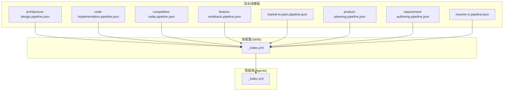
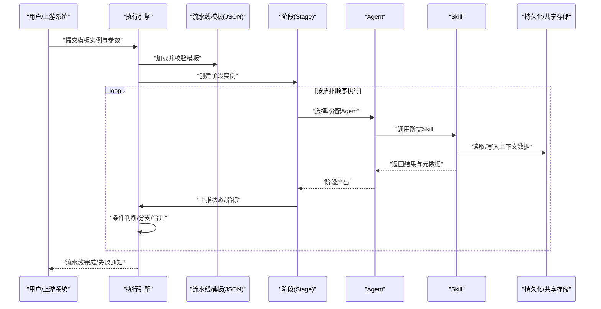
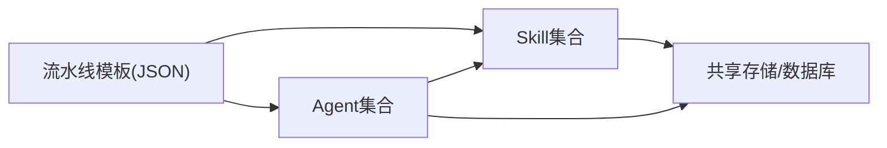

# 流水线编排机制

<cite>
**本文引用的文件**   
- [pipeline-templates/README.md](file://pipeline-templates/README.md)
- [pipeline-templates/architecture-design.pipeline.json](file://pipeline-templates/architecture-design.pipeline.json)
- [pipeline-templates/code-implementation.pipeline.json](file://pipeline-templates/code-implementation.pipeline.json)
- [pipeline-templates/competitive-radar.pipeline.json](file://pipeline-templates/competitive-radar.pipeline.json)
- [pipeline-templates/feature-writeback.pipeline.json](file://pipeline-templates/feature-writeback.pipeline.json)
- [pipeline-templates/market-to-plan.pipeline.json](file://pipeline-templates/market-to-plan.pipeline.json)
- [pipeline-templates/product-planning.pipeline.json](file://pipeline-templates/product-planning.pipeline.json)
- [pipeline-templates/requirement-authoring.pipeline.json](file://pipeline-templates/requirement-authoring.pipeline.json)
- [pipeline-templates/resume-cr.pipeline.json](file://pipeline-templates/resume-cr.pipeline.json)
- [skills/_index.yml](file://skills/_index.yml)
- [agents/_index.yml](file://agents/_index.yml)
</cite>

## 目录
1. [简介](#简介)
2. [项目结构](#项目结构)
3. [核心组件](#核心组件)
4. [架构总览](#架构总览)
5. [详细组件分析](#详细组件分析)
6. [依赖关系分析](#依赖关系分析)
7. [性能考虑](#性能考虑)
8. [故障排查指南](#故障排查指南)
9. [结论](#结论)
10. [附录](#附录)

## 简介
本文件面向希望理解与扩展“流水线编排机制”的读者，围绕声明式配置、阶段定义与流转控制、状态管理与错误处理、重试策略、与Agent/Skill集成、数据传递、以及监控调试与优化等主题展开。文档以仓库中提供的8个内置流水线模板为依据，结合Skills与Agents索引，给出从概念到落地的完整说明，帮助读者快速上手并安全地自定义流水线。

## 项目结构
仓库中与流水线编排直接相关的资源主要位于以下位置：
- pipeline-templates：包含8个内置流水线的JSON声明式配置与说明
- skills：按领域划分的可复用能力（Skill）集合，提供具体执行动作
- agents：角色化智能体（Agent）集合，用于驱动或协同执行任务

图表来源
- [pipeline-templates/architecture-design.pipeline.json](file://pipeline-templates/architecture-design.pipeline.json)
- [pipeline-templates/code-implementation.pipeline.json](file://pipeline-templates/code-implementation.pipeline.json)
- [pipeline-templates/competitive-radar.pipeline.json](file://pipeline-templates/competitive-radar.pipeline.json)
- [pipeline-templates/feature-writeback.pipeline.json](file://pipeline-templates/feature-writeback.pipeline.json)
- [pipeline-templates/market-to-plan.pipeline.json](file://pipeline-templates/market-to-plan.pipeline.json)
- [pipeline-templates/product-planning.pipeline.json](file://pipeline-templates/product-planning.pipeline.json)
- [pipeline-templates/requirement-authoring.pipeline.json](file://pipeline-templates/requirement-authoring.pipeline.json)
- [pipeline-templates/resume-cr.pipeline.json](file://pipeline-templates/resume-cr.pipeline.json)
- [skills/_index.yml](file://skills/_index.yml)
- [agents/_index.yml](file://agents/_index.yml)

章节来源
- [pipeline-templates/README.md](file://pipeline-templates/README.md)
- [skills/_index.yml](file://skills/_index.yml)
- [agents/_index.yml](file://agents/_index.yml)

## 核心组件
- 流水线模板（Pipeline Template）：以JSON声明式描述一个端到端流程，包括阶段、条件、并行度、输入输出、与Skill/Agent的绑定等。
- 执行引擎（Execution Engine）：负责解析模板、调度阶段、管理状态、处理错误与重试、协调Agent与Skill执行、维护上下文数据流。
- 技能（Skill）：最小可复用的执行单元，封装特定业务动作（如查询、生成、校验、写回等）。
- 智能体（Agent）：具备角色与能力的执行主体，通常作为阶段的调用者或协调者。

职责边界
- 模板仅描述“做什么”和“何时做”，不包含实现细节。
- 执行引擎关注“如何可靠地做”，包括并发、容错、幂等、观测性。
- Skill是“怎么做”的具体实现，遵循统一接口契约。
- Agent在阶段层面参与决策、编排与交互。

章节来源
- [pipeline-templates/README.md](file://pipeline-templates/README.md)
- [skills/_index.yml](file://skills/_index.yml)
- [agents/_index.yml](file://agents/_index.yml)

## 架构总览
下图展示了流水线模板、执行引擎、Skill与Agent之间的协作关系及数据流向。

图表来源
- [pipeline-templates/architecture-design.pipeline.json](file://pipeline-templates/architecture-design.pipeline.json)
- [pipeline-templates/code-implementation.pipeline.json](file://pipeline-templates/code-implementation.pipeline.json)
- [pipeline-templates/competitive-radar.pipeline.json](file://pipeline-templates/competitive-radar.pipeline.json)
- [pipeline-templates/feature-writeback.pipeline.json](file://pipeline-templates/feature-writeback.pipeline.json)
- [pipeline-templates/market-to-plan.pipeline.json](file://pipeline-templates/market-to-plan.pipeline.json)
- [pipeline-templates/product-planning.pipeline.json](file://pipeline-templates/product-planning.pipeline.json)
- [pipeline-templates/requirement-authoring.pipeline.json](file://pipeline-templates/requirement-authoring.pipeline.json)
- [pipeline-templates/resume-cr.pipeline.json](file://pipeline-templates/resume-cr.pipeline.json)
- [skills/_index.yml](file://skills/_index.yml)
- [agents/_index.yml](file://agents/_index.yml)

## 详细组件分析

### 内置流水线模板概览
以下为8个内置模板的功能特性与典型使用场景说明。每个模板均以JSON声明式配置，便于版本化管理与复用。

- 架构设计（architecture-design）
  - 目标：基于产品规划与市场洞察，产出系统架构方案与设计要点。
  - 关键阶段：需求对齐、上下文收集、候选方案评估、架构决策记录、评审与归档。
  - 适用场景：新产品立项、重大重构、跨团队技术拉齐。
  - 参考路径：[architecture-design.pipeline.json](file://pipeline-templates/architecture-design.pipeline.json)

- 代码实现（code-implementation）
  - 目标：将技术方案转化为可执行的开发任务与代码产物，支持评审与回归。
  - 关键阶段：任务拆解、编码、单元测试、代码评审、合并与发布准备。
  - 适用场景：功能迭代、缺陷修复、技术债清理。
  - 参考路径：[code-implementation.pipeline.json](file://pipeline-templates/code-implementation.pipeline.json)

- 竞争雷达（competitive-radar）
  - 目标：持续跟踪竞品动态，形成洞察简报与应对建议。
  - 关键阶段：信息采集、情报清洗、对比分析、报告生成、分发与归档。
  - 适用场景：市场策略制定、差异化定位、预警与机会识别。
  - 参考路径：[competitive-radar.pipeline.json](file://pipeline-templates/competitive-radar.pipeline.json)

- 特性写回（feature-writeback）
  - 目标：将研发过程产物（PRD/SDD/任务等）写回到指定系统，保持双向一致。
  - 关键阶段：差异检测、转换映射、批量写回、一致性校验、异常回滚。
  - 适用场景：多系统同步、审计追踪、合规留痕。
  - 参考路径：[feature-writeback.pipeline.json](file://pipeline-templates/feature-writeback.pipeline.json)

- 市场到规划（market-to-plan）
  - 目标：从市场研究到产品规划的端到端转化，沉淀路线图与里程碑。
  - 关键阶段：市场调研、用户反馈聚合、洞察提炼、规划草案、评审定稿。
  - 适用场景：年度/季度规划、产品线演进、战略落地。
  - 参考路径：[market-to-plan.pipeline.json](file://pipeline-templates/market-to-plan.pipeline.json)

- 产品规划（product-planning）
  - 目标：结构化产品规划流程，确保目标、范围、优先级与资源匹配。
  - 关键阶段：目标设定、范围界定、优先级排序、资源估算、风险识别。
  - 适用场景：产品立项、版本规划、组合管理。
  - 参考路径：[product-planning.pipeline.json](file://pipeline-templates/product-planning.pipeline.json)

- 需求编写（requirement-authoring）
  - 目标：将模糊需求转化为高质量PRD，支撑设计与开发。
  - 关键阶段：需求注册、澄清与调研、PRD撰写、同行评审、基线化。
  - 适用场景：新功能定义、体验优化、合规要求落地。
  - 参考路径：[requirement-authoring.pipeline.json](file://pipeline-templates/requirement-authoring.pipeline.json)

- 简历CR（resume-cr）
  - 目标：自动化简历相关的需求评审与归档流程，提升效率与一致性。
  - 关键阶段：材料收集、格式校验、内容审查、意见汇总、归档与通知。
  - 适用场景：招聘流程自动化、人才库建设、合规存档。
  - 参考路径：[resume-cr.pipeline.json](file://pipeline-templates/resume-cr.pipeline.json)

章节来源
- [pipeline-templates/architecture-design.pipeline.json](file://pipeline-templates/architecture-design.pipeline.json)
- [pipeline-templates/code-implementation.pipeline.json](file://pipeline-templates/code-implementation.pipeline.json)
- [pipeline-templates/competitive-radar.pipeline.json](file://pipeline-templates/competitive-radar.pipeline.json)
- [pipeline-templates/feature-writeback.pipeline.json](file://pipeline-templates/feature-writeback.pipeline.json)
- [pipeline-templates/market-to-plan.pipeline.json](file://pipeline-templates/market-to-plan.pipeline.json)
- [pipeline-templates/product-planning.pipeline.json](file://pipeline-templates/product-planning.pipeline.json)
- [pipeline-templates/requirement-authoring.pipeline.json](file://pipeline-templates/requirement-authoring.pipeline.json)
- [pipeline-templates/resume-cr.pipeline.json](file://pipeline-templates/resume-cr.pipeline.json)

### 声明式配置与阶段定义
- 模板结构要点
  - 元信息：名称、版本、描述、作者、标签等
  - 输入参数：类型、默认值、约束、示例
  - 阶段列表：顺序/并行拓扑、前置依赖、条件表达式、重试策略、超时
  - 数据契约：阶段输入/输出字段、Schema校验、命名规范
  - 外部集成：Skill引用、Agent绑定、环境变量、凭据注入
  - 观测性：日志级别、指标埋点、告警规则
- 阶段定义要素
  - 标识与标题：唯一ID、可读名称
  - 执行主体：Agent或无头执行器
  - 能力绑定：一个或多个Skill的组合
  - 流转控制：条件分支、合并策略、跳过/强制通过
  - 质量门禁：校验规则、人工审批、回归检查
- 条件与并行
  - 条件：基于输入参数、上游阶段输出、外部状态进行布尔判定
  - 并行：同层阶段可并行执行，需明确合并与冲突解决策略
  - 幂等：同一阶段多次执行应产生一致结果或可恢复状态

章节来源
- [pipeline-templates/README.md](file://pipeline-templates/README.md)
- [pipeline-templates/architecture-design.pipeline.json](file://pipeline-templates/architecture-design.pipeline.json)
- [pipeline-templates/code-implementation.pipeline.json](file://pipeline-templates/code-implementation.pipeline.json)
- [pipeline-templates/competitive-radar.pipeline.json](file://pipeline-templates/competitive-radar.pipeline.json)
- [pipeline-templates/feature-writeback.pipeline.json](file://pipeline-templates/feature-writeback.pipeline.json)
- [pipeline-templates/market-to-plan.pipeline.json](file://pipeline-templates/market-to-plan.pipeline.json)
- [pipeline-templates/product-planning.pipeline.json](file://pipeline-templates/product-planning.pipeline.json)
- [pipeline-templates/requirement-authoring.pipeline.json](file://pipeline-templates/requirement-authoring.pipeline.json)
- [pipeline-templates/resume-cr.pipeline.json](file://pipeline-templates/resume-cr.pipeline.json)

### 状态管理、错误处理与重试
- 状态模型
  - 全局状态：新建、运行中、成功、失败、取消、暂停
  - 阶段状态：待执行、排队中、执行中、成功、失败、跳过、重试中
  - 状态迁移：受条件与事件驱动，保证单向性与可追溯
- 错误分类
  - 可重试错误：网络抖动、临时限流、下游服务不可用
  - 不可重试错误：参数非法、权限不足、数据不一致
  - 人工介入：需要审批、确认或补充材料
- 重试策略
  - 指数退避与抖动：避免雪崩与热点
  - 最大重试次数与超时：防止无限循环
  - 幂等保障：对写操作进行去重与补偿
- 补偿与回滚
  - 写回类流水线需提供反向操作或快照对比
  - 失败后保留中间产物，支持断点续跑

章节来源
- [pipeline-templates/feature-writeback.pipeline.json](file://pipeline-templates/feature-writeback.pipeline.json)
- [pipeline-templates/requirement-authoring.pipeline.json](file://pipeline-templates/requirement-authoring.pipeline.json)

### 与Agent、Skill的集成与数据传递
- 集成方式
  - Agent作为阶段执行主体，负责编排Skill、处理上下文、上报状态
  - Skill为原子能力，遵循统一输入输出契约，支持异步与批处理
  - 模板通过引用Skill ID与Agent角色完成装配
- 数据传递
  - 上下文变量：键值对形式，跨阶段可见，支持嵌套结构与数组
  - 产物文件：大对象或二进制数据通过URI/路径引用
  - 校验与约束：Schema校验、必填项、枚举值、长度限制
- 安全与隔离
  - 凭据注入：最小权限原则，按需注入
  - 沙箱执行：限制文件系统与网络访问范围
  - 审计日志：全链路可追踪

章节来源
- [skills/_index.yml](file://skills/_index.yml)
- [agents/_index.yml](file://agents/_index.yml)
- [pipeline-templates/architecture-design.pipeline.json](file://pipeline-templates/architecture-design.pipeline.json)
- [pipeline-templates/code-implementation.pipeline.json](file://pipeline-templates/code-implementation.pipeline.json)
- [pipeline-templates/competitive-radar.pipeline.json](file://pipeline-templates/competitive-radar.pipeline.json)
- [pipeline-templates/feature-writeback.pipeline.json](file://pipeline-templates/feature-writeback.pipeline.json)
- [pipeline-templates/market-to-plan.pipeline.json](file://pipeline-templates/market-to-plan.pipeline.json)
- [pipeline-templates/product-planning.pipeline.json](file://pipeline-templates/product-planning.pipeline.json)
- [pipeline-templates/requirement-authoring.pipeline.json](file://pipeline-templates/requirement-authoring.pipeline.json)
- [pipeline-templates/resume-cr.pipeline.json](file://pipeline-templates/resume-cr.pipeline.json)

### 自定义流水线开发指南
- 步骤
  - 明确目标与范围：确定输入、输出、关键阶段与质量门禁
  - 梳理Skill清单：列出所需能力及其输入输出契约
  - 设计阶段拓扑：顺序、并行、条件分支与合并策略
  - 编写模板JSON：填充元信息、参数、阶段、重试与观测性配置
  - 本地验证：使用最小数据集走通主流程与异常分支
  - 灰度上线：小流量验证、指标观察、回滚预案
- 配置语法要点
  - 条件表达式：支持布尔逻辑、比较运算、函数调用
  - 并行度控制：同层并行上限、资源配额、抢占策略
  - 重试与超时：每阶段独立配置，支持继承与覆盖
  - 数据契约：字段类型、默认值、校验规则、示例
- 最佳实践
  - 幂等优先：所有写操作可重复执行且结果一致
  - 失败快速：尽早失败，减少无效计算
  - 可观测性：关键路径埋点，指标与日志完备
  - 文档化：模板自描述，含用途、依赖、变更历史

章节来源
- [pipeline-templates/README.md](file://pipeline-templates/README.md)
- [pipeline-templates/architecture-design.pipeline.json](file://pipeline-templates/architecture-design.pipeline.json)
- [pipeline-templates/code-implementation.pipeline.json](file://pipeline-templates/code-implementation.pipeline.json)
- [pipeline-templates/competitive-radar.pipeline.json](file://pipeline-templates/competitive-radar.pipeline.json)
- [pipeline-templates/feature-writeback.pipeline.json](file://pipeline-templates/feature-writeback.pipeline.json)
- [pipeline-templates/market-to-plan.pipeline.json](file://pipeline-templates/market-to-plan.pipeline.json)
- [pipeline-templates/product-planning.pipeline.json](file://pipeline-templates/product-planning.pipeline.json)
- [pipeline-templates/requirement-authoring.pipeline.json](file://pipeline-templates/requirement-authoring.pipeline.json)
- [pipeline-templates/resume-cr.pipeline.json](file://pipeline-templates/resume-cr.pipeline.json)

### 监控、调试与性能优化
- 监控
  - 指标：阶段耗时、成功率、重试率、吞吐、队列积压
  - 日志：结构化日志、TraceID贯穿、敏感信息脱敏
  - 告警：阈值与趋势告警、值班联动
- 调试
  - 断点续跑：从指定阶段恢复
  - 模拟执行：Dry-run模式，不触发副作用
  - 数据回放：使用历史上下文复现问题
- 性能优化
  - 并行化：合理拆分阶段，避免长尾阻塞
  - 缓存：读多写少数据缓存，失效策略清晰
  - 批处理：合并小任务，降低开销
  - 资源隔离：CPU/内存配额，避免相互影响

章节来源
- [pipeline-templates/feature-writeback.pipeline.json](file://pipeline-templates/feature-writeback.pipeline.json)
- [pipeline-templates/competitive-radar.pipeline.json](file://pipeline-templates/competitive-radar.pipeline.json)

## 依赖关系分析
- 模板与Skill/Agent的耦合
  - 模板通过ID引用Skill与Agent，松耦合、可替换
  - 变更Skill实现不影响模板结构，仅需保证契约稳定
- 阶段间依赖
  - 显式声明前置阶段，避免隐式依赖
  - 合并阶段需明确冲突解决策略
- 外部系统依赖
  - 网络、存储、认证等外部依赖需可配置与降级

图表来源
- [skills/_index.yml](file://skills/_index.yml)
- [agents/_index.yml](file://agents/_index.yml)
- [pipeline-templates/architecture-design.pipeline.json](file://pipeline-templates/architecture-design.pipeline.json)
- [pipeline-templates/code-implementation.pipeline.json](file://pipeline-templates/code-implementation.pipeline.json)
- [pipeline-templates/competitive-radar.pipeline.json](file://pipeline-templates/competitive-radar.pipeline.json)
- [pipeline-templates/feature-writeback.pipeline.json](file://pipeline-templates/feature-writeback.pipeline.json)
- [pipeline-templates/market-to-plan.pipeline.json](file://pipeline-templates/market-to-plan.pipeline.json)
- [pipeline-templates/product-planning.pipeline.json](file://pipeline-templates/product-planning.pipeline.json)
- [pipeline-templates/requirement-authoring.pipeline.json](file://pipeline-templates/requirement-authoring.pipeline.json)
- [pipeline-templates/resume-cr.pipeline.json](file://pipeline-templates/resume-cr.pipeline.json)

章节来源
- [skills/_index.yml](file://skills/_index.yml)
- [agents/_index.yml](file://agents/_index.yml)
- [pipeline-templates/README.md](file://pipeline-templates/README.md)

## 性能考虑
- 阶段粒度：过细导致调度开销大，过粗不利于并行与重试
- 资源配额：按环境设置CPU/内存/并发上限，避免争抢
- 数据局部性：尽量在同一区域读写，减少跨域传输
- 背压与限流：下游不可用时主动降速，保护整体稳定性
- 冷启动优化：预热常用Skill与Agent，缩短首包时延

[本节为通用指导，无需源码引用]

## 故障排查指南
- 常见问题
  - 阶段卡住：检查队列、资源、锁竞争与外部依赖健康
  - 数据不一致：核对Schema、默认值与转换逻辑
  - 权限错误：确认凭据注入与最小权限策略
  - 重试风暴：调整退避与抖动参数，增加熔断
- 诊断手段
  - 查看阶段级日志与TraceID
  - 导出上下文快照，对比前后差异
  - 启用Dry-run与只读模式验证
  - 使用回放工具复现问题
- 恢复策略
  - 断点续跑：从最近成功阶段继续
  - 补偿脚本：对写回类流水线执行反向操作
  - 回滚：恢复到上一个稳定版本

章节来源
- [pipeline-templates/feature-writeback.pipeline.json](file://pipeline-templates/feature-writeback.pipeline.json)
- [pipeline-templates/requirement-authoring.pipeline.json](file://pipeline-templates/requirement-authoring.pipeline.json)

## 结论
本机制以声明式模板为核心，结合可插拔的Skill与Agent，实现了高内聚、低耦合的流水线编排。通过完善的状态管理、错误处理与重试策略，配合完善的监控与调试能力，能够支撑从架构设计到代码实现、从市场洞察到产品规划、从需求编写到写回归档的全生命周期流程。建议在实践中坚持幂等、可观测与可恢复的设计原则，逐步构建企业级的AI流水线体系。

[本节为总结性内容，无需源码引用]

## 附录
- 术语表
  - 流水线：由多个阶段组成的端到端流程
  - 阶段：流水线中的最小执行单元
  - Skill：最小可复用能力
  - Agent：具备角色与能力的执行主体
  - 上下文：跨阶段共享的数据载体
- 参考模板清单
  - 架构设计：[architecture-design.pipeline.json](file://pipeline-templates/architecture-design.pipeline.json)
  - 代码实现：[code-implementation.pipeline.json](file://pipeline-templates/code-implementation.pipeline.json)
  - 竞争雷达：[competitive-radar.pipeline.json](file://pipeline-templates/competitive-radar.pipeline.json)
  - 特性写回：[feature-writeback.pipeline.json](file://pipeline-templates/feature-writeback.pipeline.json)
  - 市场到规划：[market-to-plan.pipeline.json](file://pipeline-templates/market-to-plan.pipeline.json)
  - 产品规划：[product-planning.pipeline.json](file://pipeline-templates/product-planning.pipeline.json)
  - 需求编写：[requirement-authoring.pipeline.json](file://pipeline-templates/requirement-authoring.pipeline.json)
  - 简历CR：[resume-cr.pipeline.json](file://pipeline-templates/resume-cr.pipeline.json)