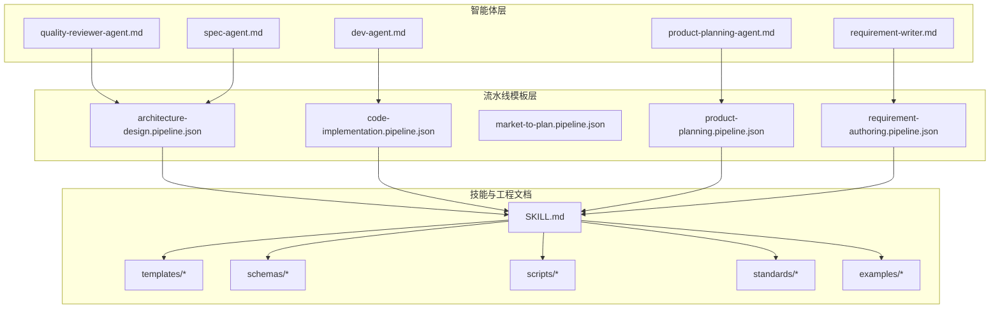
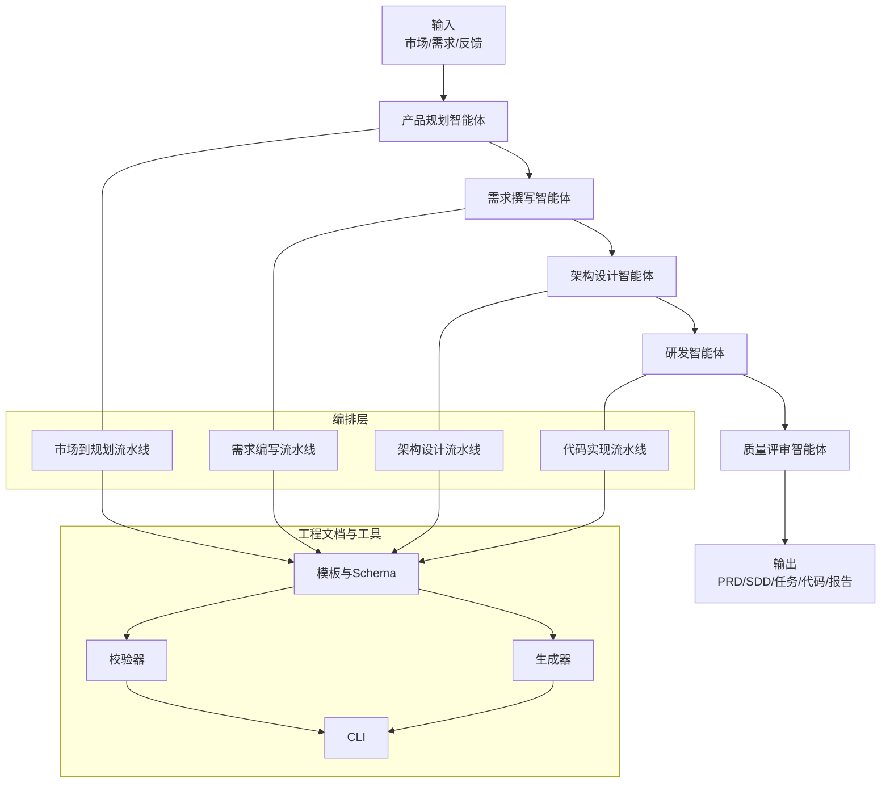
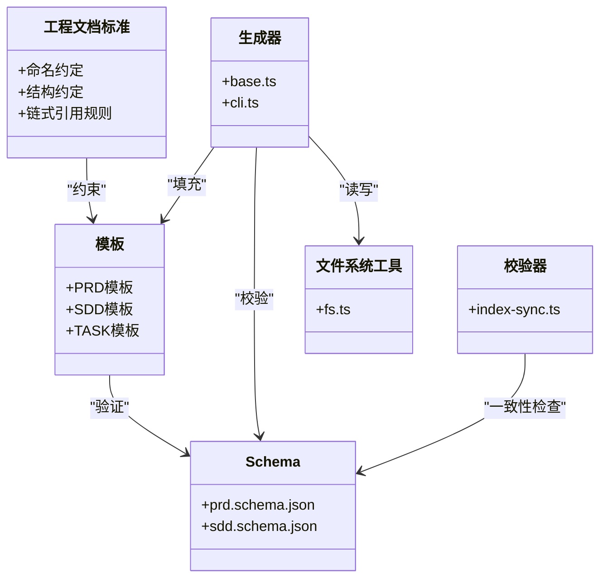
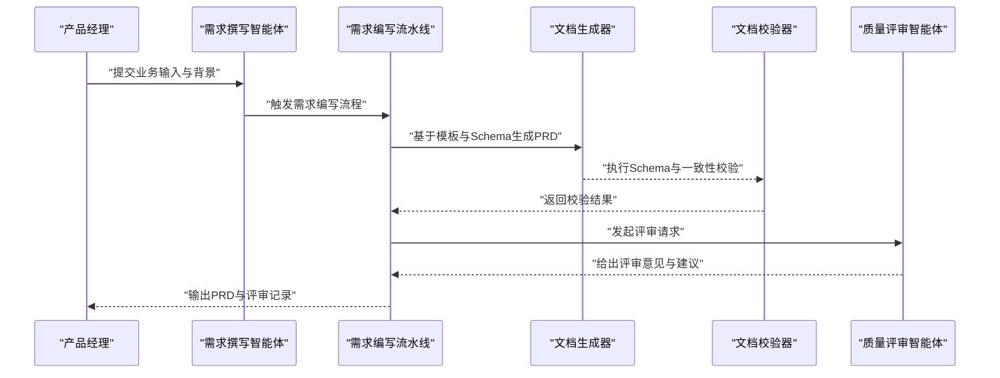
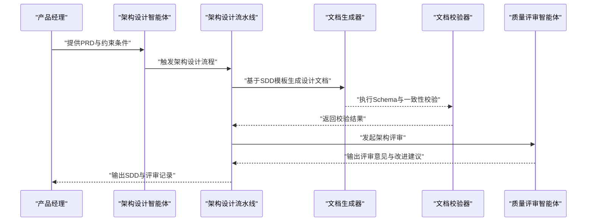
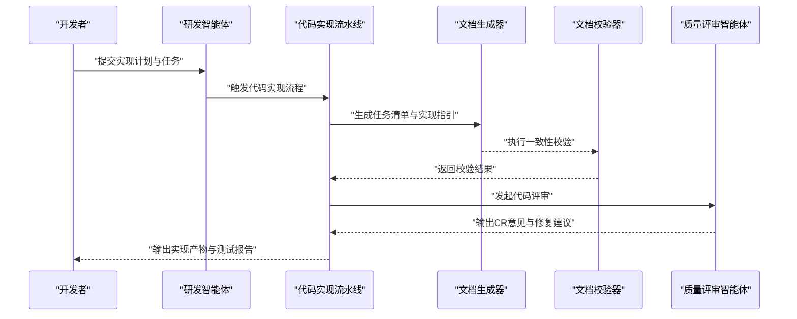
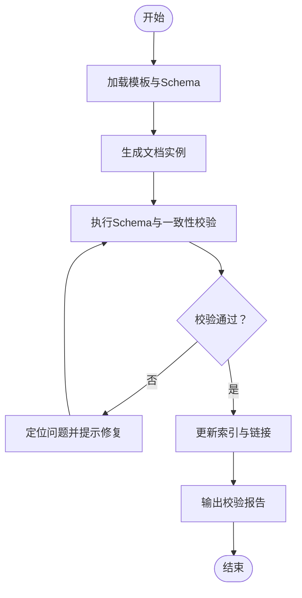
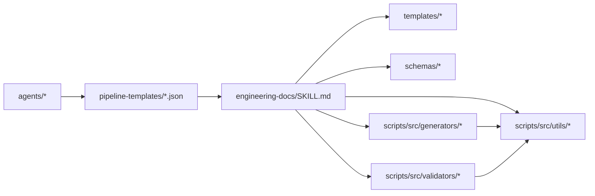

# 项目介绍与价值

<cite>
**本文引用的文件**   
- [agents/_index.yml](file://agents/_index.yml)
- [agents/dev-agent.md](file://agents/dev-agent.md)
- [agents/product-planning-agent.md](file://agents/product-planning-agent.md)
- [agents/quality-reviewer-agent.md](file://agents/quality-reviewer-agent.md)
- [agents/requirement-writer.md](file://agents/requirement-writer.md)
- [agents/spec-agent.md](file://agents/spec-agent.md)
- [pipeline-templates/README.md](file://pipeline-templates/README.md)
- [pipeline-templates/architecture-design.pipeline.json](file://pipeline-templates/architecture-design.pipeline.json)
- [pipeline-templates/code-implementation.pipeline.json](file://pipeline-templates/code-implementation.pipeline.json)
- [pipeline-templates/market-to-plan.pipeline.json](file://pipeline-templates/market-to-plan.pipeline.json)
- [pipeline-templates/product-planning.pipeline.json](file://pipeline-templates/product-planning.pipeline.json)
- [pipeline-templates/requirement-authoring.pipeline.json](file://pipeline-templates/requirement-authoring.pipeline.json)
- [skills/shared/engineering-docs/SKILL.md](file://skills/shared/engineering-docs/SKILL.md)
- [skills/shared/engineering-docs/templates/PRD-template.md](file://skills/shared/engineering-docs/templates/PRD-template.md)
- [skills/shared/engineering-docs/templates/SDD-template.md](file://skills/shared/engineering-docs/templates/SDD-template.md)
- [skills/shared/engineering-docs/templates/TASK-template.md](file://skills/shared/engineering-docs/templates/TASK-template.md)
- [skills/shared/engineering-docs/schemas/prd.schema.json](file://skills/shared/engineering-docs/schemas/prd.schema.json)
- [skills/shared/engineering-docs/schemas/sdd.schema.json](file://skills/shared/engineering-docs/schemas/sdd.schema.json)
- [skills/shared/engineering-docs/scripts/src/cli.ts](file://skills/shared/engineering-docs/scripts/src/cli.ts)
- [skills/shared/engineering-docs/scripts/src/generators/base.ts](file://skills/shared/engineering-docs/scripts/src/generators/base.ts)
- [skills/shared/engineering-docs/scripts/src/validators/index-sync.ts](file://skills/shared/engineering-docs/scripts/src/validators/index-sync.ts)
- [skills/shared/engineering-docs/scripts/src/utils/fs.ts](file://skills/shared/engineering-docs/scripts/src/utils/fs.ts)
- [skills/shared/engineering-docs/scripts/package.json](file://skills/shared/engineering-docs/scripts/package.json)
- [skills/shared/engineering-docs/standards/ENGINEERING-STRUCTURE-TEAM.md](file://skills/shared/engineering-docs/standards/ENGINEERING-STRUCTURE-TEAM.md)
- [skills/shared/engineering-docs/examples/PLAN-v1.0-001-sample-mvp.md](file://skills/shared/engineering-docs/examples/PLAN-v1.0-001-sample-mvp.md)
- [skills/shared/engineering-docs/examples/PRD-001-sample-login.md](file://skills/shared/engineering-docs/examples/PRD-001-sample-login.md)
- [skills/shared/engineering-docs/examples/README.md](file://skills/shared/engineering-docs/examples/README.md)
- [dir-graph.yaml](file://dir-graph.yaml)
</cite>

## 目录
1. [引言](#引言)
2. [项目结构](#项目结构)
3. [核心组件](#核心组件)
4. [架构总览](#架构总览)
5. [详细组件分析](#详细组件分析)
6. [依赖关系分析](#依赖关系分析)
7. [性能与可扩展性](#性能与可扩展性)
8. [故障排查指南](#故障排查指南)
9. [结论](#结论)
10. [附录](#附录)

## 引言
本项目是一套面向AI工程化的工具集，围绕“以AI驱动软件开发生命周期”的核心目标，将产品规划、需求定义、技术设计、代码实现、质量评审与发布等关键环节标准化、模板化与自动化。通过可组合的Agent（智能体）与Pipeline（流水线）模板，配合统一的工程文档规范与校验脚本，帮助团队在保持高质量交付的同时显著提升效率与一致性。

核心价值主张：
- 提高开发效率：用模板与脚本减少重复劳动，让AI辅助生成与校验关键工件。
- 标准化文档流程：统一文档结构、命名与元数据，确保跨角色协作一致。
- 自动化代码审查：将评审要点固化为技能与流水线步骤，提升评审质量与覆盖率。
- 端到端可追溯：从市场洞察到需求、设计、任务与实现的链路贯通，便于审计与复盘。

与传统开发流程对比：
- 传统：文档分散、格式不一；评审依赖人工经验；跨阶段信息割裂；变更影响难以评估。
- AI工程化：模板+Schema约束保证一致性；Agent协同完成多阶段工作；流水线串联端到端流程；脚本自动校验与生成，降低人为错误。

适用角色与价值：
- 产品经理：快速产出结构化PRD与路线图，结合竞品与市场洞察，缩短从想法到方案的时间。
- 开发者：基于SDD与任务清单自动生成骨架与脚手架，聚焦核心逻辑；自动化CR与回归提示。
- 测试工程师：依据PRD/SDD生成测试关注点与用例大纲，联动CR与流水线进行质量门禁。

## 项目结构
仓库采用“能力分层 + 领域分域”的组织方式：
- agents：按角色/职责划分的智能体定义，覆盖产品、研发、质量等。
- pipeline-templates：可复用的端到端流水线模板，串联多Agent协作。
- skills：按领域切分的技能集合，包含工程文档标准、模板、Schema、示例与校验/生成脚本。
- assets/readme-illustrations：说明性素材。
- dir-graph.yaml：仓库结构与依赖可视化配置。

图示来源
- [agents/dev-agent.md:1-200](file://agents/dev-agent.md#L1-L200)
- [agents/product-planning-agent.md:1-200](file://agents/product-planning-agent.md#L1-L200)
- [agents/quality-reviewer-agent.md:1-200](file://agents/quality-reviewer-agent.md#L1-L200)
- [agents/requirement-writer.md:1-200](file://agents/requirement-writer.md#L1-L200)
- [agents/spec-agent.md:1-200](file://agents/spec-agent.md#L1-L200)
- [pipeline-templates/architecture-design.pipeline.json:1-200](file://pipeline-templates/architecture-design.pipeline.json#L1-L200)
- [pipeline-templates/code-implementation.pipeline.json:1-200](file://pipeline-templates/code-implementation.pipeline.json#L1-L200)
- [pipeline-templates/market-to-plan.pipeline.json:1-200](file://pipeline-templates/market-to-plan.pipeline.json#L1-L200)
- [pipeline-templates/product-planning.pipeline.json:1-200](file://pipeline-templates/product-planning.pipeline.json#L1-L200)
- [pipeline-templates/requirement-authoring.pipeline.json:1-200](file://pipeline-templates/requirement-authoring.pipeline.json#L1-L200)
- [skills/shared/engineering-docs/SKILL.md:1-200](file://skills/shared/engineering-docs/SKILL.md#L1-L200)

章节来源
- [agents/_index.yml:1-200](file://agents/_index.yml#L1-L200)
- [dir-graph.yaml:1-200](file://dir-graph.yaml#L1-L200)

## 核心组件
- 智能体（Agents）
  - 研发智能体：负责技术方案细化、任务拆解、代码实现与CR建议。
  - 产品规划智能体：整合市场洞察、竞品分析与用户反馈，输出规划与路线图。
  - 质量评审智能体：对齐需求与设计，执行变更影响分析，给出评审意见。
  - 需求撰写智能体：将业务输入转化为结构化PRD，遵循统一模板与Schema。
  - 规格智能体：维护系统/模块规格，支撑设计与实现的一致性。
- 流水线模板（Pipeline Templates）
  - 架构设计流水线：从需求到架构决策与SDD生成的端到端编排。
  - 代码实现流水线：从任务到实现、CR与测试报告的自动化编排。
  - 市场到规划流水线：从市场研究到规划报告与路线图的编排。
  - 产品规划流水线：综合多源信息，形成可执行的规划条目与ADR记录。
  - 需求编写流水线：从需求注册到PRD生成与评审的闭环。
- 工程文档体系（Engineering Docs）
  - 标准与约定：命名、结构、版本与链式引用规则。
  - 模板与Schema：PRD、SDD、TASK等模板与JSON Schema约束。
  - 示例与参考：样例文档与最佳实践。
  - 脚本工具：CLI、生成器、校验器与文件系统工具，保障文档质量与一致性。

章节来源
- [agents/dev-agent.md:1-200](file://agents/dev-agent.md#L1-L200)
- [agents/product-planning-agent.md:1-200](file://agents/product-planning-agent.md#L1-L200)
- [agents/quality-reviewer-agent.md:1-200](file://agents/quality-reviewer-agent.md#L1-L200)
- [agents/requirement-writer.md:1-200](file://agents/requirement-writer.md#L1-L200)
- [agents/spec-agent.md:1-200](file://agents/spec-agent.md#L1-L200)
- [pipeline-templates/README.md:1-200](file://pipeline-templates/README.md#L1-L200)
- [skills/shared/engineering-docs/SKILL.md:1-200](file://skills/shared/engineering-docs/SKILL.md#L1-L200)

## 架构总览
整体架构由“智能体—流水线—工程文档—脚本工具”四层构成，形成“输入→编排→产出→校验”的闭环。

图示来源
- [agents/product-planning-agent.md:1-200](file://agents/product-planning-agent.md#L1-L200)
- [agents/requirement-writer.md:1-200](file://agents/requirement-writer.md#L1-L200)
- [agents/dev-agent.md:1-200](file://agents/dev-agent.md#L1-L200)
- [agents/quality-reviewer-agent.md:1-200](file://agents/quality-reviewer-agent.md#L1-L200)
- [pipeline-templates/market-to-plan.pipeline.json:1-200](file://pipeline-templates/market-to-plan.pipeline.json#L1-L200)
- [pipeline-templates/requirement-authoring.pipeline.json:1-200](file://pipeline-templates/requirement-authoring.pipeline.json#L1-L200)
- [pipeline-templates/architecture-design.pipeline.json:1-200](file://pipeline-templates/architecture-design.pipeline.json#L1-L200)
- [pipeline-templates/code-implementation.pipeline.json:1-200](file://pipeline-templates/code-implementation.pipeline.json#L1-L200)
- [skills/shared/engineering-docs/SKILL.md:1-200](file://skills/shared/engineering-docs/SKILL.md#L1-L200)

## 详细组件分析

### 工程文档体系（标准、模板、Schema与脚本）
工程文档体系是贯穿全生命周期的“单一事实来源”，通过模板与Schema约束保证一致性，并通过脚本实现批量生成与校验。

图示来源
- [skills/shared/engineering-docs/standards/ENGINEERING-STRUCTURE-TEAM.md:1-200](file://skills/shared/engineering-docs/standards/ENGINEERING-STRUCTURE-TEAM.md#L1-L200)
- [skills/shared/engineering-docs/templates/PRD-template.md:1-200](file://skills/shared/engineering-docs/templates/PRD-template.md#L1-L200)
- [skills/shared/engineering-docs/templates/SDD-template.md:1-200](file://skills/shared/engineering-docs/templates/SDD-template.md#L1-L200)
- [skills/shared/engineering-docs/templates/TASK-template.md:1-200](file://skills/shared/engineering-docs/templates/TASK-template.md#L1-L200)
- [skills/shared/engineering-docs/schemas/prd.schema.json:1-200](file://skills/shared/engineering-docs/schemas/prd.schema.json#L1-L200)
- [skills/shared/engineering-docs/schemas/sdd.schema.json:1-200](file://skills/shared/engineering-docs/schemas/sdd.schema.json#L1-L200)
- [skills/shared/engineering-docs/scripts/src/generators/base.ts:1-200](file://skills/shared/engineering-docs/scripts/src/generators/base.ts#L1-L200)
- [skills/shared/engineering-docs/scripts/src/cli.ts:1-200](file://skills/shared/engineering-docs/scripts/src/cli.ts#L1-L200)
- [skills/shared/engineering-docs/scripts/src/validators/index-sync.ts:1-200](file://skills/shared/engineering-docs/scripts/src/validators/index-sync.ts#L1-L200)
- [skills/shared/engineering-docs/scripts/src/utils/fs.ts:1-200](file://skills/shared/engineering-docs/scripts/src/utils/fs.ts#L1-L200)

章节来源
- [skills/shared/engineering-docs/SKILL.md:1-200](file://skills/shared/engineering-docs/SKILL.md#L1-L200)
- [skills/shared/engineering-docs/examples/README.md:1-200](file://skills/shared/engineering-docs/examples/README.md#L1-L200)
- [skills/shared/engineering-docs/examples/PRD-001-sample-login.md:1-200](file://skills/shared/engineering-docs/examples/PRD-001-sample-login.md#L1-L200)
- [skills/shared/engineering-docs/examples/PLAN-v1.0-001-sample-mvp.md:1-200](file://skills/shared/engineering-docs/examples/PLAN-v1.0-001-sample-mvp.md#L1-L200)
- [skills/shared/engineering-docs/scripts/package.json:1-200](file://skills/shared/engineering-docs/scripts/package.json#L1-L200)

### 需求编写流水线（端到端序列）
该流水线将“需求注册→PRD生成→评审→归档”串联起来，确保需求工件的质量与可追溯性。

图示来源
- [pipeline-templates/requirement-authoring.pipeline.json:1-200](file://pipeline-templates/requirement-authoring.pipeline.json#L1-L200)
- [agents/requirement-writer.md:1-200](file://agents/requirement-writer.md#L1-L200)
- [skills/shared/engineering-docs/scripts/src/generators/base.ts:1-200](file://skills/shared/engineering-docs/scripts/src/generators/base.ts#L1-L200)
- [skills/shared/engineering-docs/scripts/src/validators/index-sync.ts:1-200](file://skills/shared/engineering-docs/scripts/src/validators/index-sync.ts#L1-L200)
- [agents/quality-reviewer-agent.md:1-200](file://agents/quality-reviewer-agent.md#L1-L200)

章节来源
- [pipeline-templates/requirement-authoring.pipeline.json:1-200](file://pipeline-templates/requirement-authoring.pipeline.json#L1-L200)
- [agents/requirement-writer.md:1-200](file://agents/requirement-writer.md#L1-L200)

### 架构设计流水线（端到端序列）
该流水线将“需求→架构决策→SDD生成→评审”串联，确保架构与需求对齐并具备可实施性。

图示来源
- [pipeline-templates/architecture-design.pipeline.json:1-200](file://pipeline-templates/architecture-design.pipeline.json#L1-L200)
- [agents/spec-agent.md:1-200](file://agents/spec-agent.md#L1-L200)
- [skills/shared/engineering-docs/scripts/src/generators/base.ts:1-200](file://skills/shared/engineering-docs/scripts/src/generators/base.ts#L1-L200)
- [skills/shared/engineering-docs/scripts/src/validators/index-sync.ts:1-200](file://skills/shared/engineering-docs/scripts/src/validators/index-sync.ts#L1-L200)
- [agents/quality-reviewer-agent.md:1-200](file://agents/quality-reviewer-agent.md#L1-L200)

章节来源
- [pipeline-templates/architecture-design.pipeline.json:1-200](file://pipeline-templates/architecture-design.pipeline.json#L1-L200)
- [agents/spec-agent.md:1-200](file://agents/spec-agent.md#L1-L200)

### 代码实现流水线（端到端序列）
该流水线将“任务拆分→实现→CR→测试报告”串联，提升交付质量与可追踪性。

图示来源
- [pipeline-templates/code-implementation.pipeline.json:1-200](file://pipeline-templates/code-implementation.pipeline.json#L1-L200)
- [agents/dev-agent.md:1-200](file://agents/dev-agent.md#L1-L200)
- [skills/shared/engineering-docs/scripts/src/generators/base.ts:1-200](file://skills/shared/engineering-docs/scripts/src/generators/base.ts#L1-L200)
- [skills/shared/engineering-docs/scripts/src/validators/index-sync.ts:1-200](file://skills/shared/engineering-docs/scripts/src/validators/index-sync.ts#L1-L200)
- [agents/quality-reviewer-agent.md:1-200](file://agents/quality-reviewer-agent.md#L1-L200)

章节来源
- [pipeline-templates/code-implementation.pipeline.json:1-200](file://pipeline-templates/code-implementation.pipeline.json#L1-L200)
- [agents/dev-agent.md:1-200](file://agents/dev-agent.md#L1-L200)

### 复杂逻辑：文档校验与一致性流程
文档校验与一致性检查是保障工程文档质量的关键环节，涉及Schema校验、索引同步与命名规范检查。

图示来源
- [skills/shared/engineering-docs/scripts/src/validators/index-sync.ts:1-200](file://skills/shared/engineering-docs/scripts/src/validators/index-sync.ts#L1-L200)
- [skills/shared/engineering-docs/scripts/src/generators/base.ts:1-200](file://skills/shared/engineering-docs/scripts/src/generators/base.ts#L1-L200)
- [skills/shared/engineering-docs/scripts/src/utils/fs.ts:1-200](file://skills/shared/engineering-docs/scripts/src/utils/fs.ts#L1-L200)
- [skills/shared/engineering-docs/scripts/src/cli.ts:1-200](file://skills/shared/engineering-docs/scripts/src/cli.ts#L1-L200)

章节来源
- [skills/shared/engineering-docs/scripts/src/validators/index-sync.ts:1-200](file://skills/shared/engineering-docs/scripts/src/validators/index-sync.ts#L1-L200)
- [skills/shared/engineering-docs/scripts/src/generators/base.ts:1-200](file://skills/shared/engineering-docs/scripts/src/generators/base.ts#L1-L200)
- [skills/shared/engineering-docs/scripts/src/utils/fs.ts:1-200](file://skills/shared/engineering-docs/scripts/src/utils/fs.ts#L1-L200)
- [skills/shared/engineering-docs/scripts/src/cli.ts:1-200](file://skills/shared/engineering-docs/scripts/src/cli.ts#L1-L200)

## 依赖关系分析
- Agent与流水线的耦合：各Agent通过流水线模板被编排调用，形成松耦合的可插拔能力。
- 工程文档与脚本的强关联：模板与Schema为生成器与校验器提供契约，CLI作为统一入口协调执行。
- 外部依赖：脚本工具使用Node生态（package.json），文件系统操作封装于utils/fs.ts，避免直接散落的IO逻辑。

图示来源
- [agents/_index.yml:1-200](file://agents/_index.yml#L1-L200)
- [pipeline-templates/README.md:1-200](file://pipeline-templates/README.md#L1-L200)
- [skills/shared/engineering-docs/SKILL.md:1-200](file://skills/shared/engineering-docs/SKILL.md#L1-L200)
- [skills/shared/engineering-docs/scripts/package.json:1-200](file://skills/shared/engineering-docs/scripts/package.json#L1-L200)

章节来源
- [agents/_index.yml:1-200](file://agents/_index.yml#L1-L200)
- [dir-graph.yaml:1-200](file://dir-graph.yaml#L1-L200)

## 性能与可扩展性
- 并行化潜力：流水线中的独立步骤（如多文档生成、多文件校验）可并行执行，缩短端到端时间。
- 增量处理：校验与生成应支持增量模式，仅处理变更文件，降低开销。
- 缓存策略：对稳定模板与Schema的解析结果进行缓存，避免重复计算。
- 扩展点：新增Agent或流水线时，仅需注册至索引与模板，无需改动核心脚本。

[本节为通用指导，不直接分析具体文件]

## 故障排查指南
- 文档校验失败
  - 现象：Schema或一致性校验报错。
  - 排查：检查模板字段是否符合Schema定义；确认命名与链式引用是否满足约定；查看校验器输出的错误位置。
  - 参考路径：[校验器:1-200](file://skills/shared/engineering-docs/scripts/src/validators/index-sync.ts#L1-L200)、[Schema:1-200](file://skills/shared/engineering-docs/schemas/prd.schema.json#L1-L200)。
- 生成器异常
  - 现象：生成文档为空或字段缺失。
  - 排查：确认输入上下文完整；检查生成器参数与模板变量映射；查看CLI日志。
  - 参考路径：[生成器:1-200](file://skills/shared/engineering-docs/scripts/src/generators/base.ts#L1-L200)、[CLI:1-200](file://skills/shared/engineering-docs/scripts/src/cli.ts#L1-L200)。
- 文件系统错误
  - 现象：读写权限不足或路径不存在。
  - 排查：确认运行环境与工作目录；检查utils/fs.ts的路径拼接逻辑。
  - 参考路径：[文件系统工具:1-200](file://skills/shared/engineering-docs/scripts/src/utils/fs.ts#L1-L200)。
- 流水线步骤失败
  - 现象：某一步骤中断导致流水线失败。
  - 排查：查看步骤日志与依赖状态；确认上游产出是否满足下游输入契约；必要时回滚到最近成功节点。
  - 参考路径：[流水线模板:1-200](file://pipeline-templates/README.md#L1-L200)。

章节来源
- [skills/shared/engineering-docs/scripts/src/validators/index-sync.ts:1-200](file://skills/shared/engineering-docs/scripts/src/validators/index-sync.ts#L1-L200)
- [skills/shared/engineering-docs/scripts/src/generators/base.ts:1-200](file://skills/shared/engineering-docs/scripts/src/generators/base.ts#L1-L200)
- [skills/shared/engineering-docs/scripts/src/cli.ts:1-200](file://skills/shared/engineering-docs/scripts/src/cli.ts#L1-L200)
- [skills/shared/engineering-docs/scripts/src/utils/fs.ts:1-200](file://skills/shared/engineering-docs/scripts/src/utils/fs.ts#L1-L200)
- [pipeline-templates/README.md:1-200](file://pipeline-templates/README.md#L1-L200)

## 结论
本工具集以“智能体+流水线+工程文档+脚本工具”的组合，构建了AI驱动的软件开发全生命周期解决方案。通过标准化与自动化，显著提升了团队协作效率与交付质量，同时保持了良好的可扩展性与可维护性。对于不同角色而言，它提供了从规划到实现再到评审的端到端支撑，使团队能够在保持高质量的前提下加速创新与交付。

[本节为总结性内容，不直接分析具体文件]

## 附录
- 使用场景与案例
  - 新产品立项：市场到规划流水线结合产品规划智能体，快速产出规划报告与路线图。
  - 功能迭代：需求编写流水线生成PRD，架构设计流水线产出SDD，代码实现流水线完成开发与CR。
  - 质量治理：质量评审智能体与校验脚本联合，确保文档与代码的一致性与合规性。
- 角色价值速览
  - 产品经理：更快更稳地产出PRD与路线图，减少反复沟通成本。
  - 开发者：基于SDD与任务清单高效实现，CR前置提升一次通过率。
  - 测试工程师：依据PRD/SDD生成测试关注点，联动流水线进行质量门禁。

[本节为概念性内容，不直接分析具体文件]