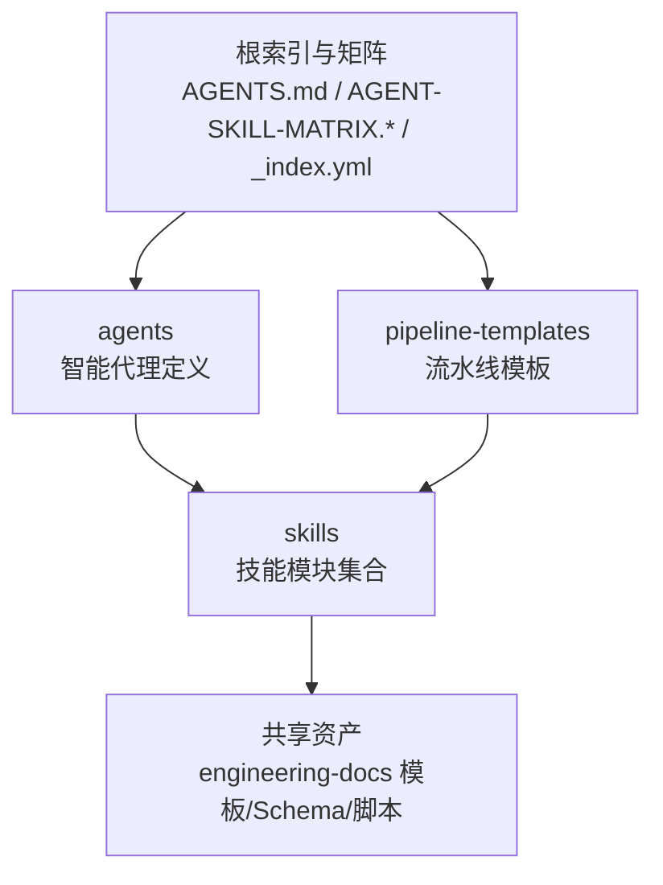
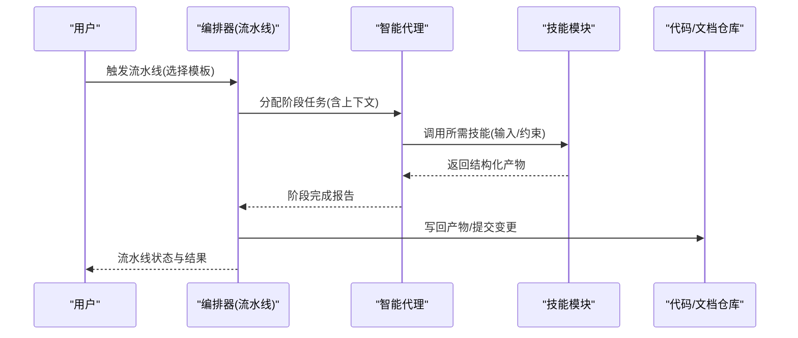
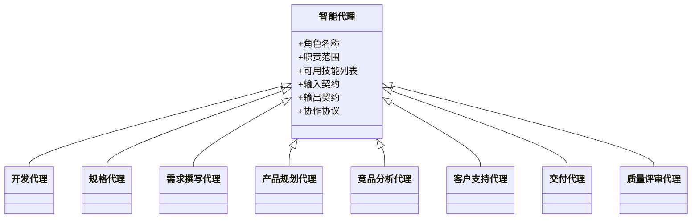
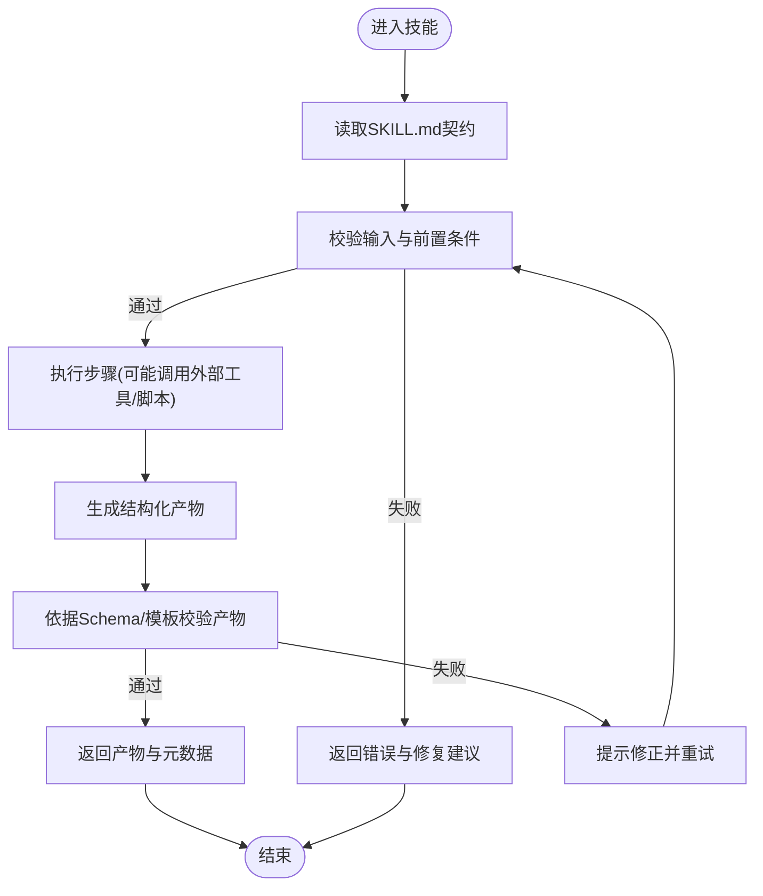
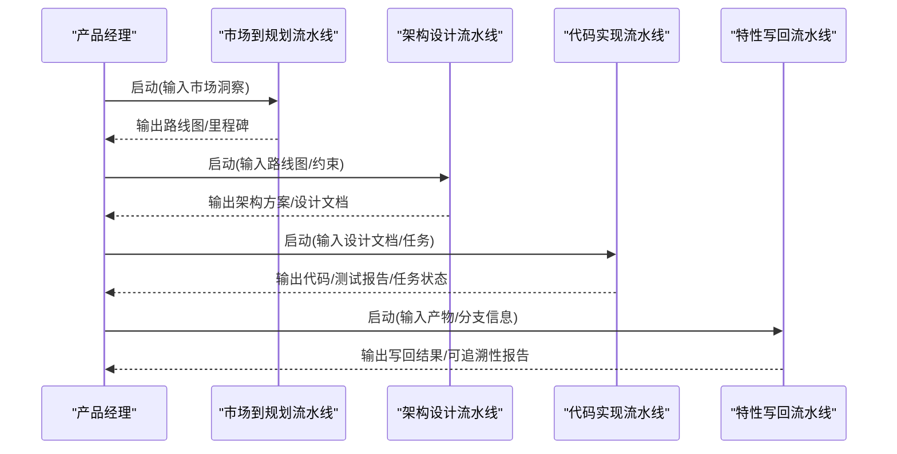
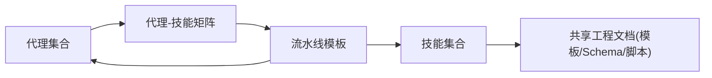

# 项目概述

<cite>
**本文引用的文件**   
- [agents/_index.yml](file://agents/_index.yml)
- [agents/dev-agent.md](file://agents/dev-agent.md)
- [agents/spec-agent.md](file://agents/spec-agent.md)
- [agents/requirement-writer.md](file://agents/requirement-writer.md)
- [agents/product-planning-agent.md](file://agents/product-planning-agent.md)
- [agents/competitive-analyst-agent.md](file://agents/competitive-analyst-agent.md)
- [agents/customer-support-agent.md](file://agents/customer-support-agent.md)
- [agents/delivery-agent.md](file://agents/delivery-agent.md)
- [agents/quality-reviewer-agent.md](file://agents/quality-reviewer-agent.md)
- [skills/_index.yml](file://skills/_index.yml)
- [skills/shared/engineering-docs/SKILL.md](file://skills/shared/engineering-docs/SKILL.md)
- [skills/planning/conduct-market-research/SKILL.md](file://skills/planning/conduct-market-research/SKILL.md)
- [skills/planning/run-competitive-analysis/SKILL.md](file://skills/planning/run-competitive-analysis/SKILL.md)
- [skills/develop/implement-code/SKILL.md](file://skills/develop/implement-code/SKILL.md)
- [skills/develop/write-dev-plan/SKILL.md](file://skills/develop/write-dev-plan/SKILL.md)
- [skills/requirement/approve-requirement/SKILL.md](file://skills/requirement/approve-requirement/SKILL.md)
- [skills/cr/cr-query/SKILL.md](file://skills/cr/cr-query/SKILL.md)
- [skills/sync/pull-progress/SKILL.md](file://skills/sync/pull-progress/SKILL.md)
- [pipeline-templates/README.md](file://pipeline-templates/README.md)
- [pipeline-templates/architecture-design.pipeline.json](file://pipeline-templates/architecture-design.pipeline.json)
- [pipeline-templates/code-implementation.pipeline.json](file://pipeline-templates/code-implementation.pipeline.json)
- [pipeline-templates/market-to-plan.pipeline.json](file://pipeline-templates/market-to-plan.pipeline.json)
- [pipeline-templates/feature-writeback.pipeline.json](file://pipeline-templates/feature-writeback.pipeline.json)
- [AGENT-SKILL-MATRIX.md](file://AGENT-SKILL-MATRIX.md)
- [AGENT-SKILL-MATRIX.yml](file://agent-skill-matrix.yml)
- [CLAUDE.MD](file://CLAUDE.MD)
</cite>

## 目录
1. [简介](#简介)
2. [项目结构](#项目结构)
3. [核心组件](#核心组件)
4. [架构总览](#架构总览)
5. [详细组件分析](#详细组件分析)
6. [依赖关系分析](#依赖关系分析)
7. [性能与可扩展性](#性能与可扩展性)
8. [故障排查指南](#故障排查指南)
9. [结论](#结论)
10. [附录：快速开始](#附录快速开始)

## 简介
本项目是一个面向AI工程化的工具集，围绕“智能代理（Agent）+ 技能（Skill）+ 流水线（Pipeline）”的体系，构建可复用的AI驱动软件开发自动化能力。其核心价值在于：
- 以智能代理生态组织角色化能力，覆盖产品规划、需求、设计、开发、评审、交付等全生命周期环节。
- 通过技能模块实现能力解耦与复用，支持跨团队、跨项目的标准化实践沉淀。
- 借助流水线编排将多Agent协作串联为端到端工作流，提升研发效率与质量一致性。

设计理念强调“角色即服务、能力即插件、流程即配置”，使AI能力像微服务一样被组合、治理和演进。

## 项目结构
仓库采用按领域与职责分层的目录组织方式：
- agents：定义各类智能代理的角色、职责与行为边界。
- skills：按领域划分的能力集合，每个技能包含SKILL.md说明文档，部分技能附带模板、Schema或脚本。
- pipeline-templates：提供可复用的流水线模板，描述多步骤任务编排与数据流转。
- 根级索引与矩阵：如AGENTS.md、AGENT-SKILL-MATRIX.*、skills/_index.yml等，用于全局导航与映射。

图示来源
- [agents/_index.yml](file://agents/_index.yml)
- [skills/_index.yml](file://skills/_index.yml)
- [skills/shared/engineering-docs/SKILL.md](file://skills/shared/engineering-docs/SKILL.md)
- [pipeline-templates/README.md](file://pipeline-templates/README.md)

章节来源
- [agents/_index.yml](file://agents/_index.yml)
- [skills/_index.yml](file://skills/_index.yml)
- [pipeline-templates/README.md](file://pipeline-templates/README.md)

## 核心组件
- 智能代理（Agent）
  - 代表特定角色的AI实体，具备目标、约束、可用技能与交互协议。
  - 典型角色包括：开发代理、规格代理、需求撰写代理、产品规划代理、竞品分析代理、客户支持代理、交付代理、质量评审代理等。
- 技能（Skill）
  - 最小可复用能力单元，通常由SKILL.md描述输入输出、前置条件、执行步骤与产物规范。
  - 覆盖市场研究、竞品分析、需求审批、技术设计、代码实现、CR查询、进度同步、写回等场景。
- 流水线（Pipeline）
  - 基于JSON模板的任务编排，串联多个技能与人工节点，形成从洞察到交付的端到端流程。
  - 常见模板包括架构设计、代码实现、市场到规划、特性写回等。

章节来源
- [agents/dev-agent.md](file://agents/dev-agent.md)
- [agents/spec-agent.md](file://agents/spec-agent.md)
- [agents/requirement-writer.md](file://agents/requirement-writer.md)
- [agents/product-planning-agent.md](file://agents/product-planning-agent.md)
- [agents/competitive-analyst-agent.md](file://agents/competitive-analyst-agent.md)
- [agents/customer-support-agent.md](file://agents/customer-support-agent.md)
- [agents/delivery-agent.md](file://agents/delivery-agent.md)
- [agents/quality-reviewer-agent.md](file://agents/quality-reviewer-agent.md)
- [skills/planning/conduct-market-research/SKILL.md](file://skills/planning/conduct-market-research/SKILL.md)
- [skills/planning/run-competitive-analysis/SKILL.md](file://skills/planning/run-competitive-analysis/SKILL.md)
- [skills/develop/implement-code/SKILL.md](file://skills/develop/implement-code/SKILL.md)
- [skills/develop/write-dev-plan/SKILL.md](file://skills/develop/write-dev-plan/SKILL.md)
- [skills/requirement/approve-requirement/SKILL.md](file://skills/requirement/approve-requirement/SKILL.md)
- [skills/cr/cr-query/SKILL.md](file://skills/cr/cr-query/SKILL.md)
- [skills/sync/pull-progress/SKILL.md](file://skills/sync/pull-progress/SKILL.md)
- [pipeline-templates/architecture-design.pipeline.json](file://pipeline-templates/architecture-design.pipeline.json)
- [pipeline-templates/code-implementation.pipeline.json](file://pipeline-templates/code-implementation.pipeline.json)
- [pipeline-templates/market-to-plan.pipeline.json](file://pipeline-templates/market-to-plan.pipeline.json)
- [pipeline-templates/feature-writeback.pipeline.json](file://pipeline-templates/feature-writeback.pipeline.json)

## 架构总览
系统以“代理为中心、技能为能力、流水线为编排”的三层架构运行：
- 代理层：负责意图理解、任务分解、资源调度与结果收敛。
- 技能层：提供标准化的输入/输出契约与执行上下文，确保可插拔与可观测。
- 编排层：通过流水线模板将多步任务串并联，管理状态、分支与人工确认点。

图示来源
- [pipeline-templates/README.md](file://pipeline-templates/README.md)
- [pipeline-templates/architecture-design.pipeline.json](file://pipeline-templates/architecture-design.pipeline.json)
- [pipeline-templates/code-implementation.pipeline.json](file://pipeline-templates/code-implementation.pipeline.json)
- [pipeline-templates/market-to-plan.pipeline.json](file://pipeline-templates/market-to-plan.pipeline.json)
- [pipeline-templates/feature-writeback.pipeline.json](file://pipeline-templates/feature-writeback.pipeline.json)
- [skills/shared/engineering-docs/SKILL.md](file://skills/shared/engineering-docs/SKILL.md)

## 详细组件分析

### 智能代理（Agent）
- 角色与职责
  - 开发代理：负责技术方案细化、任务拆解、编码与测试策略制定。
  - 规格代理：负责规格文档生成、版本管理与一致性校验。
  - 需求撰写代理：负责PRD产出、需求登记与评审协同。
  - 产品规划代理：负责洞察收集、路线图与里程碑规划。
  - 竞品分析代理：负责竞品动态抓取、雷达图与策略建议。
  - 客户支持代理：负责工单处理、知识库更新与满意度跟踪。
  - 交付代理：负责发布准备、变更合并与上线检查清单。
  - 质量评审代理：负责变更影响分析、对齐度审查与质量门禁。
- 交互模式
  - 代理通过“技能注册表”发现并调用技能；在流水线中作为阶段执行者。
  - 代理间通过共享产物（文档、指标、任务项）进行协作。

图示来源
- [agents/dev-agent.md](file://agents/dev-agent.md)
- [agents/spec-agent.md](file://agents/spec-agent.md)
- [agents/requirement-writer.md](file://agents/requirement-writer.md)
- [agents/product-planning-agent.md](file://agents/product-planning-agent.md)
- [agents/competitive-analyst-agent.md](file://agents/competitive-analyst-agent.md)
- [agents/customer-support-agent.md](file://agents/customer-support-agent.md)
- [agents/delivery-agent.md](file://agents/delivery-agent.md)
- [agents/quality-reviewer-agent.md](file://agents/quality-reviewer-agent.md)

章节来源
- [agents/dev-agent.md](file://agents/dev-agent.md)
- [agents/spec-agent.md](file://agents/spec-agent.md)
- [agents/requirement-writer.md](file://agents/requirement-writer.md)
- [agents/product-planning-agent.md](file://agents/product-planning-agent.md)
- [agents/competitive-analyst-agent.md](file://agents/competitive-analyst-agent.md)
- [agents/customer-support-agent.md](file://agents/customer-support-agent.md)
- [agents/delivery-agent.md](file://agents/delivery-agent.md)
- [agents/quality-reviewer-agent.md](file://agents/quality-reviewer-agent.md)

### 技能（Skill）
- 能力分类
  - 规划类：市场调研、竞争分析、洞察摘要、路线图编写等。
  - 需求类：需求登记、评审、批准与PRD撰写。
  - 开发类：开发计划、任务拆分、技术设计、代码实现、测试报告。
  - 评审类：变更影响分析、对齐度审查。
  - 同步与写回：进度拉取/推送、远程恢复、PRD/SDD/任务写回、可追溯性维护。
- 契约与标准
  - 每个技能通过SKILL.md明确输入参数、前置条件、执行步骤、产物结构与命名约定。
  - 共享工程文档（engineering-docs）提供模板、Schema与脚本，保障产物一致性与可验证性。

图示来源
- [skills/shared/engineering-docs/SKILL.md](file://skills/shared/engineering-docs/SKILL.md)
- [skills/planning/conduct-market-research/SKILL.md](file://skills/planning/conduct-market-research/SKILL.md)
- [skills/planning/run-competitive-analysis/SKILL.md](file://skills/planning/run-competitive-analysis/SKILL.md)
- [skills/develop/implement-code/SKILL.md](file://skills/develop/implement-code/SKILL.md)
- [skills/develop/write-dev-plan/SKILL.md](file://skills/develop/write-dev-plan/SKILL.md)
- [skills/requirement/approve-requirement/SKILL.md](file://skills/requirement/approve-requirement/SKILL.md)
- [skills/cr/cr-query/SKILL.md](file://skills/cr/cr-query/SKILL.md)
- [skills/sync/pull-progress/SKILL.md](file://skills/sync/pull-progress/SKILL.md)

章节来源
- [skills/_index.yml](file://skills/_index.yml)
- [skills/shared/engineering-docs/SKILL.md](file://skills/shared/engineering-docs/SKILL.md)
- [skills/planning/conduct-market-research/SKILL.md](file://skills/planning/conduct-market-research/SKILL.md)
- [skills/planning/run-competitive-analysis/SKILL.md](file://skills/planning/run-competitive-analysis/SKILL.md)
- [skills/develop/implement-code/SKILL.md](file://skills/develop/implement-code/SKILL.md)
- [skills/develop/write-dev-plan/SKILL.md](file://skills/develop/write-dev-plan/SKILL.md)
- [skills/requirement/approve-requirement/SKILL.md](file://skills/requirement/approve-requirement/SKILL.md)
- [skills/cr/cr-query/SKILL.md](file://skills/cr/cr-query/SKILL.md)
- [skills/sync/pull-progress/SKILL.md](file://skills/sync/pull-progress/SKILL.md)

### 流水线（Pipeline）
- 模板类型
  - 架构设计：从需求到架构方案的结构化产出。
  - 代码实现：从设计到实现、测试与回归的闭环。
  - 市场到规划：从洞察到路线图与里程碑的计划生成。
  - 特性写回：将产物写回仓库并建立可追溯性。
- 编排要素
  - 阶段顺序、并行度、人工审批节点、失败重试与回滚策略。
  - 产物路径、命名规范与版本标记。

图示来源
- [pipeline-templates/market-to-plan.pipeline.json](file://pipeline-templates/market-to-plan.pipeline.json)
- [pipeline-templates/architecture-design.pipeline.json](file://pipeline-templates/architecture-design.pipeline.json)
- [pipeline-templates/code-implementation.pipeline.json](file://pipeline-templates/code-implementation.pipeline.json)
- [pipeline-templates/feature-writeback.pipeline.json](file://pipeline-templates/feature-writeback.pipeline.json)
- [pipeline-templates/README.md](file://pipeline-templates/README.md)

章节来源
- [pipeline-templates/README.md](file://pipeline-templates/README.md)
- [pipeline-templates/architecture-design.pipeline.json](file://pipeline-templates/architecture-design.pipeline.json)
- [pipeline-templates/code-implementation.pipeline.json](file://pipeline-templates/code-implementation.pipeline.json)
- [pipeline-templates/market-to-plan.pipeline.json](file://pipeline-templates/market-to-plan.pipeline.json)
- [pipeline-templates/feature-writeback.pipeline.json](file://pipeline-templates/feature-writeback.pipeline.json)

## 依赖关系分析
- 代理与技能的映射关系通过矩阵文件集中管理，便于检索与治理。
- 技能对共享工程文档（模板/Schema/脚本）存在强依赖，保证产物一致性与可验证性。
- 流水线模板依赖具体技能与产物路径，形成稳定的编排契约。

图示来源
- [AGENT-SKILL-MATRIX.md](file://AGENT-SKILL-MATRIX.md)
- [agent-skill-matrix.yml](file://agent-skill-matrix.yml)
- [skills/shared/engineering-docs/SKILL.md](file://skills/shared/engineering-docs/SKILL.md)
- [pipeline-templates/README.md](file://pipeline-templates/README.md)

章节来源
- [AGENT-SKILL-MATRIX.md](file://AGENT-SKILL-MATRIX.md)
- [agent-skill-matrix.yml](file://agent-skill-matrix.yml)
- [skills/shared/engineering-docs/SKILL.md](file://skills/shared/engineering-docs/SKILL.md)
- [pipeline-templates/README.md](file://pipeline-templates/README.md)

## 性能与可扩展性
- 可插拔能力：新增技能只需遵循SKILL.md契约与共享Schema，即可被代理与流水线复用。
- 并行编排：流水线支持阶段内并行执行，缩短端到端周期。
- 产物治理：统一的命名与版本策略降低冲突与回溯成本。
- 扩展建议：
  - 引入缓存与增量计算，减少重复工作。
  - 增加度量与日志，完善可观测性与排障能力。
  - 对高耗时技能引入异步队列与重试机制。

[本节为通用指导，不直接分析具体文件]

## 故障排查指南
- 常见问题定位
  - 流水线失败：检查阶段产物是否符合Schema与命名约定。
  - 技能执行异常：核对SKILL.md的前置条件与输入参数。
  - 代理无法调用技能：确认代理-技能矩阵是否已更新且路径正确。
- 建议操作
  - 使用共享工程文档中的模板与脚本进行产物自检。
  - 查看流水线的阶段日志与中间产物，定位断点。
  - 必要时回滚至上一稳定版本，逐步重建产物。

章节来源
- [skills/shared/engineering-docs/SKILL.md](file://skills/shared/engineering-docs/SKILL.md)
- [pipeline-templates/README.md](file://pipeline-templates/README.md)

## 结论
本项目以“代理-技能-流水线”为核心范式，构建了可复用、可编排、可治理的AI工程化工具集。通过标准化契约与共享资产，团队能够快速组装高质量、可追踪的研发流程，并在持续演进中保持稳定性与一致性。

[本节为总结性内容，不直接分析具体文件]

## 附录：快速开始
- 环境要求
  - 操作系统：主流桌面或服务器系统。
  - 运行时：Node.js（用于工程文档脚本）、Git（用于仓库操作）。
  - 编辑器：支持Markdown与YAML的任意编辑器。
- 安装步骤
  - 克隆仓库到本地。
  - 安装工程文档脚本依赖（位于shared/engineering-docs/scripts）。
  - 初始化流水线模板（根据业务选择对应模板）。
- 基本使用示例
  - 启动“市场到规划”流水线，输入市场洞察，得到路线图与里程碑。
  - 启动“架构设计”流水线，输入路线图与约束，得到架构方案与设计文档。
  - 启动“代码实现”流水线，输入设计文档与任务，得到代码与测试报告。
  - 启动“特性写回”流水线，将产物写回仓库并生成可追溯性报告。
- 最佳实践
  - 严格遵循SKILL.md契约与共享Schema，确保产物一致。
  - 在关键阶段设置人工审批节点，控制风险。
  - 定期复盘流水线与技能，优化执行路径与产物质量。

章节来源
- [pipeline-templates/README.md](file://pipeline-templates/README.md)
- [skills/shared/engineering-docs/SKILL.md](file://skills/shared/engineering-docs/SKILL.md)
- [CLAUDE.MD](file://CLAUDE.MD)