# AI First 研发协同平台 内置的tools


这个tools包，是之前预置到我们内部研发协同平台的一个可用版本，后面看情况把最新的也放出来和大家交流。

整套tools包含了软件产品研发从产品规划到代码实现再到知识回写的完成流程，即可个人独立使用，也可团队之间的协作推进。

整套tools可以按Skill、Agent、pipeline等颗粒度单独拆出来使用。

本套tools如果只是在Codex、Claude、qoder、Kimi等工具上使用，比较容易出现飘移现象，我自己使用的时候是结合者前面说的那个平台、以及配套的知识库来使用的，平台本身做了很多的执行层面的优化，例如一些渐进加载、pipeline执行约束等等。

个人建议：不用copy这些内容，把这个核心思路落地到团队中即可，每个团队还是有点不一样的，落地过程中想清楚两个问题：1. 团队的所有信息、资产如何管理；2. 团队基于什么来进行协作、如何协作；

## 核心思路


基于 CR 的全流程协作与贯穿。

这套方法里最关键的不是某一个 Skill 写得多完整，而是把一次产品变更变成一个可以持续推进、可以多人接手、可以被 AI 稳定理解的 CR。CR 不是简单的需求单，而是一次变更从想法、需求、设计、任务、代码、测试、评审到最终回写的工作容器。

这里之所以选择CR，而不是issue的模式，很重要的一个点是因为我要把所有的执行过程全部沉淀下来，作为后续复盘等的信息来源，且能够和代码保持强一致。

每个 CR 都有自己的目录、分支、worktree、状态、owner 和过程产物。需求负责人、开发负责人、测试负责人围绕同一个 CR 工作，不是靠口头同步上下文，而是把 PRD、SDD、任务拆解、测试报告、评审意见、审批记录、traceability 都沉淀在 `change-requests/{CR-ID}/` 里。这样不管是同一个人隔天继续，还是换一个人、换一个 Agent 接手，都能从 CR 本身恢复上下文。

推进上，CR 通过状态机往前走。不是 prompt 里说“已经通过了”就算通过，而是每个关键节点都要由明确的 Skill 写入证据并推进状态。比如需求评审通过后进入 `requirement-reviewing`，人工确认后由 `approve-requirement` 推进到 `requirement-approved`；代码评审和测试证据都通过后，才由 `approve-code` 推进到 `code-approved`。自动评审发现 blocker 时，不把问题丢给人工兜底，而是带着 `review_feedback` 回到对应节点自修复，直到证据闭环。

协作上，CR 把“谁负责什么”显式化。`owners.requirement`、`owners.development`、`owners.test` 分别对应需求、开发、测试责任人，角色变化也要留下 owner history。Agent 之间也不是谁都能做所有事，而是通过 `agent-skill-matrix.yml` 限定边界：需求 Agent 负责 PRD 和需求审批，开发 Agent 负责 SDD、任务、编码和代码审批，系统编排器负责跨仓合并、回写、归档这类事务型动作。

回写上，CR 的过程产物不会一直停留在临时目录里。开发完成并通过审批后，`feature-writeback` 会把分支合并回各仓 trunk，把 PRD / SDD 写入 `specs/{id}/`，把任务写入 `delivery/task/`，把测试、评审、代码提交和需求之间的关系生成 `traceability.yml`。最后 CR 从 `_backlog.yml` 移到 `_history.yml`，保留 `change-requests/{CR-ID}/` 作为历史痕迹。也就是说，CR 是过程工作台，`specs/` 和 `delivery/` 是回写后的团队知识库。

所以这套 tools 的核心价值是让AI参与一条可追踪、可恢复、可审计的研发链路。它把过程中的每一步都变成结构化事实，让团队协作从“人脑记上下文”转成“CR 维护上下文”，再让 Agent 基于这些事实稳定推进。

## 目录

```text
tools/
  agents/              # Agent 定义与台账
  skills/              # active Skill 定义
  pipeline-templates/  # 可加载 Pipeline 模板
  agent-skill-matrix.yml # Agent / Skill 权限与归属矩阵
```

## 使用前提

| 前提 | 说明 |
|------|------|
| workspace 已初始化 | 至少包含 `AGENTS.md`、`dir-graph.yaml`、`change-requests/`、`specs/`、`delivery/`、`docs/` |
| repositories 已声明 | `dir-graph.yaml#repositories` 需要声明 knowledge-base repo、代码 repo、trunk、active 状态 |
| 受控 shell 可用 | git 操作必须走 `controlled-shell` 约束的白名单适配器；在 Codex / Claude Code / Cursor / Kimi / Qoder 等 IDE 单独使用时，官方适配器为 `crctl git`（`skills/shared/crctl/`） |
| IDE 单独使用时的执行强制层 | 脱离平台使用时，状态推进、门禁校验、人工审批、review-loop 轮次一律经 `crctl`（`skills/shared/crctl/SKILL.md`），并按 `docs/漂移治理_v2.md` 安装 hooks 与 CI 校验；hooks 适配器见 `skills/shared/crctl/adapters/`（claude-code / qoder / cursor / codex） |
| Agent runtime 可用 | 代码实现阶段需要 Claude Code / Codex / Cursor / Cline 等外部 coding runtime |
| Agent/Skill 矩阵已加载 | `agent-skill-matrix.yml` 定义每个 Skill 的唯一 owner、可调用边界、外部依赖和禁止调用项 |
| CR 角色 owner 明确 | 每个 CR 必须有需求 owner、开发 owner、测试 owner，并记录各自 assigned-at 时间戳 |
| 人工审批人明确 | 需求、架构、开发启动、代码审批都需要人工确认，不能由 prompt 隐式推进 |

## 总体流程图


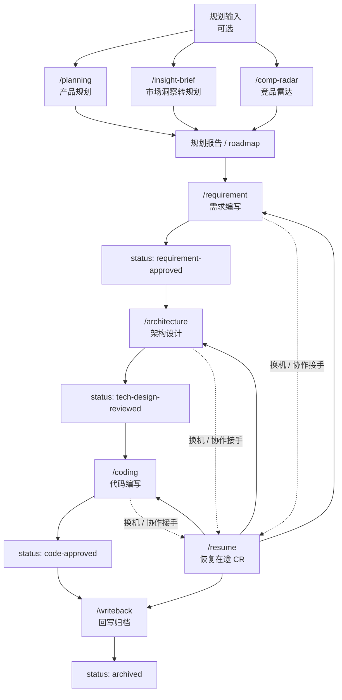

## 主流程速览

| 顺序 | 触发命令 | Pipeline | Pipeline owner | 目标状态 / 产物 | 是否必跑 |
|------|----------|----------|----------------|-----------------|----------|
| 0 | `/planning` | `product-planning` | `product-planning-agent` | `docs/product-planning/`、`roadmap.md` | 可选 |
| 0a | `/insight-brief` | `market-to-plan` | `product-planning-agent` | 市场洞察、规划建议 | 可选 |
| 0b | `/comp-radar` | `competitive-radar` | `competitive-analyst-agent` | 竞品报告、规划建议 | 可选 |
| 1 | `/requirement` | `requirement-authoring` | `requirement-writer` | `prd.md`、`requirement-approved` | 必跑 |
| 2 | `/architecture` | `architecture-design` | `dev-agent` | `sdd.md`、`tech-design-reviewed` | 必跑 |
| 3 | `/coding` | `code-implementation` | `dev-agent` | `plan.md`、`tasks/`、代码、`test-report.md`、`code-approved` | 必跑 |
| 4 | `/writeback` | `feature-writeback` | `system-orchestrator` | `specs/{id}/`、`delivery/task/`、归档 | 必跑 |
| R | `/resume` | `resume-cr` | `system-orchestrator` | 恢复本地 CR worktree 并给出下一步 | 按需 |

`system-orchestrator` 是系统编排器，不是可部署 Agent。它承接回写、同步、CR 状态、受控 shell 等跨 Agent 基础能力。

## Agent / Skill 权限矩阵

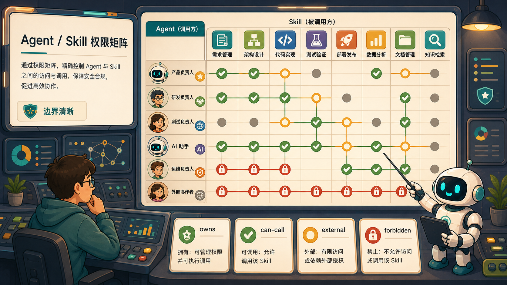

`agent-skill-matrix.yml` 是 Agent 与 Skill 关系的机器可读事实源；`AGENT-SKILL-MATRIX.md` 是人读说明。手工执行或系统编排时，先按 Pipeline owner 选择入口，再按矩阵判断该入口能否调用某个 Skill。

| 关系 | 使用含义 | Playbook 中的执行规则 |
|------|----------|----------------------|
| `owns` | Actor 对 Skill 负主责，默认维护执行契约 | 每个 active Skill 必须且只能有一个 owner；新增 Skill 必须先补矩阵 |
| `can-call` | Actor 可在职责边界内调用该 Skill | 可协作调用，但不得绕过 Skill 自身前置条件、状态机和质量门 |
| `external` | 目标运行时提供的外部方法论 Skill | phase0 tools 不打包同名 `SKILL.md`，只声明依赖 |
| `forbidden` | Actor 明确禁止调用 | 手工演练和系统编排都不得调用；需要改边界时先修矩阵 |

### 主责关系速览

| Actor | 主责范围 |
|-------|----------|
| `product-planning-agent` | 规划、洞察、规划报告、roadmap、想法/ADR、产品上下文 |
| `requirement-writer` | CR 注册、PRD、需求评审、需求审批 |
| `dev-agent` | SDD、技术评审、开发计划、任务、编码、测试报告、代码评审、代码审批 |
| `competitive-analyst-agent` | 竞品动态、竞品报告、报告转规划建议 |
| `spec-agent` | baseline spec 查询、展示、看板 |
| `delivery-agent` | CR TASK 回写到 `delivery/task/` |
| `quality-reviewer-agent` | 横向对齐与影响分析；可协作调用质量门 Skill |
| `system-orchestrator` | 回写合并、远端同步、CR 状态、收件箱、归档、通用校验、受控 shell |

### 当前设计缺口

| 缺口 | 当前处理 | 后续建议 |
|------|----------|----------|
| `knowledge-agent` 写入 Skill 不足 | 只能复用 `engineering-docs`、`validate-doc`、`record-idea` | 补 `write-tech-note` / `write-knowledge-entry` 或收敛能力声明 |
| `customer-support-agent` 反馈落盘缺 Skill | 当前只允许读 specs 和有限代码，反馈写入缺专用 Skill | 补 `record-feedback` 或接入目标系统工单入口 |
| 回写期没有独立 primary Agent | 由 `system-orchestrator` 编排 writeback / CR / delivery Skill，`spec-agent` 仅做回写后只读核对 | 若需要人工入口，再新增 `writeback-agent` |

## 文档与事实源模型

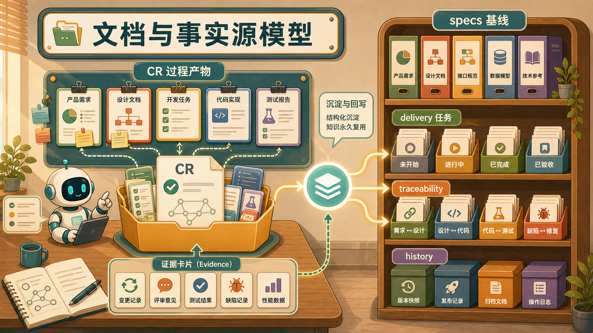

| 阶段 | 工作区产物 | 基线 / 归档产物 |
|------|------------|----------------|
| 需求 | `change-requests/{CR-ID}/prd.md` | `specs/{id}/PRD.md` |
| 设计 | `change-requests/{CR-ID}/sdd.md` | `specs/{id}/SDD.md` |
| 开发计划 | `change-requests/{CR-ID}/plan.md` | 不回写为 specs 设计文档 |
| 任务 | `change-requests/{CR-ID}/tasks/TASK-NN.md` | `delivery/task/TASK-*.md` |
| 测试报告 | `change-requests/{CR-ID}/test-report.md` | `specs/{id}/traceability.yml#tests` |
| 评审证据 | `change-requests/{CR-ID}/review-annotations/*.yml` | `specs/{id}/traceability.yml#reviews` |
| 追溯链 | `change-requests/{CR-ID}/traceability.yml` | `specs/{id}/traceability.yml` |
| CR 归档 | `change-requests/{CR-ID}/` 保留痕迹 | `change-requests/_history.yml` |

## CR Owner 模型

CR 责任归属以 `cr.md` 与 `change-requests/_backlog.yml` 中的 `owners` 为准。顶层 `owner` 仅保留为旧视图兼容字段，默认等于 `owners.requirement.id`。

```yaml
owners:
  requirement:
    id: product-owner
    assigned-at: "YYYY-MM-DDTHH:mm:ss+08:00"
  development:
    id: dev-owner
    assigned-at: "YYYY-MM-DDTHH:mm:ss+08:00"
  test:
    id: test-owner
    assigned-at: "YYYY-MM-DDTHH:mm:ss+08:00"
```

| 角色 | 作用 | 首次写入 | 后续使用 |

- **注册**：`crctl register`（CR-2026-031 TASK-05，取代 cr-init）显式接收三个角色 Owner（`--owner-requirement --owner-development --owner-test`，缺任一参数零写入），CR-ID 分配 + 三账本 recoverable write-set + 注册 commit/trailer + lease push + 逐仓 worktree ensure 一次完成（registration-key 幂等，同键同输入续跑）。
- **移交**：Owner 变更唯一业务入口是 `handover-cr`（`owner-set -> push-progress` 固定顺序）：crctl 原子更新双投影、追加唯一责任历史 `owner-history`、形成只含两份账本的隔离 commit，并以同一 SHA 发出 owners/inbox 事件；`resume-from-remote` 只恢复 worktree，不改变 Owner（CR-2026-030 FR-3~FR-5）。
- **审批**：四阶段人工审批支持平台签名 grant 与本地 TTY 双模式；签名驳回（decision=reject）在完整验签后执行状态机既有回退并返回 `APPROVAL_DECLINED_ROLLED_BACK` 业务结果，紧邻结果态重放幂等（CR-2026-030 FR-6~FR-7）。
|------|------|----------|----------|
| `requirement` | 需求负责人，负责 PRD、需求评审响应与需求审批 | `/requirement` 的 `requirement_owner` | `approve-requirement`、需求收件箱、需求类看板 |
| `development` | 开发负责人，负责 SDD、任务拆分、编码与代码审批 | `/requirement` 的 `dev_owner` | `approve-tech-design`、`approve-dev-start`、`implement-code`、`approve-code` |
| `test` | 测试负责人，负责验证证据与测试报告 | `/requirement` 的 `test_owner` | `write-test-report`、代码审批测试证据门、traceability tests |

角色变更必须通过 `handover-cr` 或 `resume-from-remote` 的角色移交逻辑更新 `owners.{role}.id` 与 `owners.{role}.assigned-at`，并追加 `owner-history`。

## CR 状态机

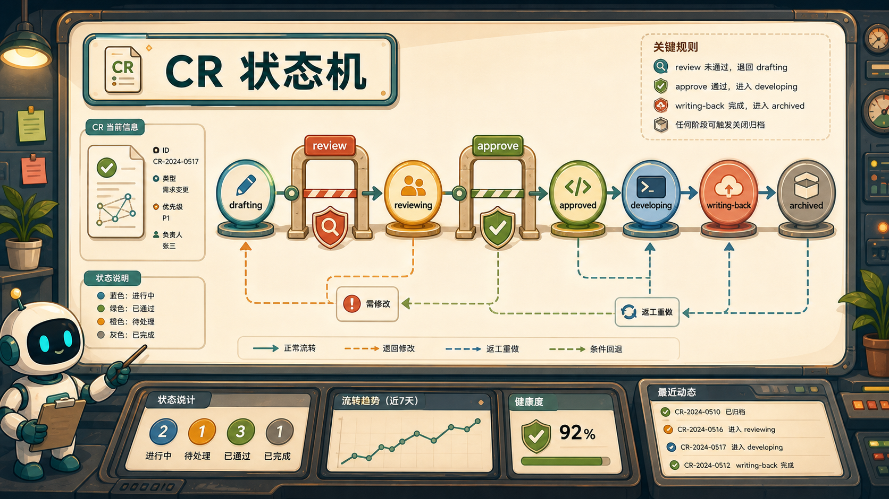

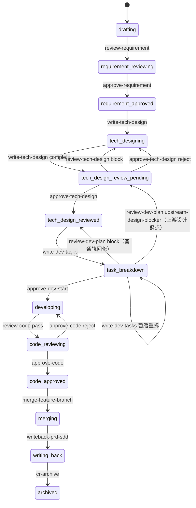

`human_approval` 只表示人工确认，不直接改状态。所有状态推进必须由显式 Skill 完成。`tech-design-review-pending` 同时覆盖“SDD 已写完待自动 Review”和“自动 Review 已通过待人工审批”，因此恢复/看板/人工接续时必须读取 `review-annotations/sdd.yml`：只有 `verdict=pass` 且 `blockers=[]` 时，下一步才是 `human_approval -> approve-tech-design`。

## 自动审查自修复闭环

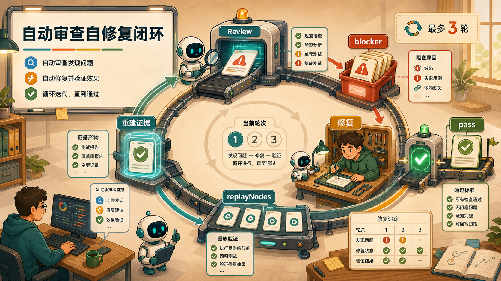

所有自动审查节点都必须先完成自修复闭环，完整通过 Review 后才可进入下一环节，包括人工审核。`onFail=abort` 只表示 Skill 运行异常；如果 Review 正常产出 `blockers`，则按 `reviewLoop` 自动回到对应修复节点。若修复后还必须重建测试报告、checkpoint 或其他证据，pipeline JSON 必须声明 `reviewLoop.replayNodes[]`，运行时按该列表从修复节点顺序重放到当前评审节点。

| 小闭环 | 评审/检查节点 | 修复节点 | 通过条件 | 不通过处理 | 可跳过 |
|--------|---------------|----------|----------|------------|--------|
| 规划报告 | `review-planning-report` | `write-planning-report` | `passCondition.allOf=[approved==true, blockers is empty]` | 传入 `review_feedback` 自动修订规划报告，最多 3 次 | 否 |
| 需求 PRD | `review-requirement` | `write-requirement-prd` | `passCondition.allOf=[verdict==pass, blockers is empty]` | 回到 PRD 修订，保持或回退 `drafting`，最多 3 次 | 否 |
| 技术设计 | `review-tech-design` | `write-tech-design` | `passCondition.allOf=[verdict==pass, blockers is empty]` | 回到 SDD 修订，状态回到 `tech-designing`，最多 3 次 | 否 |
| 测试证据 | `write-test-report` | `implement-code` | `passCondition.allOf=[status==pass, blockers is empty]` | 按 `replayNodes=[implement-code, write-test-report]` 重跑，最多 3 次 | 否 |
| 代码评审 | `review-code` | `implement-code` | `passCondition.allOf=[verdict==pass, blockers is empty, test-report.status==pass]` | 按 `replayNodes=[implement-code, write-test-report, push-progress, review-code]` 重跑，最多 3 次 | 否 |

每次自动审查必须把轮次写入评审产物：`review-loop.current-attempt` 与 `review-loop.attempts[]`。CR 类闭环还必须同步写入 `change-requests/{CR-ID}/traceability.yml` 对应的 `reviews.*.review-loop` 或 `tests.review-loop`。若达到 `reviewLoop.maxAttempts=3` 后仍未通过，pipeline 停止在当前闭环并输出剩余 blocker、最后一次修复记录和建议处理人，不得把未清空的问题带入 `human_approval`。

自动审查节点的主责与协作边界以 `agent-skill-matrix.yml` 为准：规划评审归 `product-planning-agent` 主责，需求/技术/代码阶段的评审 Skill 分别归阶段 owner 主责；`quality-reviewer-agent` 可协作调用质量门 Skill，但不得替代 `approve-*` 或直接推进状态。

| 人工节点后 | 显式状态 Skill | 目标状态 |
|------------|----------------|----------|
| 需求审批 | `approve-requirement` | `requirement-approved` |
| 架构审批 | `approve-tech-design` | `tech-design-reviewed` |
| 开发启动确认 | `approve-dev-start` | `developing` |
| 代码审批 | `approve-code` | `code-approved` |

## 0. 产品规划流程


适用场景：版本规划、季度规划、产品方向梳理。该流程不直接创建 CR，不修改 `specs/` 或 `change-requests/`。

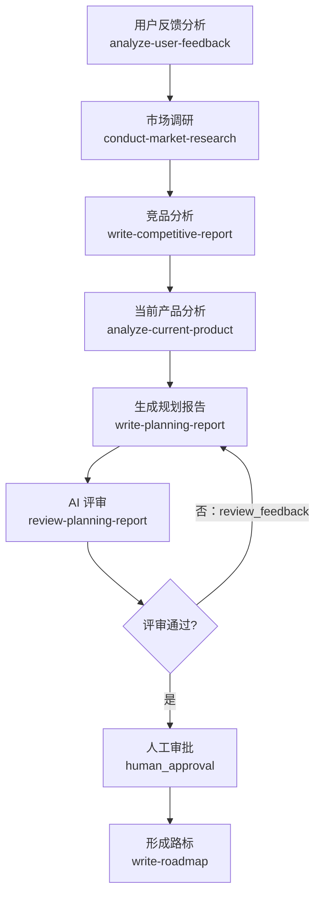

### 输入

| 输入 | 必填 | 说明 |
|------|------|------|
| `topic` | 是 | 规划主题，用于报告标题与文件名 |
| `target_version` | 否 | 目标版本；为空时按时间或季度组织 |
| `skip_feedback` | 否 | 是否跳过用户反馈分析 |
| `skip_market` | 否 | 是否跳过市场调研 |
| `skip_competitive` | 否 | 是否跳过竞品分析 |
| `skip_product` | 否 | 是否跳过当前产品分析 |

### 节点

| 节点 | 输入是什么 | 作用是什么 | 产出是什么 | 可跳过 |
|------|------------|------------|------------|--------|
| 用户反馈分析 | `docs/feedback/`、`skip_feedback` | 提炼高频诉求、痛点和代表反馈 | `node-1.md` 用户反馈摘要 | 是，`skip_feedback=true` 或无反馈文件时跳过 |
| 市场调研 | `topic`、`skip_market` | 生成市场洞察材料 | `docs/market-insights/market-*.md`、索引更新 | 是，`skip_market=true` |
| 竞品分析 | 竞品资料、`skip_competitive` | 串联竞品动态抓取和报告生成 | 竞品报告引用路径 | 是，`skip_competitive=true` |
| 当前产品分析 | `specs/_index.yml`、`specs/_history.yml`、`change-requests/_backlog.yml`、`metrics.yml` | 梳理 baseline、在途 CR、指标与 gap | `node-4.md` 产品现状分析 | 是，`skip_product=true` |
| 生成规划报告 | 前序节点输出、`topic`、`target_version`、可选 `review_feedback` | 汇总调研与产品现状；若为回修轮次，则按 blocker 定点修订 | `docs/product-planning/{date}-{topic}.md`、`_index.yml` draft 条目、fixed-blockers | 否 |
| AI 评审 | 规划报告 | 检查依据、建议、成功指标和待决策项；block 时输出回修指令 | `docs/product-planning/review-annotations/{report-id}.yml`、`repair-instructions` | 否 |
| 人工审批 | 规划报告、已通过的 AI 评审记录 | 仅在 `approved=true` 且 `blockers=[]` 后决定是否进入路标 | 审批通过或驳回结论 | 否 |
| 形成路标 | 已审批规划报告 | 将路线图候选项写入 roadmap | `docs/product-planning/roadmap.md`、规划条目 status=approved | 否 |

## 0a. 市场洞察转规划流程

适用场景：已经有一段用户访谈、市场调研、NPS、内部反馈或竞品压力材料，需要转成规划建议。

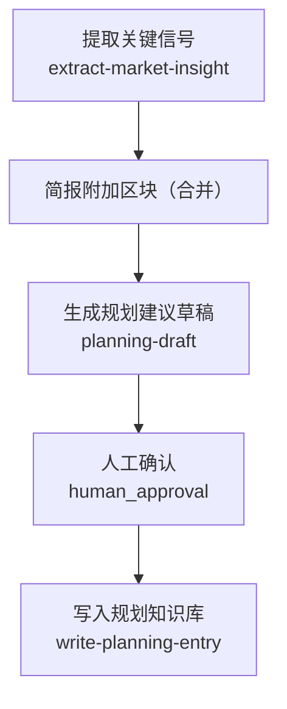

### 输入

| 输入 | 必填 | 说明 |
|------|------|------|
| `insight_source` | 是 | 原始洞察素材 |
| `insight_type` | 否 | 用户痛点 / 市场机会 / 竞品压力 / 内部反馈 / 综合 |
| `target_version` | 否 | 关联目标版本 |

### 节点

| 节点 | 输入是什么 | 作用是什么 | 产出是什么 | 可跳过 |
|------|------------|------------|------------|--------|
| 提取关键信号 | `insight_source`、`insight_type`、`target_version` | 从原文提取痛点、机会、数据、可信度和待验证假设 | `docs/market-insights/market-*.md`、`_index.yml` raw 条目 | 否 |
| 撰写洞察简报 | raw insight 文件路径 | 将 raw insight 整理成可用于规划的简报 | `docs/market-insights/brief-*.md`、raw 条目 status=briefed | 否 |
| 生成规划建议草稿 | 洞察简报、`target_version` | 生成 3-5 条可执行规划建议 | `node-3.md` 规划建议草稿 | 否 |
| 人工确认 | 洞察简报、规划建议草稿 | 决定是否写入产品规划知识库 | 通过或驳回结论 | 否 |
| 写入规划知识库 | 已确认建议 | 将建议转为正式规划条目 | `docs/product-planning/{date}-{slug}.md`、`_index.yml` 更新 | 否 |

## 0b. 竞品雷达流程

适用场景：针对一个竞品收集近期动态，并判断是否转成规划建议。

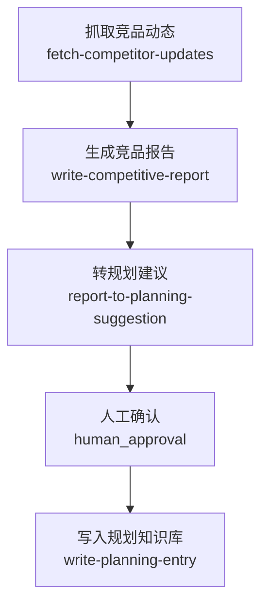

### 输入

| 输入 | 必填 | 说明 |
|------|------|------|
| `competitor_slug` | 是 | 与 `docs/competitive/_index.yml` 中竞品标识对应 |
| `since_days` | 否 | 追溯天数，默认 7 |
| `focus_dimension` | 否 | 功能对比、定价、UI/UX、技术架构、市场定位或全量 |

### 节点

| 节点 | 输入是什么 | 作用是什么 | 产出是什么 | 可跳过 |
|------|------------|------------|------------|--------|
| 抓取竞品动态 | `competitor_slug`、`since_days`、`focus_dimension` | 获取竞品官网、更新日志、博客和公开动态 | `node-1.md` 动态块 | 否 |
| 生成竞品报告 | 动态块、分析维度 | 形成结构化竞品分析 | `docs/competitive/reports/*.md`、报告索引 | 否 |
| 转规划建议 | 竞品报告 | 把机会点转为规划建议草稿 | `node-3.md` 建议草稿 | 是，节点失败时可跳过，后续人工可只审报告 |
| 人工确认 | 报告、建议草稿 | 决定是否进入产品规划知识库 | 通过或驳回结论 | 否 |
| 写入规划知识库 | 已确认建议 | 写入正式规划条目 | `docs/product-planning/{date}-{slug}.md` | 否 |

## 1. 需求编写流程

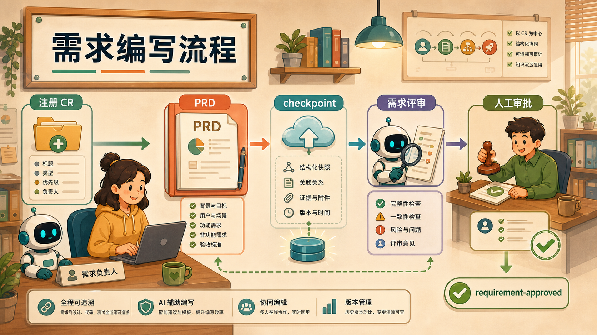

适用场景：创建一个正式 CR，并把 PRD 写入 CR worktree。该流程是主交付链路的入口。

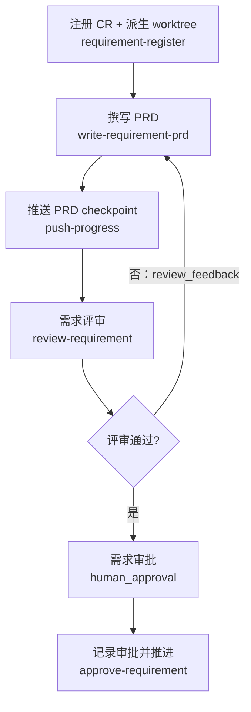

### 输入

| 输入 | 必填 | 说明 |
|------|------|------|
| `title` | 是 | 需求标题 |
| `cr_id` | 否 | 显式 CR-ID；为空时自动生成 |
| `summary` | 是 | 1-3 句话描述目标和价值 |
| `source` | 否 | 规划报告、用户反馈或 idea 路径 |
| `target_version` | 是 | 目标版本 |
| `requirement_owner` | 是 | 需求负责人，写入 `owners.requirement.id` 与 assigned-at |
| `dev_owner` | 是 | 开发负责人，写入 `owners.development.id` 与 assigned-at |
| `test_owner` | 是 | 测试负责人，写入 `owners.test.id` 与 assigned-at |
| `auto_push_after_prd` | 否 | PRD 完成后是否自动推送 checkpoint，默认 true |

### 节点

| 节点 | 输入是什么 | 作用是什么 | 产出是什么 | 可跳过 |
|------|------------|------------|------------|--------|
| 注册 CR + 派生 worktree | `title`、`cr_id`、`summary`、`source`、`target_version`、`requirement_owner`、`dev_owner`、`test_owner`、`dir-graph.yaml#repositories` | 创建 CR 元数据，写入三角色 owner 与 assigned-at，先提交 registration commit，再为所有 active repo 创建同名 worktree | `change-requests/{CR-ID}/cr.md`、`_backlog.yml`、`_index.yml`、`execution_context` | 否 |
| 撰写 PRD | `execution_context.cr_id`、`knowledge_base_worktree`、`summary`、`source`、可选 `review_feedback` | 生成可评审 PRD；若为回修轮次，则按 blocker 定点修订 | `change-requests/{CR-ID}/prd.md`、fixed-blockers | 否 |
| 推送 PRD checkpoint | `execution_context.cr_id`、repo worktree map | 保存 PRD 草稿和 backlog 更新到远端分支 | `origin/requirement/{CR-ID}` checkpoint、`latest-checkpoint` 更新 | 是，`auto_push_after_prd=false` |
| 需求评审 | `prd.md`、`source` | 检查完整性、可测试性、范围和对齐情况；block 时回到 PRD 修订 | `review-annotations/requirement.yml`、`traceability.yml`、通过时 status=`requirement-reviewing` | 否 |
| 需求审批 | `prd.md`、已通过的需求评审记录 | 仅在 `verdict=pass` 且 `blockers=[]` 后人工判断 PRD 是否可进入架构设计 | 通过或驳回结论 | 否 |
| 记录审批并推进 | `execution_context.cr_id`、`owners.requirement.id` | 写入审批证据并推进状态 | `approval.yml#requirement`、status=`requirement-approved` | 否 |

## 2. 架构设计流程

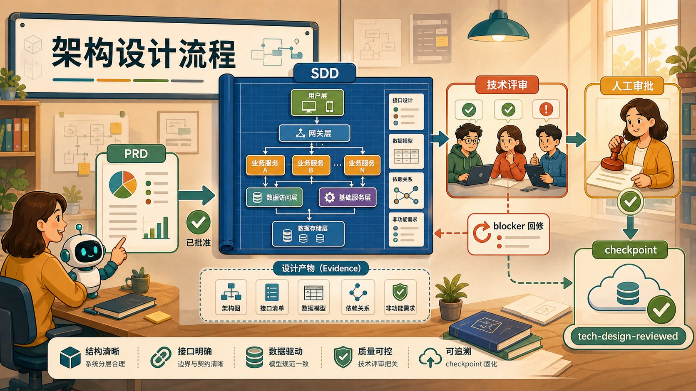

适用场景：CR 已完成需求审批，需要产出 SDD 并通过技术评审。

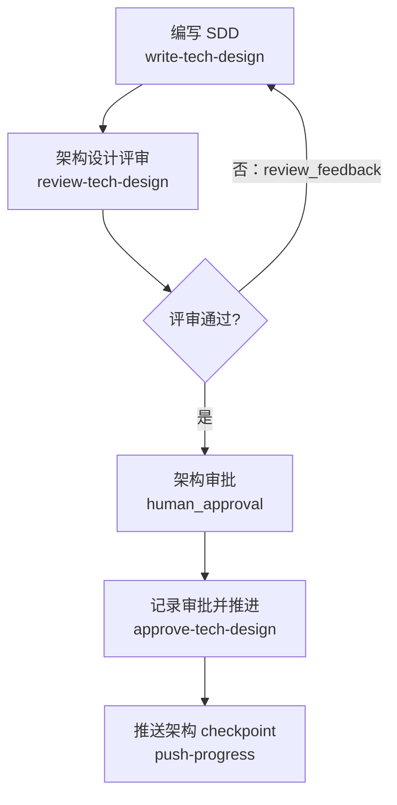

### 输入

| 输入 | 必填 | 说明 |
|------|------|------|
| `cr_id` | 是 | 已审批需求的 CR-ID，前置 status=`requirement-approved` |
| `tech_context` | 否 | 架构约束、复用组件、已知风险等 |
| `auto_push_after_sdd` | 否 | 架构审批后是否自动推送 checkpoint，默认 true |

### 节点

| 节点 | 输入是什么 | 作用是什么 | 产出是什么 | 可跳过 |
|------|------------|------------|------------|--------|
| 编写 SDD | `prd.md`、`tech_context`、可选 `review_feedback` | 将需求转成技术设计；初次要求 status=`requirement-approved`，回修允许 status=`tech-designing`，并按 blocker 定点修订 | `change-requests/{CR-ID}/sdd.md`、status=`tech-designing` 到 `tech-design-review-pending`、fixed-blockers | 否 |
| 架构设计评审 | `sdd.md`、`prd.md` | 检查 PRD 对齐、架构合理性、接口完整性、可测试性；block 时回到 SDD 修订 | `review-annotations/sdd.yml`、`traceability.yml` | 否 |
| 架构审批 | `sdd.md`、已通过的技术评审记录、`owners.development.id` | 仅在 `verdict=pass` 且 `blockers=[]` 后人工决定是否可进入开发任务拆分 | 通过或驳回结论 | 否 |
| 记录审批并推进 | `cr_id`、`owners.development.id` | 写入技术审批证据并推进状态 | `approval.yml#tech-design`、status=`tech-design-reviewed` | 否 |
| 推送架构 checkpoint | `sdd.md`、评审记录、审批记录 | 保存架构阶段产物到远端分支 | 远端 checkpoint、`latest-checkpoint` 更新 | 是，`auto_push_after_sdd=false` |

## 3. 代码编写流程

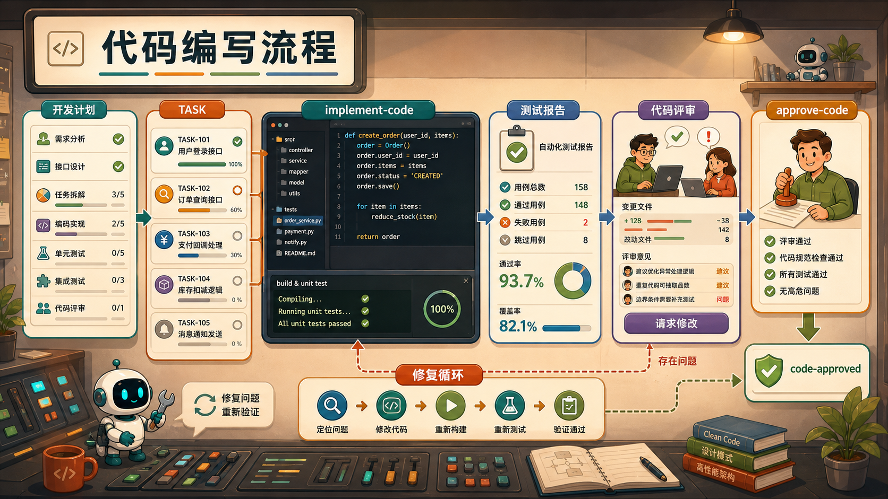

适用场景：技术设计已审批，需要拆任务、实现代码、生成测试报告并完成代码审批。

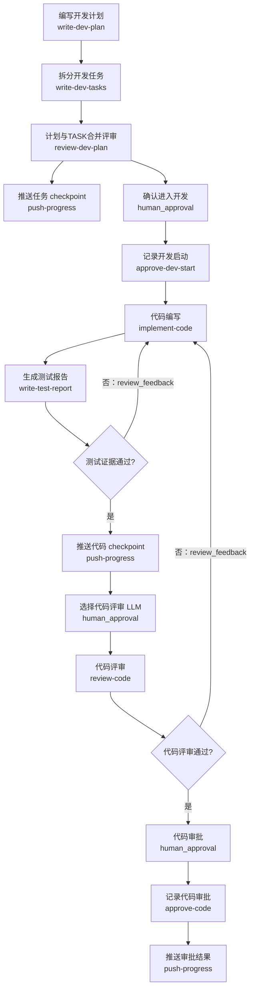

### 输入

| 输入 | 必填 | 说明 |
|------|------|------|
| `cr_id` | 是 | 已完成架构审批的 CR-ID，前置 status=`tech-design-reviewed` |
| `target_version` | 否 | 写入开发计划；为空时由 Skill 推导或标记 tbd |
| `auto_push_after_task` | 否 | 任务拆分后是否自动推送 checkpoint，默认 true |

### 节点

| 节点 | 输入是什么 | 作用是什么 | 产出是什么 | 可跳过 |
|------|------------|------------|------------|--------|
| 编写开发计划 | `sdd.md`、`target_version` | 规划里程碑、依赖、风险、验收和发布策略 | `change-requests/{CR-ID}/plan.md` | 否 |
| 拆分开发任务 | `plan.md`、`sdd.md` | 拆成可执行 TASK，明确文件、实现要点和验收条件 | `tasks/TASK-NN.md`、`tasks/_index.yml`、status=`task-breakdown` | 否 |
| 计划与 TASK 合并评审 | `sdd.md`、`plan.md`、`tasks/`、`review-annotations/sdd.yml` | 编码前八类维度评审；PASS 保持 task-breakdown，BLOCK 双轨路由（普通轨回 tech-design-reviewed 重放 / 上游疑点回 tech-design-review-pending） | `review-annotations/dev-plan.yml`、三账本投影（CR-2026-026） | 否 |
| 推送任务 checkpoint | `plan.md`、`tasks/`、traceability 改动 | 保存设计与任务拆分进度 | 远端 checkpoint、`latest-checkpoint` 更新 | 是，`auto_push_after_task=false` |
| 确认进入开发 | `plan.md`、`tasks/`、`owners.development.id` | 人工确认任务拆分可进入编码 | 通过或暂缓结论 | 否 |
| 记录开发启动 | `cr_id`、`owners.development.id` | 写入开发启动确认并解锁编码 | `approval.yml#development-start`、status=`developing` | 否 |
| 代码编写 | PRD、SDD、TASK、repo worktree map、coding runtime、`owners.development.id`、可选 `review_feedback` | 按 TASK 在 CR worktree 中实现代码；若为回修轮次，则只修复测试或代码评审指出的问题 | 代码变更、验证命令与结果、runtime 信息、fixed-blockers | 否 |
| 生成测试报告 | `implement-code` 输出、TASK 验收条件、`owners.test.id` | 汇总 lint/test/build、TASK 覆盖和未覆盖风险；block 时回到代码实现 | `test-report.md`、`traceability.yml#tests` | 否 |
| 推送代码 checkpoint | 代码变更、`test-report.md`、traceability | 将代码和测试证据统一保存到远端分支 | 各 repo checkpoint SHA | 否 |
| 选择代码评审 LLM | 统一 checkpoint 结果、触发参数 `review_llm` | 暂停等待人工选择执行评审的模型/runner；已指定 `review_llm` 时快速确认 | 无状态写入 | 否 |
| 代码评审 | 真实 diff、changed files、提交记录、`sdd.md`、TASK、`test-report.md` | 检查实现对齐、工程质量、安全性和测试证据可信度；block 时回到代码实现 | `review-annotations/code.yml`、通过时 status=`code-reviewing`，否则回到 `developing` | 否 |
| 代码审批 | 代码评审记录、测试报告、`owners.development.id`、`owners.test.id` | 仅在代码评审 `verdict=pass`、`blockers=[]` 且 `test-report.status=pass` 后人工确认代码可以进入回写 | 通过或驳回结论 | 否 |
| 记录代码审批 | `code.yml`、`test-report.md`、`owners.development.id` | 写入代码审批证据并推进状态，并校验测试报告 tester 与 `owners.test.id` 对齐 | `approval.yml#code`、status=`code-approved` | 否 |
| 推送审批结果 | 代码评审、审批、测试报告、traceability | 保存 code-approved 状态与最终证据 | 远端 checkpoint | 是，失败不阻塞本地状态，但应尽快补推 |

## 4. 回写归档流程

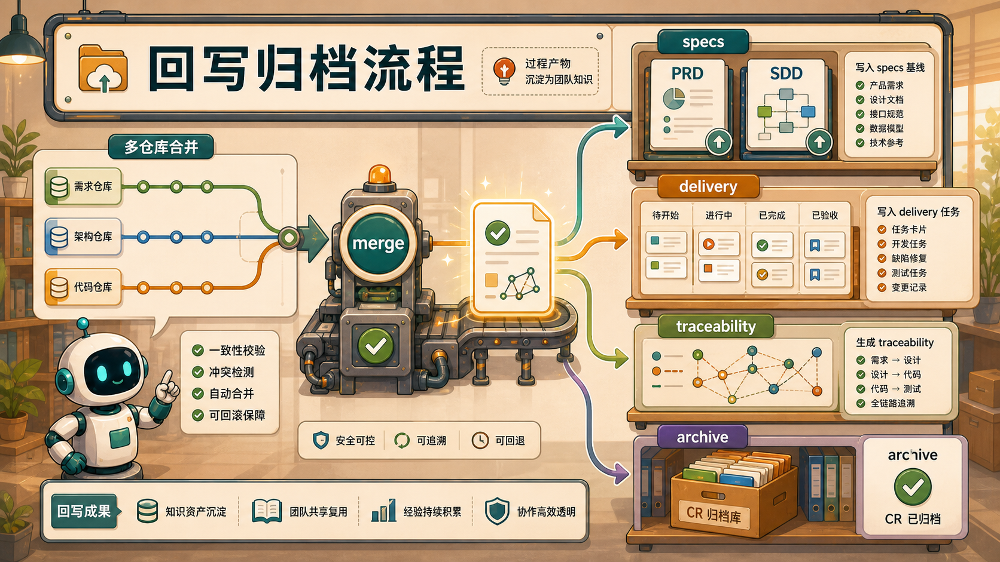

适用场景：代码已审批，需要将 CR 过程产物写入 baseline，并归档 CR。

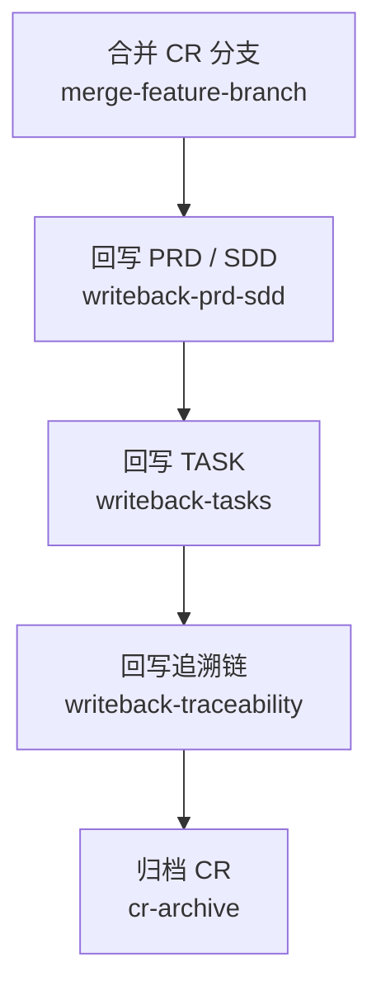

### 输入

| 输入 | 必填 | 说明 |
|------|------|------|
| `cr_id` | 是 | 已完成代码审批的 CR-ID，前置 status=`code-approved` |
| `spec_id` | 是 | 回写目标 `specs/{id}` |
| `target_version` | 是 | 用于 spec frontmatter 与 delivery task 命名 |

### 节点

| 节点 | 输入是什么 | 作用是什么 | 产出是什么 | 可跳过 |
|------|------------|------------|------------|--------|
| 合并 CR 分支 | `cr_id`、active repo worktree、远端分支、代码评审证据 | 对所有参与仓做两阶段合并，避免多仓半成功 | trunk merge commit、`merge-commits[]`、status=`merging` | 否 |
| 回写 PRD / SDD | `prd.md`、`sdd.md`、`spec_id`、`target_version` | 将已审批需求和设计写入 baseline | `specs/{id}/PRD.md`、`SDD.md`、`specs/_index.yml`、status=`writing-back` | 否 |
| 回写 TASK | `tasks/`、`spec_id`、`target_version` | 将 CR TASK 映射到交付任务索引 | `delivery/task/TASK-*.md`、`delivery/task/_index.yaml` | 任务为空时可记录警告后继续 |
| 回写追溯链 | PRD、SDD、TASK、`test-report.md`、评审记录、`merge-commits[]` | 生成完整需求到代码、测试、评审的追溯链 | `specs/{id}/traceability.yml` | 否 |
| 归档 CR | `traceability.yml`、`_backlog.yml`、worktree map | 将 CR 移入历史，清理 worktree 和远端分支 | `change-requests/_history.yml`、`_index.yml` 更新、status=`archived` | 否 |

### 归档的两阶段语义

`crctl archive` 把“发布终态”与“资源清理”分开：

1. **先发布终态事实**：四账本归档 commit 推送并确认后，CR 的 authority 终态即已生效（`status=archived/rejected/withdrawn`），正常归档同时发出 `archive` 投影事件。此后任何失败都不会反转这个终态。
2. **再尝试资源清理**：随后才尝试删除 Transaction Workspace、CR worktree 与本地分支。清理只删“干净且可证明安全”的资源；dirty、unknown、未证明已合入的远端 ref 一律保守保留在 `remaining` / `preservedRefs`。

因此 `phase=cleanup-pending` 表示“终态已发布、仅清理未完成”，不是归档失败：`lastCleanupError=null` 且 `remaining` 非空是保守保留，非空错误码才是清理执行异常；`warnings` 中的 `EMIT_FAILED` 表示投影事件发送失败，同样不代表 Git archive 失败。

处理现场后**只重跑返回的 `recoverCommand` 这一条命令**续跑：禁止手工删除 dirty、unknown、未证明已合入或 `preservedRefs` 中的资源，禁止回滚或重建归档 commit，禁止手工生成投影事件。

## R. 接手在途 CR 流程

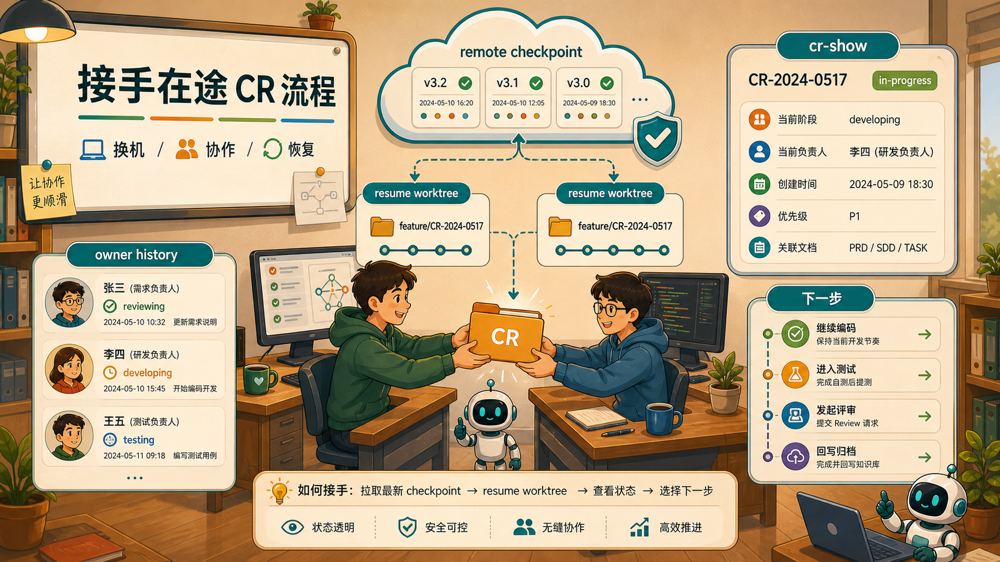

适用场景：换电脑、协作者接手、恢复中断任务。

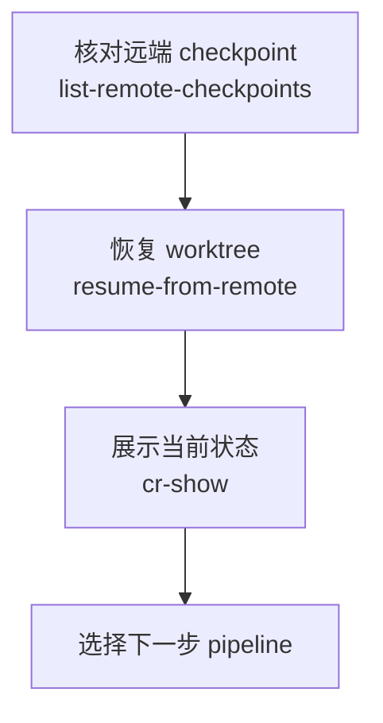

### 输入

| 输入 | 必填 | 说明 |
|------|------|------|
| `cr_id` | 是 | 要接手的 CR-ID |
| `new_owner` | 否 | 若正式移交，填入新 owner |
| `new_owner_role` | 否 | 接手角色：`requirement` / `development` / `test`，默认 `development` |

### 节点

| 节点 | 输入是什么 | 作用是什么 | 产出是什么 | 可跳过 |
|------|------------|------------|------------|--------|
| 核对远端 checkpoint | `cr_id`、active repos、远端 requirement 分支 | 确认远端分支存在，并与 backlog checkpoint 比对 | 各 repo checkpoint SHA、告警信息 | 否 |
| 恢复 worktree | `cr_id`、repo map、`new_owner`、`new_owner_role` | 从远端恢复本地 CR worktree，必要时更新指定角色 owner 与 assigned-at | `.rayai-worktrees/{bucket}/requirement/{CR-ID}` | 否 |
| 展示当前状态 | `change-requests/{CR-ID}/`、`_backlog.yml`、`review-annotations/*.yml`、`test-report.md`、`traceability.yml` | 汇总 CR 元数据、已有产物、自修复轮次，并按 status + 评审/测试证据给出下一步 skill/pipeline | CR 状态摘要、明确下一步节点 | 否 |

## 质量门

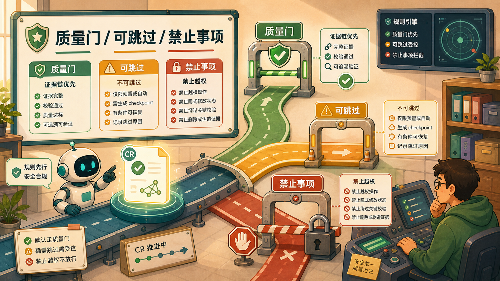

| 质量门 | Skill | 必须读取 | 必须产出 |
|--------|-------|----------|----------|
| 需求质量门 | `review-requirement` | `prd.md`、规划 source | `review-annotations/requirement.yml`、traceability 需求评审段 |
| 技术设计质量门 | `review-tech-design` | `prd.md`、`sdd.md` | `review-annotations/sdd.yml`、traceability 技术评审段 |
| 测试证据门 | `write-test-report` | TASK 验收条件、实现验证输出 | `test-report.md`、traceability 测试段 |
| 代码质量门 | `review-code` | 真实 diff、changed files、TASK、SDD、`test-report.md` | `review-annotations/code.yml`、status=`code-reviewing` |
| 横向对齐 | `review-alignment` | PRD、SDD、TASK、代码证据、traceability | drift 记录 |
| 影响分析 | `change-impact-analysis` | 上游变更与下游证据 | stale 标记 |

每个质量门都必须具备自动自修复回路。代码评审必须读取实际代码 diff、changed files、验证输出与 `test-report.md`；仅有 diff stat、commit log 或口头测试结论不足以通过质量门。

## 可跳过规则

| 类型 | 可跳过条件 | 跳过后果 |
|------|------------|----------|
| 规划前置流程 | 已有明确需求输入时，可不跑 `/planning`、`/insight-brief`、`/comp-radar` | `source` 可为空或指向手工输入 |
| planning 前三类调研节点 | 对应 `skip_*` 为 true | 规划报告少一个输入来源，但流程可继续 |
| 自动 checkpoint | 对应 `auto_push_*` 为 false | 本地可继续，换机或协作接手能力下降 |
| 竞品转规划建议 | `report-to-planning-suggestion` 失败或不需要建议 | 可只保留竞品报告 |
| writeback-tasks 空任务 | `tasks/` 为空 | 记录警告后继续，但 traceability 可能缺少任务链路 |
| 主流程质量门 | 不可跳过 | 跳过会破坏状态机和证据链 |
| 自动审查自修复闭环 | 不可跳过 | blocker 未清空不得进入后续节点或人工审批 |
| 人工审批 | 不可跳过 | `human_approval` 后必须由显式 approve Skill 推进状态 |

## 禁止事项

- 不得直接写 `specs/{id}/PRD.md` 或 `specs/{id}/SDD.md`；正式回写只能由 `writeback-prd-sdd` 执行。
- 不得创建旧式 specs 单文件模型或把开发计划写进 specs baseline。
- 不得通过 prompt 文案隐式推进状态。
- 不得调用未登记在 `skills/_index.yml` 的 Skill。
- 不得调用 `agent-skill-matrix.yml` 中当前 Actor 未 `owns` 或 `can-call` 的 Skill；外部方法论 Skill 必须出现在 `external` 中。
- 不得调用当前 Actor `forbidden` 列表中的 Skill。
- 不得把 `planning-draft` 当作落盘 Skill；落盘使用 `write-planning-entry` 或 `write-planning-report`。
- 不得让 Agent 在终端自由执行 git；所有 git 操作必须走 `controlled-shell`。
- 不得在主工作区代码目录直接编码；代码实现只写 CR worktree。
