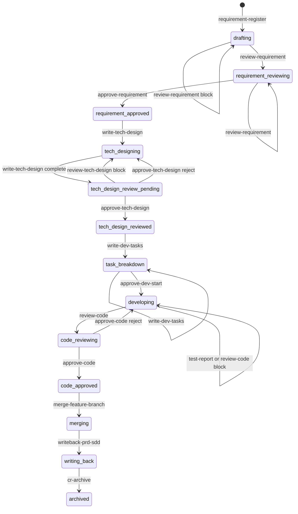
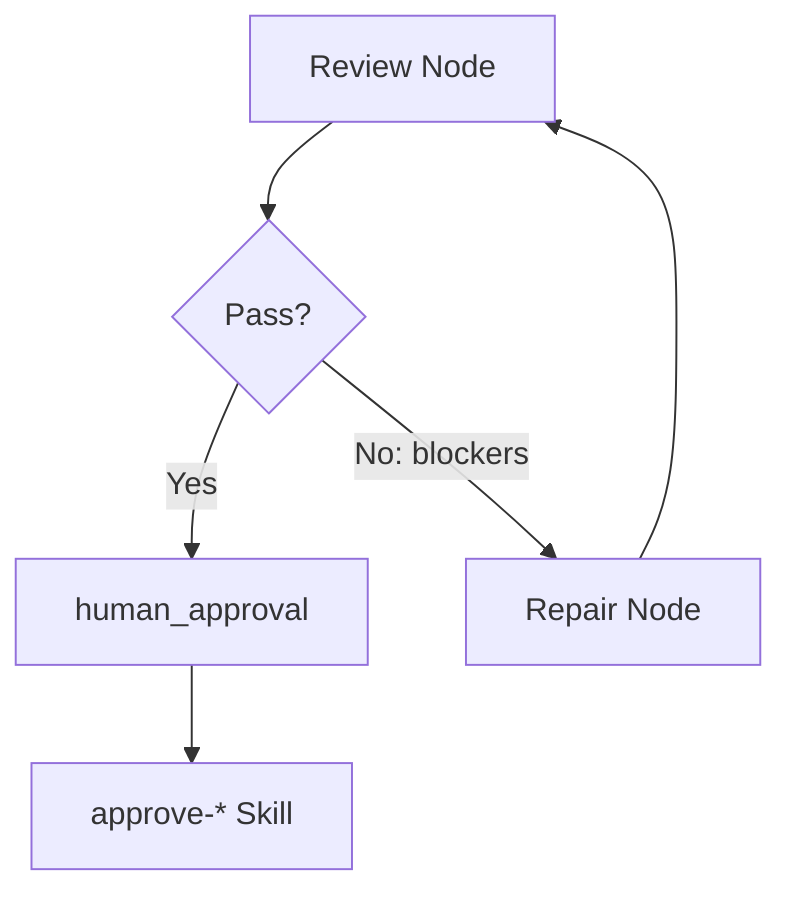

# CR Model & Platform Architecture

The AI First Phase0 platform is built around a single primitive: the **Change Request (CR)**. This page explains the CR model, the document lifecycle, the state machine, the owner model, and how these pieces compose into the four-layer platform architecture.

## The CR as Work Container

A CR is not an issue or ticket — it is a **structured work container** that holds the complete lifecycle of a product change. Unlike issue-tracker workflows, a CR maintains strong consistency with code through git worktrees and explicit evidence artifacts.

Each CR has:

| Aspect | Stored In | Purpose |
|--------|-----------|---------|
| Metadata & status | `change-requests/{CR-ID}/cr.md`, `_backlog.yml` | Identity, title, status, owners |
| Requirements | `change-requests/{CR-ID}/prd.md` | Product requirements (PRD) |
| Design | `change-requests/{CR-ID}/sdd.md` | Technical design (SDD) |
| Plan & tasks | `change-requests/{CR-ID}/plan.md`, `tasks/TASK-NN.md` | Development plan and task breakdown |
| Test evidence | `change-requests/{CR-ID}/test-report.md` | Test results and coverage |
| Review evidence | `change-requests/{CR-ID}/review-annotations/*.yml` | Review verdicts and blockers |
| Approvals | `change-requests/{CR-ID}/approval.yml` | Human approval records |
| Traceability | `change-requests/{CR-ID}/traceability.yml` | End-to-end requirement-to-code trace |

## Document Facts Model

The platform distinguishes between **work-in-progress artifacts** (in the CR directory) and **baseline artifacts** (in the team knowledge base after writeback):

| Stage | Work-in-Progress (CR) | Baseline / Archived |
|-------|----------------------|---------------------|
| Requirements | `change-requests/{CR-ID}/prd.md` | `specs/{id}/PRD.md` |
| Design | `change-requests/{CR-ID}/sdd.md` | `specs/{id}/SDD.md` |
| Development plan | `change-requests/{CR-ID}/plan.md` | Not archived to specs |
| Tasks | `change-requests/{CR-ID}/tasks/TASK-NN.md` | `delivery/task/TASK-*.md` |
| Test report | `change-requests/{CR-ID}/test-report.md` | `specs/{id}/traceability.yml#tests` |
| Review evidence | `change-requests/{CR-ID}/review-annotations/*.yml` | `specs/{id}/traceability.yml#reviews` |
| Traceability | `change-requests/{CR-ID}/traceability.yml` | `specs/{id}/traceability.yml` |
| CR archive | `change-requests/{CR-ID}/` (retained as history) | `change-requests/_history.yml` |

This dual model ensures the team knowledge base (`specs/`, `delivery/`) always reflects approved, merged reality, while the CR directory retains the full process history.

## CR State Machine

The CR lifecycle is governed by an explicit state machine with 15 active states and 3 terminal states. All transitions are triggered by named Skills — no implicit or verbal advancement is allowed.



**Terminal states**: `archived`, `rejected`, `withdrawn`. Any active state can transition to `rejected` or `withdrawn` via `cr-review-record reject/withdraw` — the state machine in `dir-graph.yaml` uses wildcard matching for these two transitions rather than listing every active state individually.

The state machine is defined in `dir-graph.yaml#change-request-track.state_machine` and enforced at runtime by either the platform's pipeline execution engine or [`crctl advance`](/openwiki/operations/drift-governance.md) in standalone IDE usage.

### The `tech-design-review-pending` Nuance

This state covers two scenarios. When entering it, you must read `review-annotations/sdd.yml` to determine the next step:
- If `verdict=pass` and `blockers=[]`: next is `human_approval → approve-tech-design`
- If `verdict=block` or missing: continue `review-tech-design` / `write-tech-design` self-repair loop

## CR Owner Model

Every CR has a **three-role owner triad** defined in `cr.md` and `_backlog.yml`:

```yaml
owners:
  requirement:
    id: product-owner
    assigned-at: "2026-07-26T10:00:00+08:00"
  development:
    id: dev-owner
    assigned-at: "2026-07-26T10:00:00+08:00"
  test:
    id: test-owner
    assigned-at: "2026-07-26T10:00:00+08:00"
```

| Role | Responsibility | First Set By |
|------|---------------|-------------|
| `requirement` | PRD, requirement review response, requirement approval | `/requirement` input `requirement_owner` |
| `development` | SDD, task breakdown, coding, code approval | `/requirement` input `dev_owner` |
| `test` | Test evidence, test report | `/requirement` input `test_owner` |

Role changes must go through `handover-cr` or `resume-from-remote` and must update `owners.{role}.id`, `owners.{role}.assigned-at`, and append `owner-history`. The top-level `owner` field is only a compatibility view, defaulting to `owners.requirement.id`.

## Auto-Review Repair Loops

Automated reviews (planning report, PRD, SDD, test report, code) follow a **self-repair loop** pattern:



Key rules:
- **Max 3 attempts** per loop (`reviewLoop.maxAttempts=3` in pipeline JSON)
- Each attempt must persist `review-loop.current-attempt` and `review-loop.attempts[]`
- CR-class loops must also sync to `traceability.yml`
- If max attempts reached: pipeline stops, outputs remaining blockers, last repair record, and suggested handler
- Repair may require replaying multiple nodes (`reviewLoop.replayNodes[]`)

| Loop | Review Node | Repair Node | Pass Condition |
|------|------------|-------------|----------------|
| Planning | `review-planning-report` | `write-planning-report` | `approved=true`, blockers empty |
| PRD | `review-requirement` | `write-requirement-prd` | `verdict=pass`, blockers empty |
| SDD | `review-tech-design` | `write-tech-design` | `verdict=pass`, blockers empty |
| Test | `write-test-report` | `implement-code` | `status=pass`, blockers empty |
| Code | `review-code` | `implement-code` | `verdict=pass`, blockers empty, `test-report.status=pass` |

## The Four-Layer Platform Architecture

The platform is organized into four layers that build on each other:

1. **Agents** — 10 agents with ownership boundaries defined in the [Agent/Skill Matrix](/openwiki/architecture/agent-skill-matrix.md). Each agent owns a set of Skills and may call others within its boundary. Agents are the scheduling and routing layer.

2. **Pipelines** — 8 JSON templates in [pipeline-templates/](/openwiki/pipelines/overview.md) that orchestrate multi-step workflows. Each pipeline declares its owner agent, nodes (skill invocations or human approvals), inputs, and review loops.

3. **Skills** — 50+ atomic capabilities across 10 domains (planning, requirement, develop, cr, writeback, sync, spec, competitive, review, shared). Each Skill is a `SKILL.md` file with defined inputs, outputs, state effects, and failure handling.

4. **Engineering Docs** — Schema-driven documents ([PRD, SDD, PLAN, TASK, etc.](/openwiki/engineering-docs/overview.md)) produced by Skills and archived after writeback. A CLI/MCP toolchain validates conformance.

Outside the platform's execution layer, the **[drift governance system](/openwiki/operations/drift-governance.md)** (`crctl`) provides code-level enforcement of the same rules for IDE-only usage.

## Agent Contract Invariants

`dir-graph.yaml#agents.contract` defines four invariants that must hold for the agent/skill system. They are enforced by [CI guards](/openwiki/operations/ci-guards.md) and the pre-commit hook via two zero-dependency Node.js scripts.

| # | Invariant | Enforced By |
|---|-----------|-------------|
| 1 | Every agent in `agents/_index.yml` must have a corresponding `.md` file, and every `agents/*.md` file must be registered | `check-agents-contract.mjs` |
| 2 | Every Skill referenced by an agent must be registered as `active` in `skills/_index.yml` (or declared `external`) | `check-agents-contract.mjs` |
| 3 | Every active Skill appearing in an agent's references must be listed in that agent's `owns`, `can-call`, or `external` in `agent-skill-matrix.yml` | `check-agents-contract.mjs` |
| 4 | Agents must not bypass Skills to write directly to controlled ledgers or state files | Runtime: `crctl` CAS writes + PreToolUse hook + CI gate |

Invariants 1-3 are **static** and verified on every commit and CI push. Invariant 4 is **behavioral** and enforced at runtime by [crctl's](/openwiki/operations/drift-governance.md) exclusive write paths (CAS-based `_backlog.yml` and `approval.yml` updates) and the Claude Code PreToolUse guard.

## Source References

| Concept | Primary Source |
|---------|---------------|
| State machine | `dir-graph.yaml#change-request-track.state_machine` |
| Agent contract | `dir-graph.yaml#agents.contract` |
| Owner model | `dir-graph.yaml#target_workspace_contract.cr_owner_model` |
| Document facts | `README.md` §文档与事实源模型 |
| Review loops | `README.md` §自动审查自修复闭环 |
| Pipeline contracts | `dir-graph.yaml#pipeline_templates.contract` |
| CR state constraints | `AGENTS.md` §CR 状态约束 |
| Contract check script | `skills/shared/crctl/scripts/check-agents-contract.mjs` |
