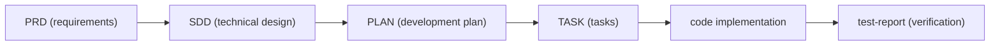

# Engineering Documentation System

The Phase0 tools package includes a schema-driven engineering documentation system under `skills/shared/engineering-docs/`. It defines the structure of key project artifacts (PRD, SDD, PLAN, TASK) and provides tooling to generate, validate, and maintain them.

## Document Schema Types

| Schema | File | Purpose | Lifecycle Stage |
|--------|------|---------|-----------------|
| **PRD** | `prd.schema.json` | Product Requirements Document | Requirement → baseline `specs/{id}/PRD.md` |
| **SDD** | `sdd.schema.json` | Software Design Document (technical design) | Architecture → baseline `specs/{id}/SDD.md` |
| **PLAN** | `plan.schema.json` | Development plan (milestones, risks, release strategy) | Coding → stays in CR directory |
| **TASK** | `task.schema.json` | Individual development task | Coding → `delivery/task/TASK-*.md` |
| **FORM** | `form.schema.json` | Form/survey definitions | Auxiliary |
| **MODULE** | `module.schema.json` | Module descriptions | Auxiliary |
| **RELEASE** | `release.schema.json` | Release notes | Auxiliary |

All schemas share common definitions from `common-defs.schema.json`.

## Document Chain Lifecycle

The document chain convention (`conventions/doc-chain.yaml`) defines how documents flow through the development lifecycle:



Each document links to its predecessor and successor through the chain, maintaining traceability from requirements through to code and tests.

## Naming Conventions

Defined in `conventions/naming.yaml`:

- **PRD**: `PRD-{NNN}-{slug}.md` (e.g., `PRD-001-sample-login.md`)
- **SDD**: `SDD-{NNN}-{slug}.md`
- **PLAN**: `PLAN-v{version}-{NNN}-{slug}.md` (e.g., `PLAN-v1.0-001-sample-mvp.md`)
- **TASK**: `TASK-{NN}.md` (e.g., `TASK-01.md`)
- **FORM**: `FORM-{NNN}-{slug}.md`
- **RELEASE**: `RELEASE-v{version}.md`

IDs are generated via the `id` utility; slugs via the `slug` utility (both in `scripts/src/utils/`).

## Templates

The `templates/` directory provides starter files for each document type:

| Template | For |
|----------|-----|
| `PRD-template.md` | New product requirements documents |
| `SDD-template.md` | New software design documents |
| `PLAN-template.md` | New development plans |
| `TASK-template.md` | New development tasks |
| `FORM-template.md` + `FORM-schema-template.yaml` | New form/survey definitions |
| `MODULE-template.md` | New module descriptions |
| `RELEASE-template.md` | New release notes |
| `OpenAPI-template.yaml` | OpenAPI specification starter |

## Validation Tools

### CLI

The `scripts/` directory contains a pnpm-based TypeScript CLI (`scripts/src/cli.ts`):

```bash
pnpm validate   # Run all validators on documents
pnpm generate   # Generate documents from templates
```

### Validators

Located in `scripts/src/validators/`:

| Validator | Checks |
|-----------|--------|
| `frontmatter.ts` | YAML frontmatter in documents follows schema |
| `naming.ts` | File naming matches conventions |
| `chain.ts` | Document chain references are consistent |
| `index-sync.ts` | Index files match actual directory contents |

### MCP Server

`scripts/src/mcp.ts` exposes validators and generators as an MCP (Model Context Protocol) server, enabling AI agents to validate documents during pipeline execution. The MCP server is used by the platform's execution layer and can be called by [`crctl validate`](/openwiki/operations/drift-governance.md#crctl-subcommands) in standalone mode.

### Generators

The `scripts/src/generators/base.ts` and `scripts/src/registry.ts` provide template-based document generation with ID assignment and slug creation.

## Registration System

`scripts/src/registry.ts` maintains a registry of all generated documents, tracking:

- Document ID and type
- Creation and modification timestamps
- Status (draft, review, approved)
- Chain links (predecessors and successors)

## Relationship to the CR Model

Engineering docs are the **output format** for pipeline artifacts:

- The `write-requirement-prd` skill produces a PRD following `prd.schema.json`
- The `write-tech-design` skill produces an SDD following `sdd.schema.json`
- The `write-dev-plan` skill produces a PLAN following `plan.schema.json`
- The `write-dev-tasks` skill produces TASK files following `task.schema.json`

After writeback, these documents move from the CR work-in-progress directory to the baseline `specs/` and `delivery/` directories. Schema validation ensures they remain machine-readable and structurally consistent throughout.

## Source References

| Concept | Source Path |
|---------|-------------|
| PRD schema | `skills/shared/engineering-docs/schemas/prd.schema.json` |
| SDD schema | `skills/shared/engineering-docs/schemas/sdd.schema.json` |
| PLAN schema | `skills/shared/engineering-docs/schemas/plan.schema.json` |
| TASK schema | `skills/shared/engineering-docs/schemas/task.schema.json` |
| Common definitions | `skills/shared/engineering-docs/schemas/common-defs.schema.json` |
| Document chain | `skills/shared/engineering-docs/conventions/doc-chain.yaml` |
| Naming conventions | `skills/shared/engineering-docs/conventions/naming.yaml` |
| Templates | `skills/shared/engineering-docs/templates/` |
| CLI entry | `skills/shared/engineering-docs/scripts/src/cli.ts` |
| MCP server | `skills/shared/engineering-docs/scripts/src/mcp.ts` |
| Validators | `skills/shared/engineering-docs/scripts/src/validators/` |
| Example PRD | `skills/shared/engineering-docs/examples/PRD-001-sample-login.md` |
| Team standards | `skills/shared/engineering-docs/standards/ENGINEERING-STRUCTURE-TEAM.md` |
