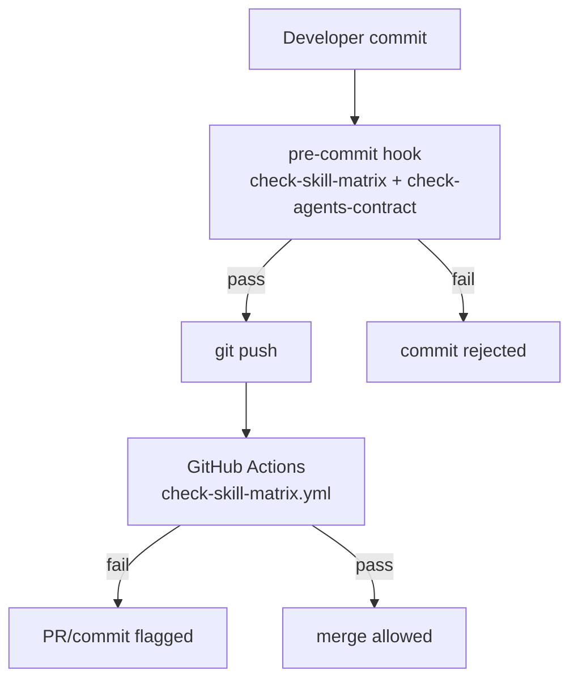

# CI Guards & Pre-Commit Hooks

The Phase0 tools package uses a layered verification system to ensure the agent/skill matrix and agent contract invariants stay consistent. These checks run locally (pre-commit) and remotely (GitHub Actions CI) to catch drift before it reaches the main branch.

## Architecture



The same two scripts run in both contexts, ensuring local and remote checks are identical.

## Check Scripts

Both scripts live under `skills/shared/crctl/scripts/` and use zero external dependencies (Node.js built-in modules only).

### check-skill-matrix.mjs

Validates three-way consistency between `skills/_index.yml`, `agent-skill-matrix.yml`, and `AGENT-SKILL-MATRIX.md`:

| Check | Description |
|-------|-------------|
| **Ownership completeness** | Every `active` skill in `skills/_index.yml` must have exactly one `owns` entry in `agent-skill-matrix.yml` |
| **Target validity** | Every skill targeted by an `owns` entry must either be registered as `active` in `skills/_index.yml` or declared in an actor's `external` list |
| **MD consistency** | The "主责矩阵" (primary responsibility matrix) table in `AGENT-SKILL-MATRIX.md` must exactly match the `owns` entries in `agent-skill-matrix.yml` |

Exit code 1 on any inconsistency; exit code 0 on clean pass.

### check-agents-contract.mjs

Validates the four invariants declared in `dir-graph.yaml#agents.contract`:

| # | Invariant | Static/Runtime |
|---|-----------|----------------|
| 1 | Bidirectional registration: every agent in `_index.yml` has a `.md` file, and every `agents/*.md` file is registered | Static (checked here) |
| 2 | Skill references validity: every Skill path in an agent's `references[]` must resolve to an `active` skill (or `external`) | Static (checked here) |
| 3 | Matrix coverage: every active skill in an agent's `references` must appear in that agent's `owns`, `can-call`, or `external` in the matrix | Static (checked here) |
| 4 | No bypass writes: agents must not write directly to controlled ledger/state files | **Runtime** — enforced by `crctl` CAS writes, PreToolUse hook, and CI gate |

Invariants 1-3 are statically verifiable. Invariant 4 is behavioral — the script declares it as a runtime concern handled by `crctl` and the PreToolUse hook.

## GitHub Actions Workflow

**File**: `.github/workflows/check-skill-matrix.yml`

**Triggers**:
- `push` and `pull_request` on changes to:
  - `skills/_index.yml`
  - `agent-skill-matrix.yml`
  - `AGENT-SKILL-MATRIX.md`
  - `agents/**`

**Jobs**:
| Step | What it runs |
|------|-------------|
| `actions/checkout@v4` | Clones the repository |
| `actions/setup-node@v4` (Node 20) | Sets up Node.js runtime |
| Verify skill matrix consistency | `node skills/shared/crctl/scripts/check-skill-matrix.mjs` |
| Verify agents.contract invariants | `node skills/shared/crctl/scripts/check-agents-contract.mjs` |

If either script exits non-zero, the workflow fails and the PR is blocked.

## Pre-Commit Hook

**File**: `.githooks/pre-commit`

```sh
node skills/shared/crctl/scripts/check-skill-matrix.mjs || exit 1
node skills/shared/crctl/scripts/check-agents-contract.mjs || exit 1
```

**Setup** (one-time per clone):
```bash
git config core.hooksPath .githooks
```

**Fallback**: If a developer hasn't set up the local hook, CI catches the same issues on push/PR. There is no way to bypass these checks — the CI runs on all qualifying pushes regardless of local hook configuration.

## OpenWiki Auto-Update

**File**: `.github/workflows/openwiki-update.yml`

A separate workflow that runs daily at 8:00 UTC (plus manual `workflow_dispatch`) to keep the OpenWiki knowledge base current. It:
1. Installs `openwiki` and dependencies (`mermaid`, `jsdom`)
2. Runs `openwiki code --update --print`
3. Creates a PR on branch `openwiki/update` with the title `"docs: update OpenWiki"`

## Relationship to crctl

The CI guards complement [crctl's](/openwiki/operations/drift-governance.md) runtime enforcement:

- **CI guards** verify **static** correctness: are the registrations, references, and matrix entries consistent?
- **crctl** enforces **runtime** behavior: are state transitions valid? Are gates passing? Is human approval actually happening?

Together they form a complete governance system: the matrix can't drift out of sync (CI catches it), and CR state can't be manipulated outside the rules (crctl catches it).

## Source References

| Concept | Primary Source |
|---------|---------------|
| CI workflow | `.github/workflows/check-skill-matrix.yml` |
| Pre-commit hook | `.githooks/pre-commit` |
| Skill matrix checker | `skills/shared/crctl/scripts/check-skill-matrix.mjs` |
| Agent contract checker | `skills/shared/crctl/scripts/check-agents-contract.mjs` |
| Agent contract invariants | `dir-graph.yaml#agents.contract` |
| OpenWiki update workflow | `.github/workflows/openwiki-update.yml` |
