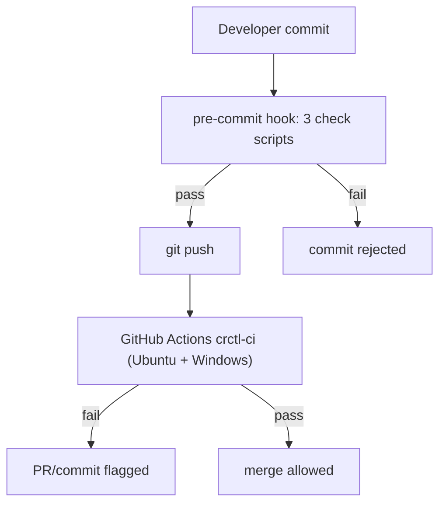

# CI Guards & Pre-Commit Hooks

The Phase0 tools package uses a layered verification system to ensure the [Agent/Skill matrix](/openwiki/architecture/agent-skill-matrix.md) and [agent contract invariants](/openwiki/architecture/overview.md#agent-contract-invariants) stay consistent, and that prompt text does not drift from the `crctl` command surface. These checks run locally (pre-commit) and remotely (GitHub Actions CI) to catch drift before it reaches the main branch.

## Architecture



The same three scripts run in both contexts, and CI adds the full crctl/writeback test suites on both OSes.

## Check Scripts

All three live under `skills/shared/crctl/scripts/` and use zero external dependencies (Node.js built-in modules only).

### check-skill-matrix.mjs

Validates three-way consistency between `skills/_index.yml`, `agent-skill-matrix.yml`, and `AGENT-SKILL-MATRIX.md`:

| Check | Description |
|-------|-------------|
| **Ownership completeness** | Every `active` skill in `skills/_index.yml` must have exactly one `owns` entry in `agent-skill-matrix.yml` |
| **Target validity** | Every skill targeted by an `owns` entry must be registered as `active` or declared in an actor's `external` list |
| **MD consistency** | The "主责矩阵" table in `AGENT-SKILL-MATRIX.md` must exactly match the `owns` entries in `agent-skill-matrix.yml` |
| **external reference points** | Every actor-level `external` declaration must have at least one reference point in `skills/` or `pipeline-templates/` (CR-2026-025 FR-1) |

Exit code 1 on any inconsistency; 0 on clean pass.

### check-agents-contract.mjs

Validates the four invariants declared in `dir-graph.yaml#agents.contract`:

| # | Invariant | Static/Runtime |
|---|-----------|----------------|
| 1 | Bidirectional registration: every agent in `_index.yml` has a `.md` file, and every `agents/*.md` file is registered | Static (checked here) |
| 2 | Skill references validity: every Skill path in an agent's `references[]` must resolve to an `active` skill (or `external`) | Static (checked here) |
| 3 | Matrix coverage: every active skill in an agent's `references` must appear in that agent's `owns`, `can-call`, or `external` | Static (checked here) |
| 4 | No bypass writes: agents must not write directly to controlled ledger/state files | **Runtime** — enforced by [crctl](/openwiki/operations/drift-governance.md) durable transactions + CAS + PreToolUse hook |

Invariants 1-3 are statically verifiable. Invariant 4 is behavioral — the script declares it as a runtime concern handled by crctl and the PreToolUse hook.

### lint-prompts.mjs

Added in CR-2026-021 and switched to `--mode enforce` (hard block) in CR-2026-021 TASK-22. It reads the controlled-shell `rules.json` and crctl's command surface, then scans prompt files (`SKILL.md`, `AGENTS.md`, agent docs) for text that would reintroduce drift:

| Rule | Guards against |
|------|----------------|
| R1 | Hand-written `cr.md`/`_backlog.yml`/`review-loop.yml` ledger edits |
| R2 | Raw `git` invocations instead of `crctl git` |
| R5 | Hand-written test-report blocks that `crctl test` should generate |
| R7 | Stale `crctl advance --to/--trigger` flag shapes, full-width/pseudo flags, non-whitelisted `backlog-set` reads, and (CR-2026-063) `gate --mode pre-review` calls that omit `--for requirement-reviewing` |
| R8 | Manual `inbox-emit` calls with non-whitelisted `--event` enums |

`report` mode lists findings; `enforce` mode fails. The pre-commit hook and CI both run `enforce`.

## GitHub Actions Workflow

**File**: `.github/workflows/crctl-ci.yml` (the former `check-skill-matrix.yml` was merged into this workflow in CR-2026-031/040/042).

**Triggers**: `push` and `pull_request` on changes to `skills/**`, `pipeline-templates/**`, `dir-graph.yaml`, `agent-skill-matrix.yml`, `agents/**`, `AGENTS.md`, `AGENT-SKILL-MATRIX.md`, `README.md`, `ARCHITECTURE.md`, `rules.json`, and the workflow itself.

**Jobs** (one job on `ubuntu-latest` **and** `windows-latest`, `fail-fast: false`):

| Step | What it runs |
|------|-------------|
| Lint prompts | `node skills/shared/crctl/scripts/lint-prompts.mjs --mode enforce` |
| Skill matrix consistency | `node skills/shared/crctl/scripts/check-skill-matrix.mjs` |
| Agents contract invariants | `node skills/shared/crctl/scripts/check-agents-contract.mjs` |
| Pipeline JSON structure | inline assertion: every template parses, has unique node ids, and references only `active` skills with valid `repairNodeId`/`replayNodes` |
| crctl full test suite | `node skills/shared/crctl/scripts/test/suite-gate.mjs --run` |
| writeback unit tests | `node --test skills/writeback/scripts/test/*.test.mjs` |

The dual-OS matrix exists to exercise line-ending (autocrlf/CRLF) and Windows-path invariants that have historically caused false positives.

## Test Suite Gate (suite-gate.mjs)

Since CR-2026-065, the `crctl full test suite` step no longer invokes `node --test` directly. It runs the **suite gate** wrapper `skills/shared/crctl/scripts/test/suite-gate.mjs`, which guards against silent test-loss by comparing what actually ran against a committed manifest:

- **I1 (ownership)** — each `*.test.mjs` file runs as its own `node --test --test-reporter=tap <abs file>` subprocess; the file set is read from disk (`readTestFileSet` in `assertion-sources.mjs`), never from report contents.
- **I2 (case baseline)** — each file's top-level TAP `plan` must equal its top-level result-line count, and that count must be `>=` the committed baseline in `gate-registry.json#manifest.cases`. A drop below baseline fails with `SUITE_MANIFEST_CASE_DROP`.
- **I3 (fail-closed)** — any unparseable/undecidable input hard-fails (`SUITE_REPORT_UNPARSEABLE`, `SUITE_FILE_LOAD_FAILURE`, `SUITE_MANIFEST_FILE_DRIFT`) rather than degrading to an empty pass.

`gate-registry.json` (schema `crctl-suite-gate/v1`) is the **human-maintained** registry: `manifest.files` + `manifest.cases` (per-file baseline case counts), a `stateMachine` mirror of `dir-graph.yaml`, and an `exceptions[]` allowlist. Its only write path is manual editing + `git commit` — the suite gate is strictly read-only toward it, a property enforced by static assertions in `contract-scan.test.mjs`. `--rc` (per-file return-code input) was removed; per-file exit codes live in the report's `files[]` records.

The suite gate supports two forms: `--run` (spawn the files) and `--report <ndjson>` (re-judge an existing per-file NDJSON stream), both emitting a fixed-field JSON report plus a `skipped_cases`/`skipped_file_level` summary (the literal word `skipped` is a forbidden token in stdout). `CONCURRENCY` is the single source for pool size (null → `max(1, availableParallelism()-1)`).

## Pre-Commit Hook

**File**: `.githooks/pre-commit`

```sh
node "$(git rev-parse --show-toplevel)/skills/shared/crctl/scripts/check-skill-matrix.mjs" || exit 1
node "$(git rev-parse --show-toplevel)/skills/shared/crctl/scripts/check-agents-contract.mjs" || exit 1
node "$(git rev-parse --show-toplevel)/skills/shared/crctl/scripts/lint-prompts.mjs" --mode enforce || exit 1
```

**Setup** (one-time per clone):
```bash
git config core.hooksPath .githooks
```

**Fallback**: If a developer hasn't set up the local hook, CI catches the same issues on push/PR — including the full crctl/writeback test gate, which only CI runs.

## OpenWiki Auto-Update

**File**: `.github/workflows/openwiki-update.yml`

A separate workflow that runs daily at 8:00 UTC (plus manual `workflow_dispatch`) to keep the OpenWiki knowledge base current. It installs `openwiki` (+ `mermaid`, `jsdom`), runs `openwiki code --update --print`, and opens a PR on `openwiki/update` with the title `"docs: update OpenWiki"`.

## Relationship to crctl

The CI guards complement [crctl's](/openwiki/operations/drift-governance.md) runtime enforcement:

- **CI guards** verify **static** correctness: are the registrations, references, matrix entries, and prompt texts consistent?
- **crctl** enforces **runtime** behavior: are state transitions valid? Are gates passing? Is human approval actually happening?

Together they form a complete governance system: the matrix and prompts can't drift out of sync (CI catches it), and CR state can't be manipulated outside the rules (crctl catches it).

## Source References

| Concept | Primary Source |
|---------|---------------|
| CI workflow | `.github/workflows/crctl-ci.yml` |
| Pre-commit hook | `.githooks/pre-commit` |
| Skill matrix checker | `skills/shared/crctl/scripts/check-skill-matrix.mjs` |
| Agent contract checker | `skills/shared/crctl/scripts/check-agents-contract.mjs` |
| Prompt-drift lint | `skills/shared/crctl/scripts/lint-prompts.mjs` |
| Test suite gate | `skills/shared/crctl/scripts/test/suite-gate.mjs` |
| Suite gate registry | `skills/shared/crctl/scripts/test/gate-registry.json` |
| Assertion source derivation | `skills/shared/crctl/scripts/test/assertion-sources.mjs` |
| Outbox dedup contract | `skills/shared/crctl/scripts/lib/outbox-contract.mjs` |
| Agent contract invariants | `dir-graph.yaml#agents.contract` |
| OpenWiki update workflow | `.github/workflows/openwiki-update.yml` |
