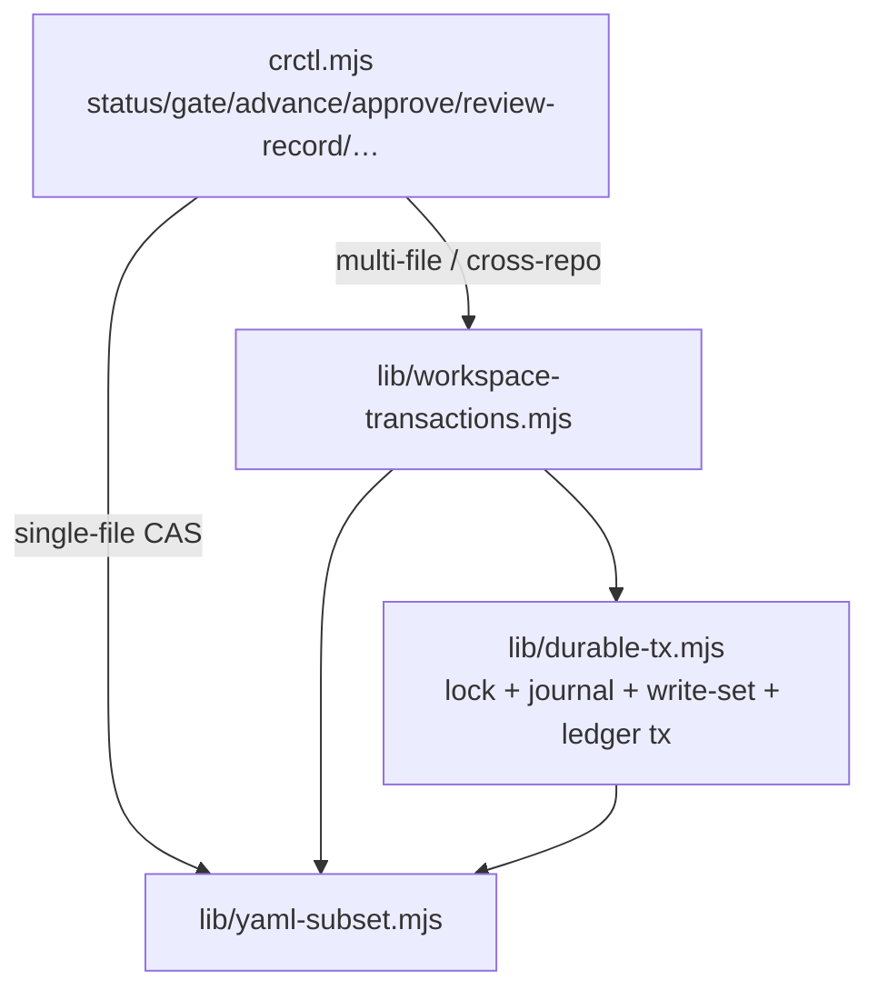

# crctl Transactions & Deep Primitives

The [crctl CLI](/openwiki/operations/drift-governance.md) is no longer a single flat script. Its state-machine and gate logic stays in `crctl.mjs`, while all cross-file and cross-repo writes are delegated to a transaction layer under `skills/shared/crctl/scripts/lib/`. This page explains that layer and the deep primitives it supports.

## When to Consult This Page

- You are changing any write path in `crctl.mjs` or adding a new ledger-writing subcommand.
- You need to understand why `register`, `checkpoint`, `merge`, `writeback-apply`, `archive`, `approve`, `review-record`, or `owner-set` survive interruption and re-run idempotently.
- You are reviewing a change that touches `_backlog.yml`, `_history.yml`, `cr.md`, `tasks/_index.yml`, or `approval.yml` and must verify it goes through the transaction layer rather than a new bypass.

## Layer Boundaries

- **`lib/yaml-subset.mjs`** — a line-oriented YAML reader/writer (`parseYaml`, `matchEntryBlock`) with a strict mode that hard-fails on duplicate keys. This is the only YAML parsing the package uses; it deliberately avoids a generic serializer so comments and field order survive.
- **`lib/durable-tx.mjs`** — generic durability primitives: `acquireLock` (directory lock via `owner.json`), `loadOrCreateJournal`/`saveJournal` (journal envelope), `applyWriteSet`/`recoverWriteSet`/`cleanupTxBlobs` (recoverable write-set with `write-set.json` + content-addressed `blobs/`), `beginLedgerTransaction`/`recoverLedgerTransaction`/`abortLedgerTransaction`/`finishLedgerTransaction` (command-level ledger transaction), and `FAULT_POINTS`/`faultPoint` for deterministic fault injection.
- **`lib/workspace-transactions.mjs`** — the deep primitives that own the actual Git and ledger algorithms, plus the repository resolver and authority-path logic.

`lib/` never depends back on the CLI, and there is no second command entry point. This mirrors the [architecture layering rule](/openwiki/architecture/overview.md) that dependencies point only downward.

## Durable Transaction Envelope

Every deep primitive runs under the same envelope:

1. **Lock** — `acquireLock({ root, scope, op, cr })` creates a per-scope directory lock with an `owner.json` token (pid + hostname + startedAt). Scopes are per registration-key/CR-ID.
2. **Journal** — `loadOrCreateJournal` writes `journal.json` under `.crctl/transactions/{op}/{cr-or-key}/{txId}/`. The journal records `txId`, `op`, `phase`, timestamps, and an op-specific payload.
3. **Phase checkpoints** — each primitive advances its payload through named phases (e.g. `preflight`, `prepared`, `pushed`, `complete`) and saves after each, so an interrupted run can resume from the last durable phase.
4. **Write-set** — multi-file writes are staged as a `write-set.json` manifest plus content-addressed `blobs/`, then applied atomically (tmp + rename). `recoverWriteSet` re-applies only missing/divergent entries.
5. **Recovery** — a primitive that fails mid-run returns a `recoverCommand` (e.g. `crctl checkpoint <CR> --workspace …`); re-running that same command resumes from the journal, never re-issuing a completed step.

The primitive operations are enumerated in `durable-tx.mjs` `OPS = ['register', 'workspace', 'merge', 'writeback', 'archive', 'ledger', 'checkpoint', 'test']`.

## Deep Primitives

| Primitive | CLI entry | Owns | Focused test |
|-----------|-----------|------|--------------|
| `registerCr` | `crctl register` | Creates `cr.md` + `_backlog.yml` + `_index.yml` entries (with `--target-version`, `--origin`, three-role owners), commits on the knowledge-base trunk, then creates per-repo worktrees | `register-tx.test.mjs` |
| `ensureWorkspace` / `classifyWorkspaceFreshness` / `syncWorkspaceToTrunk` | `crctl workspace inspect\|ensure\|cleanup\|freshness\|sync` | Classifies each repo's CR worktree (`missing/healthy/branch-only/remote-only/dirty/wrong-branch/path-unregistered`), and does explicit ff-only sync for `behind-clean` | `workspace-freshness.test.mjs` |
| `checkpointCr` | `crctl checkpoint` | Single deep primitive: full-repo source commit → non-KB lease publish → KB `latest-checkpoint` + metadata commit, the only complete-batch visibility point | `checkpoint-tx.test.mjs` |
| `mergeCr` / `mergeStatus` | `crctl merge [status]` | Per-repo merge-tree + synthetic `_backlog.yml` merge, finalize commit, and `operationalWorkspace` establishment | `merge-tx.test.mjs` |
| `prepareWritebackCandidate` / `applyWriteback` | `crctl writeback-apply` | Candidate-only writeback of baseline/tasks/traceability; freezes `generator`/`candidate`, publishes baseline + `writing-back` state in one batch | `writeback-tx.test.mjs` |
| `archiveCr` | `crctl archive` | Moves CR from `_backlog.yml` to `_history.yml` (with `final-status`/`writeback-spec-id`), updates `cr.md` status, cleans worktrees/refs | `archive-tx.test.mjs` |

### release-subjects (release snapshot)

`buildReleaseSubjects` / `verifyReleaseSubjects` construct and re-verify a **signed release snapshot** (CR-2026-044). The snapshot binds the CR's version, each participating repository's reviewed source SHA, and the sha256 of each controlled artifact (PRD/SDD/TASK) at `code-approved`. `approve` re-checks it and rejects on `RELEASE_SUBJECT_DRIFT` with a zero-write refusal; `merge` re-verifies it before publication and routes a mismatch back through `merge-feature-branch:release-drift`. Release-subjects construction reads only the local healthy committed worktree — it never fetches or reads remote-tracking refs, keeping `status`/`gate`/`review`/`approve` network-independent.

### version-set (version correction)

`version-set` (CR-2026-057) is a ledger write subcommand that reuses the `owner-set` ledger-transaction skeleton and `AI-First-Tx` trailer-confirm semantics. It is the **only** correction entry for `unassigned → real version`, atomically syncing `cr.md` + `_backlog.yml` + any already-produced PRD/SDD/PLAN/TASK, without changing CR status or adding a transition. `writeback-apply`'s version guard (`guardWritebackVersion`) short-circuits version errors before any candidate/journal side effect, and permits a backfill only when `cr.md=unassigned` and the input is a real version.

## Ledger Transactions (single-command multi-file)

Commands that must update several ledger files in one atomic unit — `approve`, `review-record`, `owner-set`, `version-set` — use the command-level ledger transaction in `durable-tx.mjs` rather than `casWriteMulti` (which has been deleted). A ledger transaction snapshots `before` hashes, applies the write-set, and on commit writes an `AI-First-Tx` trailer so an interrupted post-commit run can confirm authority and clean up only the journal. Other single-file ledger commands continue to use hash-CAS; all paths share `.crctl/audit.log` and controlled Git.

## Hard Invariants

These are the architectural invariants this layer exists to enforce (full text in [ARCHITECTURE.md §5](/openwiki/architecture/overview.md)):

1. **Status single writer** — CR `status` changes only through `crctl advance` writing `cr.md` frontmatter.
2. **Ledger single write channel** — `_backlog.yml` / `tasks/_index.yml` / `_history.yml` writes only through crctl subcommands with CAS + audit.
3. **Zero third-party deps** — `crctl.mjs` uses only `node:*` built-ins; YAML is line-oriented regex editing.
4. **Line-ending + hard-fail discipline** — normalize `\r\n → \n` before hashing/regex; parsing failures hard-fail.
5. **git is authoritative, outbox is projection** — outbox write failure logs an audit and never blocks the main operation.
6. **Human approval has no bypass** — the four approval nodes only via `crctl approve` (interactive TTY or Ed25519 grant).

## Change-Safety Guidance

- **Adding a new ledger write** must go through either a deep primitive (cross-repo/multi-file) or the ledger transaction (single-command multi-file), never a new ad-hoc `fs.writeFileSync` path. Update `OPS` and add a fault-injection vector in `durable-tx.test.mjs` / `fault-harness.test.mjs`.
- **Changing the state machine** requires a coordinated edit to `dir-graph.yaml` and `gates.json` (they are the single source of truth) and a re-check of the state-machine size invariant in [ARCHITECTURE.md §5 inv 5](/openwiki/architecture/overview.md).
- **Changing a deep primitive's phases** must keep idempotency: re-run from the returned `recoverCommand` must resume, not redo.
- **Do not** add a second transaction framework or generic YAML serializer — both are explicitly rejected in [ARCHITECTURE.md §6](/openwiki/architecture/overview.md).

## Validation

- Focused: `node --test skills/shared/crctl/scripts/test/crctl.test.mjs`
- Full transaction + fault suite (matches CI): `node --test --test-concurrency=2 skills/shared/crctl/scripts/test/*.test.mjs`
- Run the full suite when changing `lib/durable-tx.mjs`, `lib/workspace-transactions.mjs`, or `lib/yaml-subset.mjs`; a focused test file is sufficient for a single-primitive change.
