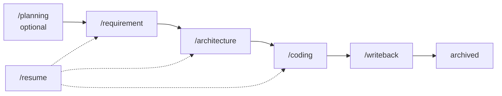
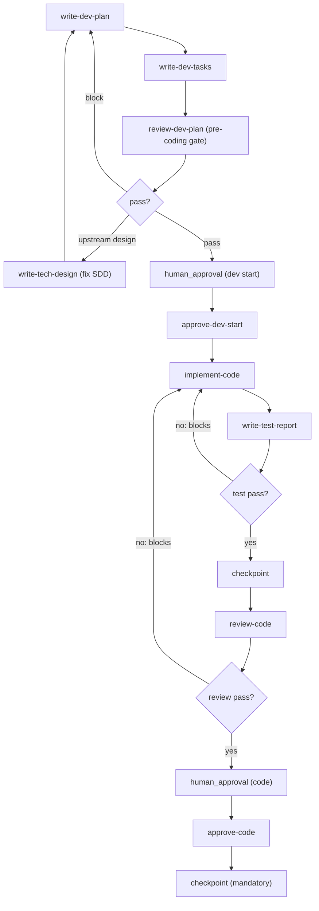

# Pipeline Templates & Workflows

Pipeline templates are JSON definitions that orchestrate multi-step R&D workflows. Each template declares nodes (Skill invocations or human approvals), inputs, and review loops. The 8 active pipelines cover the full lifecycle from product planning through code implementation and writeback.

## Pipeline JSON Structure

Every pipeline follows the `PipelineDefinition` schema:

```json
{
  "id": "unique-id",
  "name": "Human-readable name",
  "description": "...",
  "triggerCommand": "/planning",
  "scope": "product-planning | product-design | product-dev",
  "isDefault": false,
  "inputs": [
    { "key": "topic", "label": "...", "type": "text", "required": true }
  ],
  "nodes": [
    {
      "id": "uuid",
      "kind": "skill | human_approval | code_generation",
      "label": "...",
      "ref": "skill-name",
      "prompt": "Detailed instructions with {{inputs.key}} interpolation",
      "onFail": "abort | skip",
      "timeoutMinutes": 60,
      "reviewLoop": {
        "maxAttempts": 3,
        "passCondition": { "allOf": ["verdict==pass", "blockers==[]"] },
        "repairNodeId": "...",
        "replayNodes": ["...", "..."]
      }
    }
  ]
}
```

### Node Kinds

| Kind | Purpose | Example |
|------|---------|---------|
| `skill` | Invokes a registered Skill from `skills/_index.yml` | `write-requirement-prd`, `review-code` |
| `human_approval` | Blocks until a human confirms via the TODO system | `human_approval` before `approve-requirement` |
| `code_generation` | Invokes an external coding runtime (Claude Code, Codex, Cursor) | `implement-code` node |

### Review Loops

Nodes that perform automated review can declare a `reviewLoop`:

- **`maxAttempts`**: Maximum self-repair cycles (default 3)
- **`passCondition`**: Machine-readable conditions using `allOf` / `anyOf` with expressions like `verdict==pass`, `blockers==[]`, `approved==true`
- **`repairNodeId`**: The node to jump back to when blockers are found
- **`replayNodes[]`**: When repair requires rerunning multiple nodes (e.g., code fix → test report → checkpoint → re-review)

## The 8 Active Pipelines

### Main Workflow (Sequential)



| # | Trigger | Pipeline | Nodes | Owner | Phase |
|---|---------|----------|-------|-------|-------|
| 0 | `/planning` | `product-planning` | 8 | product-planning-agent | Planning |
| 0a | `/insight-brief` | `market-to-plan` | 5 | product-planning-agent | Planning |
| 0b | `/comp-radar` | `competitive-radar` | 5 | competitive-analyst-agent | Planning |
| 1 | `/requirement` | `requirement-authoring` | 7 | requirement-writer | Requirement |
| 2 | `/architecture` | `architecture-design` | 5 | dev-agent | Design |
| 3 | `/coding` | `code-implementation` | 16 | dev-agent | Coding |
| 4 | `/writeback` | `feature-writeback` | 5 | delivery-agent | Writeback |
| R | `/resume` | `resume-cr` | 3 | system-orchestrator | Recovery |

### Planning Pipelines (Optional)

The three planning pipelines are optional and do not create CRs:

- **`/planning`**: User feedback analysis → market research → competitive analysis → current product analysis → planning report → AI review → human approval → roadmap
- **`/insight-brief`**: Raw insight extraction → insight brief → planning suggestion draft → human approval → write to planning KB
- **`/comp-radar`**: Fetch competitor updates → competitive report → convert to planning suggestions → human approval → write to planning KB

### Main Delivery Pipeline (Required)

The four required pipelines form the main delivery chain:

**`/requirement`** — CR registration with worktree creation, PRD writing, requirement review (with auto-repair loop), human approval, `approve-requirement` state advance, then a **mandatory approval checkpoint**. Prerequisite: none. Output: `prd.md`, status=`requirement-approved`.

**`/architecture`** — SDD writing based on approved PRD (entry reads the authority path via `crctl workspace inspect`), tech design review (with auto-repair loop), human approval, `approve-tech-design` state advance, then a **mandatory checkpoint**. Prerequisite: status=`requirement-approved`. Output: `sdd.md`, status=`tech-design-reviewed`.

**`/coding`** — Development plan → task breakdown → **dev-plan review** (`review-dev-plan`, the pre-coding SDD→PLAN→TASK quality gate) → human approval to start → code implementation (via external coding runtime) → test report generation (with auto-fix loop) → unified checkpoint → code review (with auto-fix loop) → human approval → `approve-code` state advance → mandatory approval checkpoint. Prerequisite: status=`tech-design-reviewed`. Output: code, `test-report.md`, status=`code-approved`. Entry reads the authority path via `crctl workspace inspect`.



**`/writeback`** — Merge CR branches to trunk → writeback PRD/SDD to `specs/` → writeback TASKs to `delivery/task/` → generate traceability chain → archive CR (move to `_history.yml`, clean up worktrees). Prerequisite: status=`code-approved`. Output: `specs/{id}/`, `delivery/task/`, `traceability.yml`, status=`archived`.

**`/resume`** — For recovering in-flight CRs when switching machines or collaborators: verify remote checkpoints → restore worktrees → show CR status and next step.

## Human Approval Pattern

Human approval nodes do not directly change state. They block until a human confirms, then the following Skill node writes evidence and advances state:

| Human Approval Node | Follow-Up Skill | Target State |
|---------------------|-----------------|--------------|
| Requirement approval | `approve-requirement` | `requirement-approved` |
| Architecture approval | `approve-tech-design` | `tech-design-reviewed` |
| Development start | `approve-dev-start` | `developing` |
| Code approval | `approve-code` | `code-approved` |

In standalone IDE usage, [crctl approve](/openwiki/operations/drift-governance.md#crctl-subcommands) provides an interactive terminal replacement for human approval.

## Pipeline Contracts

When modifying pipelines, observe these rules from `dir-graph.yaml#pipeline_templates.contract`:

1. `human_approval` nodes must be followed by explicit `approve-*` or write-type Skills
2. `code-implementation` must generate `test-report.md` before `review-code`
3. Auto-review nodes must declare `reviewLoop`; blockers must route back to `repairNodeId`
4. If repair requires multiple replays, declare `replayNodes[]`
5. Auto-review nodes must persist `review-loop.current-attempt` and `review-loop.attempts[]`
6. CR-class loops must sync to `traceability.yml`
7. `feature-writeback` must require `spec_id` and `target_version` — empty values are not allowed
8. `review-dev-plan` is the pre-coding quality gate in `task-breakdown` state: a block routes back to `write-dev-plan` (or `write-tech-design` on an upstream design blocker) before `approve-dev-start`
9. Requirement/architecture/code approval-stage terminal checkpoints are mandatory (CR-2026-044): failure keeps the already-approved status, and re-running the same checkpoint does not re-approve
10. Pipeline entry nodes that need the authority workspace resolve it via `crctl workspace inspect`, not by assuming a fixed path

## Source References

| Concept | Primary Source |
|---------|---------------|
| Pipeline JSON schema | `pipeline-templates/*.pipeline.json` |
| Pipeline registry | `pipeline-templates/_index.yml` |
| Pipeline contracts | `dir-graph.yaml#pipeline_templates.contract` |
| Pipeline editing rules | `AGENTS.md` §修改 Pipeline |
| Self-check command | `AGENTS.md` §自检命令 |
