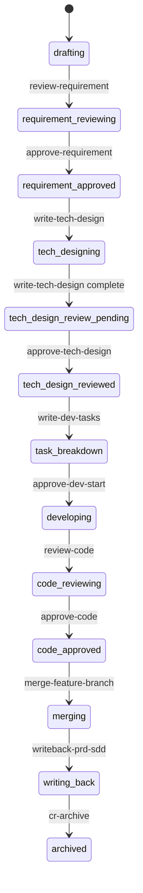
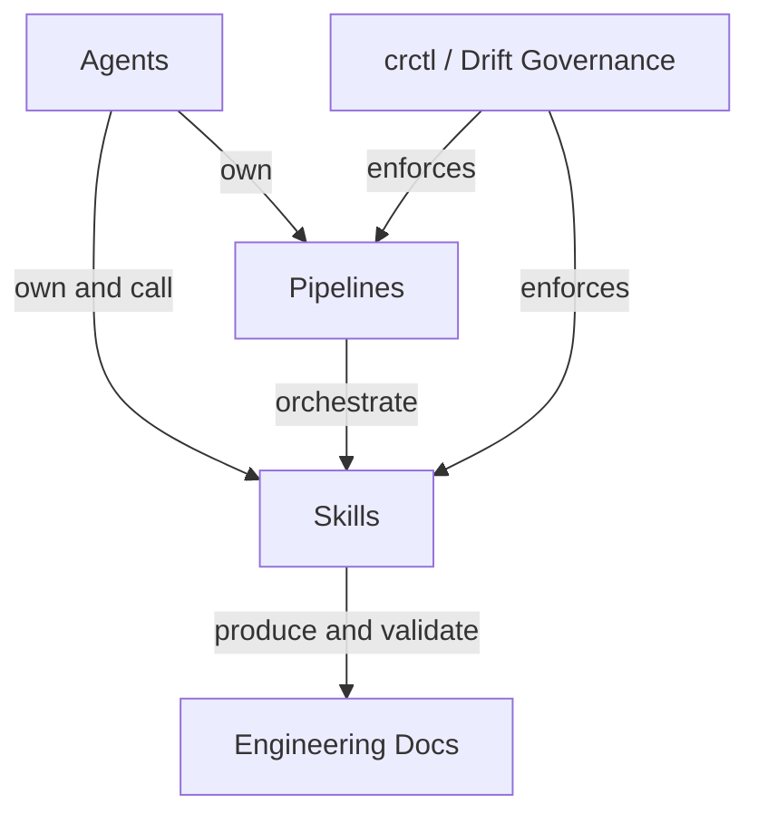

# AI First Phase0 Tools — Quickstart

This repository is the **Phase0 pre-built tools package** for the AI First R&D Collaboration Platform (AI First 研发协同平台). It contains Agent definitions, Skill definitions, Pipeline templates, and governance tooling that turn product development into a traceable, recoverable, and auditable chain driven by AI agents.

This tools package can be installed into a target workspace and used on the platform with progressive loading and pipeline execution constraints, or used standalone in IDEs like Claude Code, Cursor, or Codex with the [drift governance tooling](/openwiki/operations/drift-governance.md) (`crctl`).

## What This Package Provides

| Component | Location | Purpose |
|-----------|----------|---------|
| **Agent definitions** | `agents/` | 10 agents with defined scopes, capabilities, and constraints |
| **Skill definitions** | `skills/` | 50+ skills across 10 domains — the atomic capability units |
| **Pipeline templates** | `pipeline-templates/` | 8 JSON pipelines orchestrating the full R&D lifecycle |
| **Agent/Skill matrix** | `agent-skill-matrix.yml` | Machine-readable permission and ownership map |
| **Drift governance** | `skills/shared/crctl/` | CLI-based code enforcement (crctl V2) with outbox events, evidence digest, and dual-track approval |
| **CI guards** | `.github/workflows/`, `.githooks/` | Automated matrix consistency and agent contract invariant checks |
| **Engineering docs** | `skills/shared/engineering-docs/` | Schema-driven document system (PRD, SDD, PLAN, TASK) |

## Core Idea: Change Requests as Work Containers

The central primitive is the **Change Request (CR)** — not an issue or ticket, but a structured **work container** that holds the full lifecycle of a product change. Each CR has its own directory, git branches, worktrees, status, owners, and process artifacts under `change-requests/{CR-ID}/`.

A CR moves through a **[four-stage state machine](/openwiki/architecture/overview.md#cr-state-machine)**:

Key properties:
- **Status transitions are explicit** — no prompt-based "verbal approval"; every transition is a Skill invocation with written evidence.
- **Three-role owner model**: `requirement`, `development`, and `test` owners, each with `id` and `assigned-at` timestamps.
- **Auto-review repair loops**: When automated review finds blockers, the system loops back to the repair node (max 3 attempts) before reaching human approval.
- **Writeback**: After code approval, CR artifacts are merged back into `specs/`, `delivery/`, and `traceability.yml` — the team's permanent knowledge base.

## The 8 Pipelines

| Trigger | Pipeline | Owner | Phase |
|---------|----------|-------|-------|
| `/planning` | `product-planning` | product-planning-agent | Planning |
| `/insight-brief` | `market-to-plan` | product-planning-agent | Planning |
| `/comp-radar` | `competitive-radar` | competitive-analyst-agent | Planning |
| `/requirement` | `requirement-authoring` | requirement-writer | Requirement |
| `/architecture` | `architecture-design` | dev-agent | Design |
| `/coding` | `code-implementation` | dev-agent | Coding |
| `/writeback` | `feature-writeback` | system-orchestrator | Writeback |
| `/resume` | `resume-cr` | system-orchestrator | Recovery |

See [Pipelines Overview](/openwiki/pipelines/overview.md) for details on each pipeline's structure, inputs, and node flow.

## The Four-Layer Architecture

1. **[Agents](/openwiki/architecture/agent-skill-matrix.md)**: 10 agents (5 primary, 5 sub-agents) with strict ownership boundaries defined in `agent-skill-matrix.yml`. Each Skill has exactly one owning Agent.
2. **[Pipelines](/openwiki/pipelines/overview.md)**: 8 JSON templates that orchestrate Skill invocation with review loops, human approval gates, and state transitions.
3. **Skills**: 50+ atomic capabilities across 10 domains — planning, requirement, develop, cr, writeback, sync, spec, competitive, review, shared.
4. **[Engineering Docs](/openwiki/engineering-docs/overview.md)**: Schema-driven document system (PRD, SDD, PLAN, TASK, FORM, MODULE, RELEASE) with validation CLI and MCP tools.

## Relationship Model

The [Agent/Skill permission matrix](/openwiki/architecture/agent-skill-matrix.md) defines four relation types:

| Relation | Meaning |
|----------|---------|
| `owns` | Actor is the primary maintainer; each active Skill has exactly one owner |
| `can-call` | Actor may invoke within its responsibility boundary |
| `external` | Provided by the target runtime; Phase0 does not bundle it |
| `forbidden` | Explicitly prohibited to prevent cross-domain violations |

## Prerequisites for Use

- Initialized workspace with `AGENTS.md`, `dir-graph.yaml`, `change-requests/`, `specs/`, `delivery/`, `docs/`
- Declared repositories in `dir-graph.yaml#repositories`
- Agent/Skill matrix loaded from `agent-skill-matrix.yml`
- CR with explicit requirement/development/test owners
- Human approvers identified for each approval gate
- When used standalone (no platform): [`crctl` installed](/openwiki/operations/drift-governance.md)

## Documentation Map

| Page | Covers |
|------|--------|
| [Architecture Overview](/openwiki/architecture/overview.md) | CR model, state machine, facts model, owner triad, review loops, agent contract invariants |
| [Agent/Skill Matrix](/openwiki/architecture/agent-skill-matrix.md) | Permission system, pipeline owners, actor summary, contract enforcement, design gaps |
| [Pipelines Overview](/openwiki/pipelines/overview.md) | Pipeline JSON structure, all 8 pipelines, node types, reviewLoop |
| [Drift Governance](/openwiki/operations/drift-governance.md) | crctl V2 CLI, outbox events, evidence digest, dual-track approval, controlled-shell, adapters, workspace setup |
| [CI Guards](/openwiki/operations/ci-guards.md) | GitHub Actions workflow, pre-commit hook, skill matrix checker, agent contract checker |
| [Engineering Docs](/openwiki/engineering-docs/overview.md) | Document schemas, doc-chain, templates, validation tools |

## Git History

This repository is a fork of `xinyiai0724/tools` with customizations on the `custom/main` branch:
- **Commit `a3ca761`**: Initial push to the fork repository with full Phase0 tools content
- **Commit `40447db`**: Restructured workspace directory, added drift governance v2 and the `crctl` execution layer
- **Commits `e5746e4`–`be966d4`**: crctl V2 maturity — outbox event channel, unified evidence digest, dual-track approval (TTY + server-approve with ed25519 grants), controlled-shell rules.json single source of truth, skill matrix and agent contract checkers, CI enforcement, delivery index consistency gate, and multiple bug fixes (line ending normalization, RE2 compatibility, Windows outbox, idempotency key collisions)

See `CUSTOM.md` for the fork deviation ledger and merge conflict policies.

## Backlog

| Area | Source | Reason Deferred |
|------|--------|-----------------|
| QODER platform usage guide | `docs/QODER-使用指南.md` (33KB) | Large existing doc; reference rather than duplicate |
| Individual Skill deep dives | `skills/*/SKILL.md` (50+ files) | Too granular for initial wiki; covered by domain summaries |
| Individual Agent deep dives | `agents/*.md` (10 files) | Covered sufficiently in agent-skill-matrix page |
| `.qoder/repowiki/` knowledge base | `.qoder/repowiki/` (133 files) | Qoder-local generated docs; not in git |
