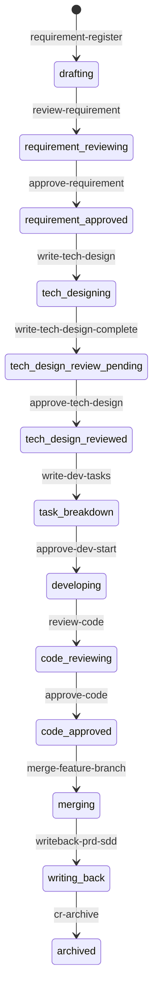
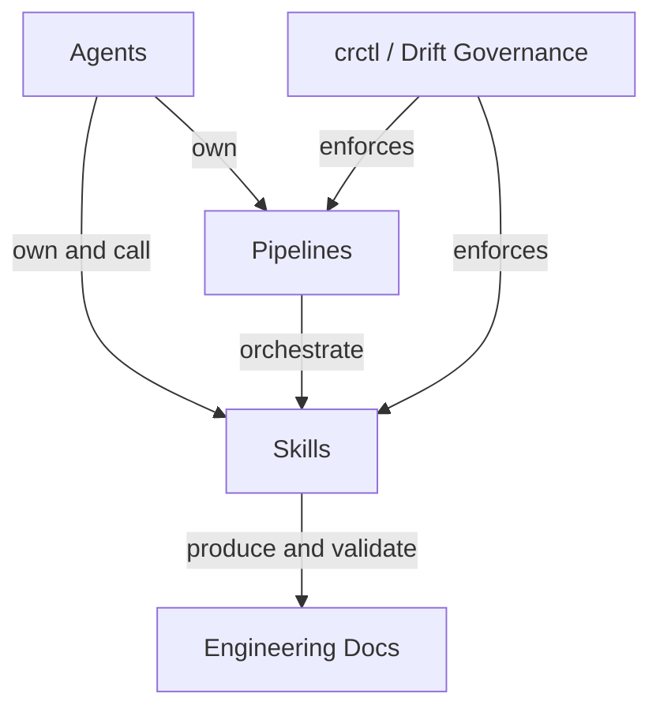

# AI First Phase0 Tools — Quickstart

This repository is the **Phase0 pre-built tools package** for the AI First R&D Collaboration Platform (AI First 研发协同平台). It contains Agent definitions, Skill definitions, Pipeline templates, and governance tooling that turn product development into a traceable, recoverable, and auditable chain driven by AI agents.

This tools package can be installed into a target workspace and used on the platform with progressive loading and pipeline execution constraints, or used standalone in IDEs like Claude Code, Cursor, or Codex with the [drift governance tooling](/openwiki/operations/drift-governance.md) (`crctl`).

## What This Package Provides

| Component | Location | Purpose |
|-----------|----------|---------|
| **Agent definitions** | `agents/` | 9 deployable agents (5 primary + 4 sub) plus 2 system actors, with defined scopes and constraints |
| **Skill definitions** | `skills/` | 56 active skills across 10 domains — the atomic capability units |
| **Pipeline templates** | `pipeline-templates/` | 8 JSON pipelines orchestrating the full R&D lifecycle |
| **Agent/Skill matrix** | `agent-skill-matrix.yml` | Machine-readable permission and ownership map |
| **Drift governance** | `skills/shared/crctl/` | Code-level enforcement (`crctl`) with durable transactions, deep primitives, outbox events, evidence digest, and dual-track approval |
| **CI guards** | `.github/workflows/`, `.githooks/` | Automated matrix/contract/lint checks plus the full crctl test matrix (Ubuntu + Windows) |
| **Engineering docs** | `skills/shared/engineering-docs/` | Schema/template-driven document system (PRD, SDD, PLAN, TASK; de-MCP'd since v0.4.0) |

## Task Routing

| Change area / intent | Wiki page | Source entry points | Important symbols / types | Focused tests | Minimal validation |
|----------------------|-----------|---------------------|---------------------------|---------------|--------------------|
| Add or modify a Skill | [Matrix](/openwiki/architecture/agent-skill-matrix.md) | `skills/_index.yml`, `skills/{domain}/{skill}/SKILL.md`, `agent-skill-matrix.yml` | matrix `owns`/`can-call`/`forbidden` | `test/check-skill-matrix.test.mjs` | `node skills/shared/crctl/scripts/check-skill-matrix.mjs` |
| Add or modify an Agent | [Matrix](/openwiki/architecture/agent-skill-matrix.md) | `agents/_index.yml`, `agents/{id}.md`, `agent-skill-matrix.yml` | agent `references[]` | `test/check-agents-contract.test.mjs` | `node skills/shared/crctl/scripts/check-agents-contract.mjs` |
| Modify a pipeline | [Pipelines](/openwiki/pipelines/overview.md) | `pipeline-templates/{flow}.pipeline.json`, `pipeline-templates/_index.yml` | `reviewLoop`, `human_approval`, `replayNodes` | `test/pipeline-structure.test.mjs` | JSON parse + `node skills/shared/crctl/scripts/lint-prompts.mjs --mode enforce` |
| Change crctl state/gate logic | [Drift Governance](/openwiki/operations/drift-governance.md), [Transactions](/openwiki/operations/crctl-transactions.md) | `crctl.mjs`, `gates.json`, `dir-graph.yaml#change-request-track.state_machine` | `cmdAdvance`, `cmdStatus`, `cmdGate`, `legalTransitions` | `test/crctl.test.mjs` | `node --test skills/shared/crctl/scripts/test/crctl.test.mjs` |
| Add a deep primitive / transaction | [Transactions](/openwiki/operations/crctl-transactions.md) | `lib/durable-tx.mjs`, `lib/workspace-transactions.mjs` | `registerCr`, `checkpointCr`, `mergeCr`, `applyWriteback`, `archiveCr` | `test/{register,checkpoint,merge,writeback,archive}-tx.test.mjs` | `node --test --test-concurrency=2 skills/shared/crctl/scripts/test/*.test.mjs` |
| Edit prompt text referencing crctl | [CI Guards](/openwiki/operations/ci-guards.md) | `skills/**/SKILL.md` | lint rules R1–R13 | `test/lint-prompts.test.mjs` | `node skills/shared/crctl/scripts/lint-prompts.mjs --mode enforce` |
| Change writeback scripts | [Pipelines](/openwiki/pipelines/overview.md) | `skills/writeback/scripts/*.mjs` | `writeback-prd-sdd.mjs`, `writeback-tasks.mjs`, `writeback-traceability.mjs` | `skills/writeback/scripts/test/*.test.mjs` | `node --test skills/writeback/scripts/test/*.test.mjs` |
| Change controlled-shell rules | [Drift Governance](/openwiki/operations/drift-governance.md) | `skills/shared/controlled-shell/rules.json`, `crctl.mjs#controlledGit` | `controlledGit` | `test/crctl.test.mjs` | `node --test skills/shared/crctl/scripts/test/crctl.test.mjs` |

## Core Idea: Change Requests as Work Containers

The central primitive is the **Change Request (CR)** — not an issue or ticket, but a structured **work container** that holds the full lifecycle of a product change. Each CR has its own directory, git branches, worktrees, status, owners, and process artifacts under `change-requests/{CR-ID}/`.

A CR moves through a **[state machine](/openwiki/architecture/overview.md#cr-state-machine)** with 15 named states plus a pre-registration `(new)` state. This is the forward "happy path"; the full machine (reject/repair self-loops, terminal `rejected`/`withdrawn`, and the `release-drift` route) is on the [architecture overview](/openwiki/architecture/overview.md#cr-state-machine):

Key properties:
- **Status transitions are explicit** — no prompt-based "verbal approval"; every transition is a Skill invocation with written evidence.
- **Three-role owner model**: `requirement`, `development`, and `test` owners, each with `id` and `assigned-at` timestamps.
- **Auto-review repair loops**: When automated review finds blockers, the system loops back to the repair node (max 3 attempts) before reaching human approval.
- **Writeback**: After code approval, CR artifacts are merged back into `specs/`, `delivery/`, and `traceability.yml` — the team's permanent knowledge base.

## The 8 Pipelines

| Trigger | Pipeline | Owner | Phase |
|---------|----------|-------|-------|
| `/planning` | `product-planning` | product-planning-agent | Planning |
| `/insight-brief` | `market-to-plan` | product-planning-agent | Planning |
| `/comp-radar` | `competitive-radar` | competitive-analyst-agent | Planning |
| `/requirement` | `requirement-authoring` | requirement-writer | Requirement |
| `/architecture` | `architecture-design` | dev-agent | Design |
| `/coding` | `code-implementation` | dev-agent | Coding |
| `/writeback` | `feature-writeback` | delivery-agent | Writeback |
| `/resume` | `resume-cr` | system-orchestrator | Recovery |

See [Pipelines Overview](/openwiki/pipelines/overview.md) for details on each pipeline's structure, inputs, and node flow.

## The Four-Layer Architecture

1. **[Agents](/openwiki/architecture/agent-skill-matrix.md)**: 9 deployable agents (5 primary, 4 sub-agents) plus 2 system actors (`cr-coordinator-agent`, `system-orchestrator`) with strict ownership boundaries defined in `agent-skill-matrix.yml`. Each active Skill has exactly one owning agent.
2. **[Pipelines](/openwiki/pipelines/overview.md)**: 8 JSON templates that orchestrate Skill invocation with review loops (including the pre-coding `review-dev-plan` gate), human approval gates, and mandatory checkpoints.
3. **Skills**: 56 atomic capabilities across 10 domains — planning, requirement, develop, writeback, sync, spec, competitive, review, cr, shared.
4. **[Engineering Docs](/openwiki/engineering-docs/overview.md)**: Schema/template-driven document system (PRD, SDD, PLAN, TASK, FORM, MODULE, RELEASE); the Skill is de-MCP'd since v0.4.0 (SKILL.md + templates + schemas are authoritative).

## Relationship Model

The [Agent/Skill permission matrix](/openwiki/architecture/agent-skill-matrix.md) defines four relation types:

| Relation | Meaning |
|----------|---------|
| `owns` | Actor is the primary maintainer; each active Skill has exactly one owner |
| `can-call` | Actor may invoke within its responsibility boundary |
| `external` | Provided by the target runtime; Phase0 does not bundle it |
| `forbidden` | Explicitly prohibited to prevent cross-domain violations |

## Prerequisites for Use

- Initialized workspace with `AGENTS.md`, `dir-graph.yaml`, `change-requests/`, `specs/`, `delivery/`, `docs/`
- Declared repositories in `dir-graph.yaml#repositories`
- Agent/Skill matrix loaded from `agent-skill-matrix.yml`
- CR with explicit requirement/development/test owners
- Human approvers identified for each approval gate
- When used standalone (no platform): [`crctl` installed](/openwiki/operations/drift-governance.md)

## Documentation Map

| Page | Covers |
|------|--------|
| [Architecture Overview](/openwiki/architecture/overview.md) | CR model, state machine, facts model, owner triad, review loops, agent contract invariants, crctl layering |
| [Agent/Skill Matrix](/openwiki/architecture/agent-skill-matrix.md) | Permission system, pipeline owners, actor summary (incl. `cr-coordinator-agent`), contract enforcement |
| [Pipelines Overview](/openwiki/pipelines/overview.md) | Pipeline JSON structure, all 8 pipelines, node types, reviewLoop, dev-plan review, mandatory checkpoints |
| [Drift Governance](/openwiki/operations/drift-governance.md) | crctl CLI, outbox events, evidence digest, dual-track approval, controlled-shell, adapters, workspace setup |
| [crctl Transactions & Deep Primitives](/openwiki/operations/crctl-transactions.md) | Durable transaction layer, journal/lock/write-set, register/checkpoint/merge/writeback/archive deep primitives |
| [CI Guards](/openwiki/operations/ci-guards.md) | crctl-ci workflow (Ubuntu + Windows), pre-commit hook, skill matrix / agent contract / lint checks, full test matrix |
| [Engineering Docs](/openwiki/engineering-docs/overview.md) | Document schemas, doc-chain, templates, de-MCP'd validation |

## History & Progression

This is a fork of `xinyiai0724/tools` (maintained at `OldBoy405/AI-First-tools`), with `crctl` and drift governance as custom additions. The wiki tracks the current `main` branch. The dominant arc since the initial crctl V2 baseline is a long sequence of CR-driven hardening (CR-2026-018 through CR-2026-060), captured in `ARCHITECTURE.md` and `CUSTOM.md` rather than in a commit list:

- **Status authority migration** (CR-2026-018): `cr.md` frontmatter became the single status source; `_backlog.yml` degraded to a registration index.
- **Durable transactions & deep primitives** (CR-2026-031…044): `register`/`checkpoint`/`merge`/`writeback-apply`/`archive` moved onto a journal-envelope + directory-lock + recoverable write-set layer; command-level ledger transactions for `approve`/`review-record`/`owner-set`/`version-set`.
- **Structured test loop** (CR-2026-040): `crctl test`/`testCr` became a deterministic machine-recorded test runner with raw-byte evidence.
- **Freshness gates & workspace sync** (CR-2026-043): `workspace-freshness` + `crctl workspace freshness|sync` ff-only reconciliation.
- **Review-skill delegation** (CR-2026-053): the four review skills moved to `quality-reviewer-agent`; `delivery-agent` took over `feature-writeback`.
- **Signed release snapshot** (CR-2026-044): `code` approval re-verifies machine-injected `release-subjects`; `merge-feature-branch:release-drift` routes back to `developing` on drift.

See `ARCHITECTURE.md` §5 for the seven hard invariants and `CUSTOM.md` for the cross-repo customization ledger (pending platform-integration capabilities).

## Backlog

| Area | Source | Reason Deferred |
|------|--------|-----------------|
| QODER platform usage guide | `docs/QODER-使用指南.md` (32KB) | Large existing doc; reference rather than duplicate |
| Individual Skill deep dives | `skills/*/SKILL.md` (56 files) | Too granular for the wiki; covered by domain summaries |
| Individual Agent deep dives | `agents/*.md` (9 files) | Covered sufficiently in the agent-skill-matrix page |
